> 本文最初写于 2026 年 6 月 16 日，记录的是 `profilepilot@0.1.0` 的第一阶段实现。项目随后继续演进，本文已按 2026 年 7 月 11 日的源码和 Git 历史重写。代码片段为讲解裁剪版，阅读目标是理解每个方案解决了什么问题、方案之间怎样取舍。

## 1. 项目定位与面试开场

如果面试官只给我 30 秒，我会这样介绍 ProfilePilot：

> ProfilePilot 是一个 local-first 的 Chrome Profile 与 Agent 浏览器控制面。它管理真实 Chrome 的 Profile 和隔离副本，能安全迁移登录态与扩展，用稳定的 CDP 入口把浏览器交给 Agent；后来又补上了会话归属、端口租约、AI 操作可见化、用户接管与归还控制权。核心挑战是在 Chrome 缺少完整管理 API 的情况下，把本地文件、系统进程和 CDP 连接拼成一套可观测、可恢复、能够保护用户数据的系统。

产品边界可以概括为三点：

- **产品目标**：面向本机真实 Chrome 的管理与自动化，保留真实浏览器指纹和本机可解释性；
- **数据边界**：Agent 使用隔离 `user-data-dir`，登录态通过可回滚同步获得，系统默认 Profile 保持独立；
- **控制范围**：覆盖 CDP 启动、Session 归属、端口互斥、用户接管以及控制权归还。

这三个边界决定了后面的技术路线。项目最值得讲的是以下三类工程问题：

1. 没有统一 API 时，怎样可靠发现 Chrome Profile、进程和端口；
2. 怎样迁移正在被浏览器使用的本地数据库，同时保证失败可回滚；
3. 当人和 Agent 共用同一个真实浏览器时，怎样建立明确、可执行的控制权协议。

<style>
.pp-flow{--pp-paper:var(--paper-soft,#faf6ec);--pp-deep:var(--paper-deep,#ece5d5);--pp-ink:var(--ink,#1a1815);--pp-muted:var(--muted,#6a6155);--pp-line:color-mix(in srgb,var(--pp-ink) 24%,transparent);--pp-teal:#2f6f73;--pp-blue:#315f9a;--pp-amber:#a86718;--pp-red:#9a3b2d;--pp-green:#4f7233;margin:1.5rem 0;padding:clamp(14px,2.8vw,24px);border:1.5px solid var(--pp-line);border-radius:16px;background:linear-gradient(145deg,color-mix(in srgb,var(--pp-paper) 94%,var(--pp-teal) 6%),var(--pp-paper));color:var(--pp-ink);box-shadow:0 12px 28px -24px color-mix(in srgb,var(--pp-ink) 46%,transparent);overflow:hidden}
.pp-flow *{box-sizing:border-box}.pp-flow .pp-kicker{margin:0 0 5px;font:700 11px/1.2 var(--font-mono,ui-monospace,monospace);letter-spacing:.14em;text-transform:uppercase;color:var(--pp-teal)}
.pp-flow .pp-title{margin:0 0 16px;font:700 clamp(17px,2.4vw,22px)/1.25 var(--font-display,system-ui,sans-serif);color:var(--pp-ink)}
.pp-flow .pp-track{display:flex;align-items:stretch;gap:8px;min-width:0}.pp-flow .pp-track.pp-wrap{flex-wrap:wrap}
.pp-flow .pp-node{flex:1 1 0;min-width:0;padding:12px;border:1px solid var(--pp-line);border-radius:11px;background:color-mix(in srgb,var(--pp-paper) 88%,white 12%);position:relative}
.pp-flow .pp-node b{display:block;font-size:13px;line-height:1.35;color:var(--pp-ink)}.pp-flow .pp-node small{display:block;margin-top:5px;font-size:11.5px;line-height:1.45;color:var(--pp-muted)}.pp-flow code{font-family:var(--font-mono,ui-monospace,monospace);font-size:.92em}
.pp-flow .pp-node[data-tone="teal"]{border-color:color-mix(in srgb,var(--pp-teal) 55%,transparent);background:color-mix(in srgb,var(--pp-paper) 88%,var(--pp-teal) 12%)}
.pp-flow .pp-node[data-tone="blue"]{border-color:color-mix(in srgb,var(--pp-blue) 55%,transparent);background:color-mix(in srgb,var(--pp-paper) 88%,var(--pp-blue) 12%)}
.pp-flow .pp-node[data-tone="amber"]{border-color:color-mix(in srgb,var(--pp-amber) 55%,transparent);background:color-mix(in srgb,var(--pp-paper) 88%,var(--pp-amber) 12%)}
.pp-flow .pp-node[data-tone="red"]{border-color:color-mix(in srgb,var(--pp-red) 55%,transparent);background:color-mix(in srgb,var(--pp-paper) 88%,var(--pp-red) 12%)}
.pp-flow .pp-node[data-tone="green"]{border-color:color-mix(in srgb,var(--pp-green) 55%,transparent);background:color-mix(in srgb,var(--pp-paper) 88%,var(--pp-green) 12%)}
.pp-flow .pp-arrow{flex:0 0 auto;align-self:center;color:var(--pp-teal);font:800 20px/1 var(--font-mono,ui-monospace,monospace)}.pp-flow .pp-arrow.pp-labeled{display:flex;flex-direction:column;align-items:center;gap:3px;font-size:17px}.pp-flow .pp-arrow.pp-labeled small{font:700 9px/1.2 var(--font-mono,ui-monospace,monospace);white-space:nowrap;color:var(--pp-muted)}
.pp-flow .pp-lanes{display:grid;gap:10px}.pp-flow .pp-lane{display:grid;grid-template-columns:minmax(95px,.32fr) 1fr;gap:10px;align-items:stretch}.pp-flow .pp-lane-name{display:flex;align-items:center;justify-content:center;padding:10px;border-radius:10px;background:var(--pp-ink);color:var(--pp-paper);font:700 12px/1.3 var(--font-mono,ui-monospace,monospace);text-align:center}.pp-flow .pp-lane-body{display:flex;align-items:stretch;gap:7px;min-width:0}
.pp-flow .pp-grid{display:grid;grid-template-columns:repeat(2,minmax(0,1fr));gap:10px}.pp-flow .pp-branch-label{margin:8px 0 5px;font:700 11px/1.2 var(--font-mono,ui-monospace,monospace);color:var(--pp-muted);letter-spacing:.06em}
.pp-flow .pp-note{margin:12px 0 0;padding-top:10px;border-top:1px dashed var(--pp-line);font-size:12px;line-height:1.55;color:var(--pp-muted)}
.pp-flow .pp-badge{display:inline-flex;margin-bottom:7px;padding:3px 7px;border-radius:999px;background:var(--pp-ink);color:var(--pp-paper);font:700 10px/1.2 var(--font-mono,ui-monospace,monospace);letter-spacing:.05em}
@media(max-width:760px){.pp-flow .pp-track{flex-direction:column}.pp-flow .pp-arrow{transform:rotate(90deg)}.pp-flow .pp-arrow.pp-labeled{transform:none}.pp-flow .pp-lane{grid-template-columns:1fr}.pp-flow .pp-lane-name{justify-content:flex-start}.pp-flow .pp-lane-body{flex-direction:column}.pp-flow .pp-grid{grid-template-columns:1fr}.pp-flow .pp-lane-body>.pp-arrow{align-self:center}}
@media(prefers-reduced-motion:reduce){.pp-flow *{scroll-behavior:auto!important;transition:none!important;animation:none!important}}
</style>

## 2. 项目之前是什么，现在是什么

项目的第一个提交叫 [Initial Chrome profile manager](https://github.com/ffffhx/profilepilot/commit/e47256f)。当时它是一个运行在 `http://127.0.0.1:5177` 的本地 Web 工具：

- 只管理 ProfilePilot 自己创建的隔离目录；
- 用 `--user-data-dir` 启动 Chrome；
- 通过进程参数判断这些隔离目录是否在运行；
- 删除时先移到类似回收站的目录，避免直接物理删除。

它先解决了日常浏览器与自动化环境的隔离问题。当时的能力范围集中在自建目录，原生 Profile、登录态同步、扩展迁移和 Agent 会话归属仍处于后续规划中。

一个多月后的当前版本，系统边界已经完全不同：

| 维度 | 最初版本 | 当前版本 |
|---|---|---|
| 形态 | localhost 本地 Web 工具 | Electron 桌面应用 + 后台 Gateway + 原生输入辅助进程 |
| Profile | 只认自己创建的隔离目录 | 原生 Profile、隔离 Profile、副本池、外部 Chromium 实例 |
| 登录态 | 尚未覆盖 | 差异预览、暂停/取消、暂存、原子替换、回滚、崩溃恢复 |
| 扩展 | 尚未覆盖 | 扫描来源、迁移包体/数据/保护记录，持久化条件不足时再降级 |
| 自动化 | 只有启动参数 | 逻辑 CDP 端口、Gateway、会话租约、连接归属、Raw CDP 白名单 |
| 人机协作 | 不知道谁在操作 | AI 活动 overlay、会话级归属、用户接管、交还 Agent、释放 Profile |
| 可靠性 | 少量运行时判断 | 单测、渲染层集成测试、E2E、压力脚本、doctor、benchmark |

<figure class="pp-flow" role="group" aria-label="ProfilePilot 从目录管理器演进为浏览器控制面的五阶段流程图">
  <p class="pp-kicker">Evolution route</p>
  <p class="pp-title">从目录管理到浏览器控制权</p>
  <div class="pp-track">
    <div class="pp-node"><span class="pp-badge">06·05</span><b>隔离目录</b><small>创建、启动、回收<br><code>user-data-dir</code></small></div>
    <span class="pp-arrow" aria-hidden="true">→</span>
    <div class="pp-node" data-tone="amber"><span class="pp-badge">06·07</span><b>数据安全</b><small>同步、迁移、回滚<br>失败路径可恢复</small></div>
    <span class="pp-arrow" aria-hidden="true">→</span>
    <div class="pp-node" data-tone="teal"><span class="pp-badge">06·22</span><b>职责拆分</b><small>主进程 11 模块<br>Renderer store 化</small></div>
    <span class="pp-arrow" aria-hidden="true">→</span>
    <div class="pp-node" data-tone="blue"><span class="pp-badge">06·25—07·07</span><b>产品化</b><small>Mini、副本池<br>实时观测与 Session</small></div>
    <span class="pp-arrow" aria-hidden="true">→</span>
    <div class="pp-node" data-tone="red"><span class="pp-badge">07·08—07·11</span><b>控制权</b><small>Gateway、租约<br>接管与归还</small></div>
  </div>
  <p class="pp-note">能力重心：文件位置与进程状态 → 身份、互斥、状态机、错误协议和故障恢复。</p>
</figure>

### 使用示例：25 秒走完核心链路

<figure class="pp-demo-video" role="group" aria-label="25 秒演示：创建隔离 Profile，并通过 CDP 模式启动 Agent 浏览器">
  <style>
    .pp-demo-video{margin:1.7rem 0;padding:clamp(14px,2.6vw,22px);border:1.5px solid color-mix(in srgb,var(--ink,#1a1815) 22%,transparent);border-radius:16px;background:linear-gradient(145deg,color-mix(in srgb,var(--paper-soft,#faf6ec) 92%,#2f6f73 8%),var(--paper-soft,#faf6ec));box-shadow:0 14px 30px -26px color-mix(in srgb,var(--ink,#1a1815) 48%,transparent)}
    .pp-demo-video video{display:block;width:100%;height:auto;border:1px solid color-mix(in srgb,var(--ink,#1a1815) 22%,transparent);border-radius:11px;background:#071313;box-shadow:0 16px 36px -28px #071313}
    .pp-demo-video figcaption{margin:.85rem 0 0;color:var(--muted,#6a6155);font:500 .86rem/1.65 var(--font-mono,ui-monospace,"SFMono-Regular",monospace)}
    .pp-demo-video figcaption b{color:var(--ink,#1a1815);font-family:var(--font-serif-body,"Songti SC","Source Han Serif SC",Georgia,serif);font-size:.98rem}
  </style>
  <video controls preload="metadata" playsinline poster="/post-assets/2026/06/16/profilepilot-%E6%BA%90%E7%A0%81%E8%A7%A3%E6%9E%90-%E6%9C%AC%E6%9C%BA%E4%BC%98%E5%85%88%E7%9A%84-chrome-profile-%E6%8E%A7%E5%88%B6%E5%8F%B0%E6%98%AF%E6%80%8E%E4%B9%88%E5%AE%9E%E7%8E%B0%E7%9A%84/profilepilot-usage-demo-poster.webp">
    <source src="/post-assets/2026/06/16/profilepilot-%E6%BA%90%E7%A0%81%E8%A7%A3%E6%9E%90-%E6%9C%AC%E6%9C%BA%E4%BC%98%E5%85%88%E7%9A%84-chrome-profile-%E6%8E%A7%E5%88%B6%E5%8F%B0%E6%98%AF%E6%80%8E%E4%B9%88%E5%AE%9E%E7%8E%B0%E7%9A%84/profilepilot-usage-demo.mp4" type="video/mp4" />
    你的浏览器无法直接播放这段视频，可以<a href="/post-assets/2026/06/16/profilepilot-%E6%BA%90%E7%A0%81%E8%A7%A3%E6%9E%90-%E6%9C%AC%E6%9C%BA%E4%BC%98%E5%85%88%E7%9A%84-chrome-profile-%E6%8E%A7%E5%88%B6%E5%8F%B0%E6%98%AF%E6%80%8E%E4%B9%88%E5%AE%9E%E7%8E%B0%E7%9A%84/profilepilot-usage-demo.mp4">直接打开 MP4</a>。
  </video>
  <figcaption><b>核心操作路径</b>：新建隔离 Profile → 选择逻辑端口 → CDP 启动 → 在控制台确认运行状态、Gateway 入口和实时画面。录制基于临时数据目录，画面只保留产品操作与运行事实。</figcaption>
</figure>

## 3. 演进历程：每一步都来自上一版暴露的问题

### 阶段一：用 MVP 验证核心链路（6 月 5 日—6 月 6 日）

第一版只有 8 个文件，核心逻辑集中在 `server.mjs`。我先验证了三个最基础的假设：

1. 独立 `user-data-dir` 能否真的隔离登录态；
2. 能否从 Chrome 启动命令反推出哪个隔离 Profile 正在运行；
3. 删除 Profile 时能否先保留恢复机会。

确认这条链路可行后，项目当天就从本地 Web 服务迁移到 Electron + TypeScript。迁移依据来自后续能力对桌面权限的天然需求：读 Chrome 数据目录、拉起/聚焦原生应用、解析本机进程、做系统通知和原生窗口交互。

**取舍**：MVP 允许逻辑集中，换取验证速度；但一旦产品边界确认，就尽快迁到类型更明确、桌面能力更完整的架构，不把临时代码继续堆成长期基础设施。

### 阶段二：建立数据安全标准（6 月 7 日—6 月 15 日）

接下来加入账号同步、差异预览、暂停/取消、扩展迁移和 CDP 启动。这个阶段把安全标准提升到与功能交付同等重要的位置：

- 同步前先展示会改哪些数据；
- 慢复制与正式替换分离；
- 替换失败自动回滚；
- 崩溃后根据 `.partial` / `.previous` 残留恢复；
- 路径片段、相对路径、软链都按不可信输入处理；
- 运行中的目标 Profile 不直接写；
- 关闭 Chrome 时先优雅退出，再逐级升级信号。

[multi-agent security audit](https://github.com/ffffhx/profilepilot/commit/9551368) 和 [transactional safety](https://github.com/ffffhx/profilepilot/commit/65eb5ae) 两次提交很能代表这个阶段：项目开始从“功能正确”转向“失败时仍然正确”。

**工程判断**：涉及 Cookies、IndexedDB、Preferences 这类用户数据时，成功路径只是基本要求；真正的完成标准是中途取消、磁盘错误、进程崩溃、回滚也失败时，用户还能知道原数据在哪里。

### 阶段三：功能验证完后，主动偿还单体架构债（6 月 22 日）

功能快速增长后，`profile-manager.ts` 和渲染层 `app.ts` 都变成了大文件。此时我没有边加功能边做“顺手重构”，而是安排了两次**行为零变化**的独立重构：

- [主进程按职责拆成 11 个模块](https://github.com/ffffhx/profilepilot/commit/69078ab)：扫描、启动、同步、扩展、CDP、文件操作分别落位；
- [渲染层把 31 个模块级可变单例收敛成 store，再拆成 13 个模块](https://github.com/ffffhx/profilepilot/commit/070909c)，同时引入 esbuild。

为什么强调“行为零变化”？因为重构和需求混在一个提交里，出问题时很难判断是行为改了还是代码移动错了。先建立不变式，再移动代码，Review 和回归都会清晰很多。

**取舍**：11 个模块代表当时已经稳定的职责边界；后续 Agent 控制面出现后，又自然长出了 Gateway、lease、session、overlay、input guard 等模块。架构价值体现在变化能够被限制在正确边界内，同时允许边界随问题域继续演进。

### 阶段四：从后台能力走向可持续使用的产品（6 月 25 日—7 月 7 日）

这个阶段补了全局指令编辑、Tailwind 渐进迁移、Mini 悬浮窗、副本池、实时画面和会话级连接归属。

几个看起来像“UI 优化”的改动，其实都包含工程判断：

- **CSS 分阶段迁移**：先接入工具链但保持零外观变化，再按页面区域逐块迁，降低一次性重写造成的视觉回归；
- **Mini 窗口复用 AppState**：沿用主应用状态模型，只增加固定列表、窗口位置和少量 IPC；
- **拖拽闪烁治理**：停止拖拽期间的自动刷新，结束时才持久化位置，同时移除会反复播放的入场动画；
- **轮询重绘优化**：保留“命令返回全量状态”的简单模型，但在 hover、tooltip、拖拽等交互期间冻结不必要刷新，避免 UI 因后台轮询闪烁。

这里的共同原则是：**尽量复用已有状态模型，同时承认桌面 UI 有时序问题，不能只看最终 DOM。**

### 阶段五：从“能被 Agent 操作”升级到“人和 Agent 能安全共用”（7 月 8 日—7 月 11 日）

最初 CDP 只是一根连接线：Agent 连上端口就能操作。但实际使用后出现了新问题：

- 人不知道现在是谁在操作、正在做什么；
- 两个 Agent 可能共用一个端口，互相抢同一个 tab；
- 用户点击“接管”后，Agent 可能把断连当成普通网络错误并自动重试；
- 页面里的遮罩盖不到 Chrome 的标签栏、地址栏和书签栏；
- 仅仅“杀掉当前 daemon”无法表达暂停、归还和结束任务的差别。

于是项目加入了 AI 活动 overlay、会话 tail、争用检测、稳定信号码、Gateway 和原生输入守卫。当前控制链路大致是：

<figure class="pp-flow" role="group" aria-label="Agent 通过 ProfilePilot Gateway 连接 Chrome 的流程图">
  <p class="pp-kicker">Agent connection</p>
  <p class="pp-title">每次浏览器连接都带上 Session 身份与控制代次</p>
  <div class="pp-track">
    <div class="pp-node"><b>Codex / Claude Code</b><small>发起 agent-browser 命令</small></div>
    <span class="pp-arrow">→</span>
    <div class="pp-node" data-tone="teal"><b>wrapper</b><small>读取 Session · 检查 hard-stop</small></div>
    <span class="pp-arrow">→</span>
    <div class="pp-node" data-tone="amber"><b>Profile lease</b><small>一 Profile 一 Session</small></div>
    <span class="pp-arrow">→</span>
    <div class="pp-node" data-tone="blue"><b>Gateway Ticket</b><small>一次性 · HMAC · generation</small></div>
    <span class="pp-arrow">→</span>
    <div class="pp-node" data-tone="green"><b>Chrome pipe</b><small>逻辑端口代理 CDP</small></div>
  </div>
</figure>

这一步把 CDP 从“谁知道端口谁就能连”的裸能力，变成了“带身份和控制代次的连接”。后面第 8 节会详细解释。

## 4. 当前架构：四条职责链

<figure class="pp-flow" role="group" aria-label="ProfilePilot 当前四条职责链架构图">
  <p class="pp-kicker">System map</p>
  <p class="pp-title">四条职责链汇入同一份控制状态</p>
  <div class="pp-lanes">
    <div class="pp-lane">
      <div class="pp-lane-name">桌面交互</div>
      <div class="pp-lane-body"><div class="pp-node"><b>Renderer UI</b><small>主窗口 · Mini</small></div><span class="pp-arrow">→</span><div class="pp-node" data-tone="teal"><b>preload 白名单</b><small>contextBridge</small></div><span class="pp-arrow">→</span><div class="pp-node"><b>IPC handlers</b><small>校验请求</small></div></div>
    </div>
    <div class="pp-lane">
      <div class="pp-lane-name">Profile 事实</div>
      <div class="pp-lane-body"><div class="pp-node"><b>磁盘 + ps/lsof</b><small>原生与外部实例</small></div><span class="pp-arrow">→</span><div class="pp-node" data-tone="amber"><b>ProfileManager</b><small>扫描 · 同步 · 迁移</small></div><span class="pp-arrow">→</span><div class="pp-node"><b>AppState</b><small>聚合事实快照</small></div></div>
    </div>
    <div class="pp-lane">
      <div class="pp-lane-name">Agent 控制</div>
      <div class="pp-lane-body"><div class="pp-node"><b>agent-browser wrapper</b><small>Session 身份</small></div><span class="pp-arrow">→</span><div class="pp-node" data-tone="blue"><b>Lease + Gateway</b><small>Ticket · generation</small></div><span class="pp-arrow">→</span><div class="pp-node"><b>Chrome pipe</b><small>受控 CDP 后端</small></div></div>
    </div>
    <div class="pp-lane">
      <div class="pp-lane-name">人机交接</div>
      <div class="pp-lane-body"><div class="pp-node"><b>页面 overlay</b><small>状态与操作入口</small></div><span class="pp-arrow">＋</span><div class="pp-node" data-tone="red"><b>Input Guard</b><small>真实输入拦截</small></div><span class="pp-arrow">→</span><div class="pp-node"><b>ownership</b><small>接管 · 归还 · 释放</small></div></div>
    </div>
  </div>
</figure>



```mermaid
flowchart TD
    A["Codex App / Claude Code 创建任务"]
    A --> B["生成 thread ID / session ID"]
    B --> C["提供 CODEX_THREAD_ID<br/>或 CLAUDE_CODE_SESSION_ID"]
    C --> D["Shell 执行 ~/.zshenv"]
    D --> E["生成 AGENT_BROWSER_SESSION<br/>cx-<thread-id> 或 cc-<session-id>"]

    E --> F["Agent 执行 agent-browser 命令"]
    F --> G["ProfilePilot agent-browser wrapper"]
    G --> H["读取 AGENT_BROWSER_SESSION"]
    G --> I["解析 --cdp 逻辑端口"]
    H --> J["请求 ProfilePilot Gateway"]
    I --> J

    J --> K{"Gateway 是否运行？"}
    K -->|是| L["复用 Gateway"]
    K -->|否| M["wrapper 自动启动 Gateway"]
    M --> L

    L --> N{"目标 Profile 是否运行？"}
    N -->|是| O["复用 Chrome Profile"]
    N -->|否| P["Gateway 启动 Chrome Profile"]
    P --> Q["Chrome 使用<br/>--remote-debugging-pipe"]
    O --> R["Gateway 持有 Chrome Pipe"]
    Q --> R

    R --> S["wrapper 请求 acquire"]
    S --> T["Gateway 校验 Profile / Session 租约"]
    T --> U["返回一次性 Ticket<br/>和 WebSocket 地址"]

    U --> V{"是否已有 agent-browser daemon？"}
    V -->|否| W["启动真实 agent-browser daemon"]
    V -->|是| X["复用已有 daemon"]
    W --> Y["daemon 通过 WebSocket 连接 Gateway"]
    X --> Y

    Y --> Z["真实 agent-browser 执行<br/>open / click / snapshot 等命令"]
    Z --> AA["CDP 消息发送到 Gateway"]
    AA --> AB["Gateway 校验控制权"]
    AB --> AC["Gateway 通过 Chrome Pipe 转发"]
    AC --> AD["Chrome 执行操作并返回结果"]
    AD --> AE["结果返回 Agent"]

    AE --> AF{"任务状态变化"}

    AF -->|Agent 完成| AG["profilepilot complete"]
    AG --> AH["Gateway 撤销 Agent 连接"]
    AH --> AI["wrapper / daemon 收到完成信号"]
    AI --> AJ["关闭 daemon<br/>释放 Session 和 Profile 租约"]
    AJ --> AK["任务结束"]

    AF -->|用户提前结束| AL["用户点击结束任务"]
    AL --> AM["Gateway stopSession"]
    AM --> AN["撤销 Agent WebSocket 连接"]
    AN --> AO["当前或下一条命令返回<br/>AGENT_TASK_STOPPED<br/>退出码 75"]
    AO --> AP["Agent 停止浏览器操作"]
    AP --> AQ["关闭 daemon<br/>释放 Session 和 Profile 租约"]
    AQ --> AK

    AF -->|用户点击接管| AR["用户点击接管"]
    AR --> AS["ProfilePilot 写入 hard-stop 请求"]
    AS --> AT["Gateway 撤销 Agent WebSocket"]
    AT --> AU["当前或下一条命令返回<br/>AGENT_USER_IN_CONTROL<br/>退出码 75"]
    AU --> AV["Agent 停止发送浏览器命令"]
    AV --> AW["保留 Session 和 Profile 租约"]
    AW --> AX["Agent 执行 wait-control"]
    AX --> AY["等待用户操作完成"]

    AF -->|Agent 主动请求用户操作| AZ["Agent 执行 handoff<br/>--reason 用户操作说明"]
    AZ --> BA["wrapper 写入控制通知"]
    BA --> BB["Gateway takeover"]
    BB --> BC["撤销 Agent WebSocket"]
    BC --> BD["handoff 返回成功<br/>ownership=user"]
    BD --> AW

    AY --> BE{"用户后续操作"}
    BE -->|用户交还 Agent| BF["收到 AGENT_CONTROL_RETURNED"]
    BF --> BG["执行 resume"]
    BG --> BH["重新 snapshot"]
    BH --> BI["Agent 继续任务"]
    BI --> Z

    BE -->|用户结束任务| BJ["收到 AGENT_TASK_STOPPED"]
    BJ --> AP
```

### 4.1 Electron 的权限边界

主窗口仍然采用受控桥接：

```ts
new BrowserWindow({
  webPreferences: {
    preload: path.join(__dirname, "../preload.js"),
    contextIsolation: true,
    nodeIntegration: false,
    sandbox: false
  }
});
```

这里三个配置不能混为一谈：

- `contextIsolation: true`：preload 和页面脚本不共享同一个 JS 全局上下文；
- `nodeIntegration: false`：渲染页面拿不到 `require` / Node API；
- `sandbox: false`：Electron renderer sandbox 当前处于关闭状态；它与前两项是彼此独立的安全开关。

preload 把权限收敛和产品 API 设计放在同一层。调用方向见上图第一条链：Renderer 只接触 `window.profileManager`，文件系统与进程操作留在主进程。

### 4.2 Profile 管理链：事实来源来自磁盘与进程

`ProfileManager` 仍是业务编排入口，但真实能力已经按职责拆开：

- `chrome-launch.ts`：Chrome 扫描、路径和启动；
- `process-scan.ts`：进程、端口和客户端连接归属；
- `account-sync.ts`：登录态同步事务；
- `extension-scan.ts` / `extension-migration.ts`：扩展识别与迁移；
- `cdp-client.ts` / `cdp-page.ts` / `cdp-live-view.ts`：CDP 连接和实时观测；
- `fs-util.ts` / `fs-copy.ts`：路径约束和可取消复制。

Renderer 看到的仍然是一份聚合后的 `AppState`。大多数命令完成后返回新状态，UI 不自己猜增量：

```ts
interface AppState {
  profiles: PublicProfile[];
  nativeChromeProfiles: NativeChromeProfile[];
  runningProfiles: PublicProfile[];
  externalInstances: ExternalChromeInstance[];
  accountSyncRecords: AccountSyncRecord[];
  // 还包括 Agent 活动、Gateway 控制状态、全局指令等
}
```

**好处**是 UI 状态简单，能够减少“操作成功但局部列表没更新”；**代价**是状态扫描和全量重绘可能较重，所以后来需要缓存、轮询节流、交互冻结和渲染协调器。这个设计用较高的可理解性换取复杂状态下的一致性。

### 4.3 Agent 控制链：Gateway 管身份，overlay 管沟通

Agent 控制相关代码已经形成另一组边界：

- `agent-browser-wrapper.ts`：在真实 agent-browser 前做租约、Gateway 接入、hard-stop 检查；
- `agent-browser-lease.ts`：保证一份 Profile 同一时刻只被一个 Session 排他持有；
- `browser-gateway-*`：逻辑端口、Ticket、连接代理、控制权状态机；
- `agent-overlay.ts` / `overlay-script.ts`：AI 活动展示和人机接管入口；
- `session-tail.ts` / `session-context.ts`：从 Codex/Claude Code 会话增量提取当前动作和计划；
- `agent-signals.ts`：面向 Agent 的稳定错误码与可执行恢复建议。

### 4.4 原生输入链：视觉层和安全层分开

页面 overlay 能告诉用户“AI 正在操作”，但不能可靠阻止用户点击 Chrome 标签栏。当前 macOS 实现增加了一个原生 Input Guard companion：

- 用按 Chrome PID 建立的 `CGEventTap` 拦截鼠标点击、拖拽和滚轮；
- 鼠标移动仍允许，用户能找到“接管”入口；
- 原生层只负责拦截真实用户输入，CDP 合成输入仍能继续；
- 点击接管区域时，再通过 CDP 把原生坐标与页面 overlay 的动作映射起来；
- 权限或窗口映射不确定时选择 fail closed，不猜测、不误触发接管。

这是一条很重要的架构原则：**状态展示、用户输入阻断、Agent 控制权判定是三个不同问题，不应该让一层代码假装全部解决。**

## 5. 难点一：从磁盘、进程和 Gateway 还原真实状态

<figure class="pp-flow" role="group" aria-label="ProfilePilot 从四类事实来源生成 AppState 的流程图">
  <p class="pp-kicker">State reconstruction</p>
  <p class="pp-title">四类事实来源 → 统一状态快照</p>
  <div class="pp-grid">
    <div class="pp-node"><span class="pp-badge">磁盘</span><b>Chrome Local State</b><small>目录名 · 显示名 · 账号</small></div>
    <div class="pp-node"><span class="pp-badge">进程</span><b>ps</b><small>主进程 · 启动参数 · 时间</small></div>
    <div class="pp-node"><span class="pp-badge">网络</span><b>lsof</b><small>监听端口 · 已建立连接</small></div>
    <div class="pp-node" data-tone="blue"><span class="pp-badge">控制面</span><b>Gateway state</b><small>Session · ownership · generation</small></div>
  </div>
  <div class="pp-track" style="margin-top:10px">
    <div class="pp-node" data-tone="amber"><b>校验与归一化</b><small>安全路径 · 主进程过滤 · locale 固定 · 超时缓存</small></div>
    <span class="pp-arrow">→</span>
    <div class="pp-node" data-tone="teal"><b>ProfileManager 合并</b><small>Gateway 优先，系统扫描补充外部事实</small></div>
    <span class="pp-arrow">→</span>
    <div class="pp-node" data-tone="green"><b>AppState</b><small>Renderer 看到的统一世界</small></div>
  </div>
</figure>

### 5.1 从 `Local State` 发现原生 Profile

Chrome 把 Profile 名册写在数据根目录的 `Local State` JSON 里。`profile.info_cache` 的 key 对应 `Default`、`Profile 1` 等目录名，value 里有显示名和 Google 账号。

```ts
for (const [dirName, info] of Object.entries(localState.profile.info_cache)) {
  if (!isSafePathSegment(dirName)) continue;
  profiles.push({
    dirName,
    name: typeof info.name === "string" ? info.name : dirName,
    userName: typeof info.user_name === "string" ? info.user_name : null,
    path: path.join(userDataDir, dirName)
  });
}
```

`dirName` 虽然来自 Chrome 文件，也不能默认可信。如果它被改成 `../../something`，后续 `path.join` 就可能逃出允许目录。我的判断是：**凡是来自磁盘、用户配置、manifest、进程参数的路径片段，都先校验，再参与路径运算。**

### 5.2 用 `ps + lsof` 还原运行态

仅知道磁盘上有哪些目录不够，界面还需要知道：

- 哪个 Profile 正在运行；
- 对应哪些 PID；
- 什么时候启动；
- 公开了哪个 CDP 端口；
- 哪些客户端正在连接。

旧路径通过 `ps` 获取命令行，用 `--profile-directory`、`--user-data-dir`、`--remote-debugging-port` 归类，再用 `lsof` 找监听和已建立连接。

这里有几个容易在面试中被追问的细节：

1. **只认主进程**：过滤带 `--type=` 的 renderer/GPU 子进程，否则一个 Chrome 会被数成很多实例；
2. **强制 `LC_ALL=C`**：`ps lstart` 会随系统语言变化，中文星期会破坏英文日期解析；
3. **完整路径与 token 级匹配**：不能因为命令行里出现 “chrome” 就判定为 Chrome；
4. **给观测设置超时和缓存**：`lsof` 可能慢或卡住，不能让整个 UI 状态刷新被无限拖住。

这条方案的优点是无需安装浏览器扩展，也不依赖云端；缺点是明显的平台相关、输出格式脆弱。因此现在 Gateway 管理的 Profile 会优先使用 Gateway 自己的状态，`ps/lsof` 负责兼容路径与外部实例发现。

## 6. 难点二：登录态同步为什么必须像数据库事务

账号同步要搬的是 `Cookies`、`Local Storage`、`Session Storage`、`IndexedDB`、`History`、`Preferences` 等文件。它们有三个共同点：体积可能很大、可能被 Chrome 写入、失败时不能把目标 Profile 留在半新半旧状态。

### 6.1 先算差异，按变化范围复制

同步前先为每类数据计算元信息指纹：把相对路径、文件大小、修改时间组合后做 SHA-256。源与目标一致，或源自上次同步后未变化，就跳过。

这里采用元信息清单哈希，是一个有意识的性能取舍：

- 优点：大目录比较很快，不需要读完所有文件内容；
- 风险：理论上存在内容变了，但大小和修改时间恰好没变的误判；
- 判断：对持续写入的 Chrome 数据，修改时间通常会变化，较小误判概率可以换取明显更好的交互性能。

面试时需要说清楚：**SHA-256 哈希的对象是元信息清单，文件内容并未参与完整哈希**。

### 6.2 慢复制放在旁边，正式切换只用 `rename`

每个同步项独立执行以下事务：

<figure class="pp-flow" role="group" aria-label="账号同步单项事务与失败回滚流程图">
  <p class="pp-kicker">Transactional copy</p>
  <p class="pp-title">慢复制留在旁路，正式切换只走原子 rename</p>
  <div class="pp-track">
    <div class="pp-node"><span class="pp-badge">① 暂存</span><b>copy</b><small>source → target.partial<br>正式目标保持原样</small></div>
    <span class="pp-arrow">→</span>
    <div class="pp-node" data-tone="amber"><span class="pp-badge">② 备份</span><b>rename</b><small>target → target.previous<br>旧数据完整让位</small></div>
    <span class="pp-arrow">→</span>
    <div class="pp-node" data-tone="teal"><span class="pp-badge">③ 上位</span><b>rename</b><small>target.partial → target<br>同盘原子切换</small></div>
    <span class="pp-arrow">→</span>
    <div class="pp-node" data-tone="green"><span class="pp-badge">④ 落定</span><b>cleanup</b><small>删除 target.previous<br>提交完成</small></div>
  </div>
  <p class="pp-branch-label">③ 上位失败</p>
  <div class="pp-track">
    <div class="pp-node" data-tone="red"><b>恢复旧目标</b><small>previous → target</small></div>
    <span class="pp-arrow">→</span>
    <div class="pp-node" data-tone="amber"><b>恢复也失败</b><small>保留 previous · 错误写明人工恢复路径</small></div>
  </div>
</figure>

核心代码可以裁剪成这样：

```ts
async function replacePathWithStagedCopy(stagingPath: string, targetPath: string) {
  const previousPath = `${targetPath}.previous`;
  const targetExists = await exists(targetPath);

  if (targetExists) {
    await fs.rm(previousPath, { recursive: true, force: true });
    await fs.rename(targetPath, previousPath);
  }

  try {
    await fs.rename(stagingPath, targetPath);
  } catch (error) {
    if (targetExists && !(await exists(targetPath)) && (await exists(previousPath))) {
      await fs.rename(previousPath, targetPath);
    }
    throw error;
  }

  if (targetExists) {
    await fs.rm(previousPath, { recursive: true, force: true });
  }
}
```

为什么暂存目录必须放在目标旁边？因为依赖的是**同一文件系统内 `rename` 的原子性**。跨盘 `rename` 不具备这个保证，可能退化成复制加删除，原子切换就失效了。

### 6.3 暂停与取消也要定义语义

暂停发生在当前文件完整复制之后；取消会停止后续项并清理未上位的暂存数据。这样每个文件仍然完整，UI 也会明确展示“已收到暂停请求，当前文件完成后暂停”。

这是一个容易被忽略的判断：**可取消需要在 AbortController 之外继续定义事务检查点，以及每个阶段允许被观察到的状态。**

### 6.4 事务边界

这套方案的保证范围需要准确表达：

- 它保证的是单个路径替换不会留下半上位状态；
- 多个同步项分别提交，整体缺少跨目录的全局原子提交；
- 源 Profile 仍在写入时，多文件副本可能来自不同时间点；
- 所以产品层仍要求在必要时关闭源/目标 Profile，并在失败时保留明确恢复路径。

承认边界，比笼统说“用了事务，所以绝对安全”更可信。

## 7. 难点三：扩展迁移同时处理包体、安装状态与用户数据

Chrome 扩展至少涉及三类数据：

1. 包体：`manifest.json`、脚本、图标等；
2. 安装状态：`Preferences` / `Secure Preferences` 中的记录；
3. 用户数据：`Local Extension Settings`、IndexedDB 等。

当前路径先判断源 Profile 是否有 Chrome 自己写过的 protected install record，再按来源选择迁移方式：

<figure class="pp-flow" role="group" aria-label="Chrome 扩展迁移决策流程图">
  <p class="pp-kicker">Extension migration</p>
  <p class="pp-title">先看 Chrome 是否承认安装记录，再选择持久化路径</p>
  <div class="pp-track">
    <div class="pp-node"><b>扫描源扩展</b><small>包体 · 来源 · 用户数据</small></div>
    <span class="pp-arrow">→</span>
    <div class="pp-node" data-tone="amber"><b>protected record?</b><small>settings · MAC · encrypted hash</small></div>
  </div>
  <div class="pp-grid" style="margin-top:10px">
    <div class="pp-node" data-tone="teal"><span class="pp-badge">有 · unpacked</span><b>迁移安装记录</b><small>目标继续引用源目录</small></div>
    <div class="pp-node" data-tone="green"><span class="pp-badge">有 · Web Store</span><b>复制包体 + 记录</b><small>按需同步扩展用户数据</small></div>
    <div class="pp-node" data-tone="amber"><span class="pp-badge">记录不足</span><b>降级路径</b><small>运行时加载或打开安装页</small></div>
    <div class="pp-node" data-tone="red"><span class="pp-badge">来源异常</span><b>跳过</b><small>内置组件 · 目录不完整 · 来源不明</small></div>
  </div>
</figure>

一个关键取舍是：ProfilePilot **不手写 Chrome 的保护哈希算法**。需要开启开发者模式时，让临时 Chrome 通过自己的 WebUI API 写出受保护状态，再迁移 Chrome 已经承认的记录。

这体现了我对“能逆向实现”和“应该自己实现”的区分：安全相关的内部校验格式即使能复刻，也可能随 Chrome 版本变化；尽量让 Chrome 自己生成，是更稳的责任边界。

## 8. 难点四：从裸 CDP 端口到有控制权的 Gateway

### 8.1 为什么固定端口还不够

早期方案是给隔离 Profile 固定 `--remote-debugging-port=9223`，轮询 `/json/version` 验证可达，再把端口写入全局 Agent 指令。它解决了“Agent 到哪里连接”，但没有解决：

- 谁拥有这个端口；
- 两个 Session 能否同时使用；
- 用户接管后旧连接怎样立即失效；
- Agent 如何区分“网络抖动”和“用户明确要求停手”。

进程扫描只能事后观察，不能成为强控制边界。因此当前版本让 Chrome 走 `remote-debugging-pipe`，由 Gateway 在逻辑端口上代理 CDP。

### 8.2 一 Profile 一 Session 的排他租约

wrapper 在执行真实 agent-browser 前先申请租约。租约包含：

```ts
interface AgentBrowserProfileLease {
  cdpPort: number;
  profileId: string;
  session: string;
  holderPid: number;
  daemonPid?: number;
  delegatedToUser?: boolean;
  acquiredAt: string;
  updatedAt: string;
  expiresAt: string;
}
```

同 Session 可以续租；其他 Session 遇到有效租约会收到冲突和可用 Profile 建议。判断租约是否有效不能只看过期时间，也要结合 holder/daemon 是否仍存活，避免僵尸文件永久占用。

这里我选择**冲突时明确失败并给出下一步**。Profile 代表不同登录态，自动切换会改变业务身份；因此工具负责推荐候选，实际切换保持可见、可审计。

### 8.3 Ticket + control generation

Gateway 为连接签发短时、一次性、HMAC 签名的 Ticket。Ticket 里绑定：

- Session；
- Profile；
- daemon instance；
- 逻辑端口；
- 当前 `controlGeneration`。

每次用户接管、归还或结束任务，`controlGeneration` 都会递增。旧 WebSocket 即使还活着，下一条 CDP 命令也会因为代次过期被拒绝。

这个设计比“杀掉某个 PID”更强：PID 会复用，daemon 可能重启，网络连接也可能残留；**generation 把控制权变化变成协议层的不变式**。

### 8.4 接管、归还、结束对应三种状态迁移

当前控制状态可以简化为：

<figure class="pp-flow" role="group" aria-label="Agent 与用户之间的浏览器控制权状态机">
  <p class="pp-kicker">Ownership state machine</p>
  <p class="pp-title">接管、归还、结束与释放走不同状态迁移</p>
  <div class="pp-track">
    <div class="pp-node" data-tone="blue"><span class="pp-badge">ownership: agent</span><b>Agent active</b><small>Ticket 有效 · CDP 可发送</small></div>
    <span class="pp-arrow pp-labeled"><small>用户接管</small>→</span>
    <div class="pp-node" data-tone="red"><span class="pp-badge">ownership: user</span><b>User control</b><small>原 Session 保留租约 · Agent waiting</small></div>
    <span class="pp-arrow pp-labeled"><small>归还</small>→</span>
    <div class="pp-node" data-tone="green"><b>Agent resumed</b><small>generation + 1<br>先重读页面再继续</small></div>
  </div>
  <div class="pp-grid" style="margin-top:10px">
    <div class="pp-node" data-tone="amber"><span class="pp-badge">waiter 消失</span><b>agentOffline</b><small>继续由用户控制，只提供释放入口</small></div>
    <div class="pp-node"><span class="pp-badge">完成 / 终止 / 释放</span><b>Session stopped</b><small>吊销旧连接 · 释放租约</small></div>
  </div>
</figure>

用户接管后，Profile 仍然租给原 Session，避免另一个 Agent 趁人工操作时抢走同一登录态；原 Agent 通过事件驱动的 `wait-control` 等待。显式“释放 Profile”或结束 Session 时，租约才真正释放。

如果 waiter 进程消失，UI 会进入 `agentOffline`：继续保留用户控制，但不再展示“归还 Agent”这种虚假能力，只允许释放 Profile。

这是从真实使用中得到的判断：**暂停控制权与释放资源拥有各自独立的生命周期。**

### 8.5 稳定信号码与可执行恢复建议

<figure class="pp-flow" role="group" aria-label="ProfilePilot 将运行时现象转换为 Agent 稳定信号的流程图">
  <p class="pp-kicker">Agent signal contract</p>
  <p class="pp-title">把“失败”转换成 Agent 能执行的下一步</p>
  <div class="pp-track">
    <div class="pp-node"><b>运行时现象</b><small>端口冲突 · Session 被顶替 · 用户接管</small></div>
    <span class="pp-arrow">→</span>
    <div class="pp-node" data-tone="teal"><b>稳定 code</b><small>跨版本保持语义<br>文案可以演进</small></div>
    <span class="pp-arrow">→</span>
    <div class="pp-node" data-tone="amber"><b>结构化信号</b><small>message · action · hardStop</small></div>
  </div>
  <div class="pp-grid" style="margin-top:10px">
    <div class="pp-node" data-tone="red"><span class="pp-badge">hardStop = true</span><b>立即停手</b><small>等待用户 · 换端口 · 结束任务</small></div>
    <div class="pp-node" data-tone="green"><span class="pp-badge">hardStop = false</span><b>继续并提示风险</b><small>控制权已归还 · 多会话共享风险</small></div>
  </div>
  <p class="pp-note">典型 code：CDP_PORT_CONTENDED · CDP_PORT_UNAVAILABLE · AGENT_USER_IN_CONTROL · AGENT_CONTROL_RETURNED · AGENT_TASK_STOPPED。</p>
</figure>

## 9. 难点五：把页面提示与真实输入锁分层

早期 overlay 的目标是“让用户看见 AI 正在操作”。它通过 CDP 注入普通页面，用 closed Shadow DOM 隔离样式，并设置 `aria-hidden`，尽量不污染 Agent 的 accessibility snapshot。

但后来需求变成“AI 操作时不允许用户误点”。如果只给 DOM 加半透明遮罩，会出现两个根本问题：

1. DOM 只能覆盖网页内容，盖不到 Chrome 的 tab、地址栏和书签栏；
2. 如果遮罩设置为 pointer-transparent，用户点击仍会穿透；如果吃掉所有点击，又可能影响接管按钮和页面语义。

最终方案把职责拆成两层：

<figure class="pp-flow" role="group" aria-label="页面 overlay、Input Guard 与 Gateway 的分层协作图">
  <p class="pp-kicker">Human–agent boundary</p>
  <p class="pp-title">展示、输入阻断、控制权判定分别落在合适的层</p>
  <div class="pp-lanes">
    <div class="pp-lane">
      <div class="pp-lane-name">看见状态</div>
      <div class="pp-lane-body"><div class="pp-node" data-tone="teal"><b>页面 overlay</b><small>Agent · 项目 · 步骤 · 接管按钮</small></div><span class="pp-arrow">→</span><div class="pp-node"><b>isolated world</b><small>降低页面脚本与 accessibility 污染</small></div></div>
    </div>
    <div class="pp-lane">
      <div class="pp-lane-name">阻断误触</div>
      <div class="pp-lane-body"><div class="pp-node" data-tone="red"><b>macOS Input Guard</b><small>按 Chrome PID 建立 CGEventTap</small></div><span class="pp-arrow">→</span><div class="pp-node"><b>网页 + browser chrome</b><small>点击 · 拖拽 · 滚轮被拦截</small></div></div>
    </div>
    <div class="pp-lane">
      <div class="pp-lane-name">改变控制权</div>
      <div class="pp-lane-body"><div class="pp-node" data-tone="blue"><b>Gateway</b><small>ownership · generation</small></div><span class="pp-arrow">→</span><div class="pp-node" data-tone="green"><b>接管 / 归还 / 释放</b><small>协议状态真实生效</small></div></div>
    </div>
  </div>
  <p class="pp-note">Input Guard 权限或健康检查失败时，overlay 明确显示保护能力不可用。</p>
</figure>

这次修正对我很重要：**视觉上像锁住，不代表输入真的被锁住。** 面试中如果只说“我加了遮罩防误触”，很容易被追问击穿；更准确的说法是“先发现 DOM 遮罩的边界，再把展示与原生输入控制拆开”。

当前实现也保留了降级：Input Guard 缺少 macOS 辅助功能权限或健康检查失败时，overlay 会明确显示保护能力不可用。

## 10. 优化：正确性、性能、维护性与可访问性

### 10.1 正确性优化

- 路径输入统一校验，复制时跳过软链；
- 同步使用 staging / previous / 原子 rename；
- 状态 payload 固定字段全集，页面端全量替换，避免上一轮字段残留；
- 接管前再次确认目标 PID 仍连接当前端口，避免误杀无关进程；
- Gateway 用 Ticket、代次和 daemon identity 防重放、防旧连接复活；
- Raw CDP 只允许明确前缀，并拒绝清 Cookie、关浏览器、删站点数据等危险命令。

### 10.2 性能与体验优化

- 同步 diff 用元信息指纹，避免反复读取大文件内容；
- `lsof` 增加超时、缓存和 fallback；
- CDP target 列表使用 TTL 缓存，减少高频扫描；
- overlay 只注入顶层 frame，避免 iframe 泄漏和重复工作；
- 会话文件按 offset 增量读取，大文件首次只读尾部；
- Mini 拖拽时暂停刷新，结束后一次性保存位置；
- tooltip/hover 期间暂停无关重绘，修复轮询造成的闪烁。

### 10.3 可维护性优化

- 大文件在功能稳定后按职责拆分，重构提交保持行为零变化；
- Agent 信号、Gateway 控制、租约、overlay、原生输入各自有稳定接口；
- 同一接管动作从主界面、Mini、页面 overlay 统一走主进程 API；
- 把复杂验证收敛成 `verify:overlay`、`doctor:overlay`、`e2e`、`e2e:stress` 和 `bench`。

### 10.4 可访问性与国际化

- overlay 支持中英双语；
- 动效遵循 `prefers-reduced-motion`；
- 键盘可达与对比度按 WCAG AA 收敛；
- 系统命令解析统一 POSIX locale，但用户界面仍按应用语言展示。

这些优化的共同点是：每一项都对应一个具体失败模式，并且拥有可重复的验证路径。

## 11. 我做过哪些取舍，又否决过什么

### 11.1 系统默认 Profile 采用隔离副本方案

项目曾尝试给原生 Profile 增加 CDP consent flow，随后主动 revert。Chrome 新版本会限制默认数据目录上的远程调试，而且直接把 Agent 接到日常主 Profile，误操作成本太高。

最终方案是：同步所需登录态到隔离 Profile，再通过 Gateway 交给 Agent。代价是多一次数据复制；换来的是可回滚、可销毁和明确的数据边界。

### 11.2 overlay 优先复用 CDP 注入

CDP 注入能复用现有控制连接，省去额外扩展安装，也能保持 Profile 扩展列表干净。它的覆盖范围限于普通网页；`chrome://`、DevTools、扩展页等区域的输入阻断由原生层补齐。

### 11.3 轮询与事件流按场景组合

全量 `AppState` + 轮询容易理解，也能兼容外部进程这种缺少主动事件的数据源。状态展示路径继续使用轮询，并在高频区域加入缓存、节流和交互冻结；控制权等待这类需要即时语义的链路采用事件驱动。

### 11.4 平台能力按成熟度交付

Profile 管理和文件迁移可以跨平台；窗口聚焦、进程观察、原生输入守卫高度依赖 macOS。与其在 README 写一个模糊的“跨平台”，不如明确 macOS 最完整、Windows 某些能力受限，并把平台适配作为后续工作。

### 11.5 身份边界优先于自动恢复

端口冲突时系统推荐其他 Profile，并等待显式切换；用户接管后 Agent 进入 hard-stop，等待控制权归还；waiter 消失后 UI 切换为释放入口。这里用显式确认换取登录身份和控制权的可解释性。

## 12. 测试策略：用不变式组织验证

<figure class="pp-flow" role="group" aria-label="ProfilePilot 测试层级与核心不变式流程图">
  <p class="pp-kicker">Verification ladder</p>
  <p class="pp-title">从纯函数一路验证到真实控制链</p>
  <div class="pp-track">
    <div class="pp-node"><b>纯函数</b><small>路径 · Session · signal · payload</small></div>
    <span class="pp-arrow">→</span>
    <div class="pp-node" data-tone="amber"><b>状态机</b><small>租约 · Ticket · generation</small></div>
    <span class="pp-arrow">→</span>
    <div class="pp-node" data-tone="teal"><b>Renderer 集成</b><small>确认流 · offline 降级</small></div>
    <span class="pp-arrow">→</span>
    <div class="pp-node" data-tone="blue"><b>E2E / Stress</b><small>真实 CDP · 多 target · 重连</small></div>
    <span class="pp-arrow">→</span>
    <div class="pp-node" data-tone="green"><b>Doctor / Bench</b><small>现场诊断 · 性能基线</small></div>
  </div>
  <p class="pp-branch-label">所有层共同守护的不变式</p>
  <div class="pp-grid">
    <div class="pp-node"><b>单一归属</b><small>一 Profile 同时只属于一个 Session</small></div>
    <div class="pp-node"><b>旧代次失效</b><small>用户接管后旧连接停止发送</small></div>
    <div class="pp-node"><b>数据可恢复</b><small>替换失败保留旧目标恢复路径</small></div>
    <div class="pp-node"><b>状态不串台</b><small>payload 全量归一化与替换</small></div>
    <div class="pp-node"><b>进程安全</b><small>结束驱动前复核连接归属</small></div>
    <div class="pp-node"><b>显式降级</b><small>Input Guard 异常时展示真实能力</small></div>
  </div>
</figure>

## 13. 如果面试官让我复盘，我会这样回答

### 13.1 我最满意的工程判断

我最满意的判断，是把项目里的“失败”分成了不同语义：

- 数据复制失败，要回滚或保留人工恢复路径；
- 端口冲突，要给出可用候选但不能偷换身份；
- 用户接管，要 hard-stop 并等待归还；
- Agent 完成，要释放控制但保留浏览器给用户；
- waiter 离线，要显示真实状态，不能保留假按钮。

当错误具有明确语义，系统才能选择等待、切换、恢复或结束等正确动作。

### 13.2 我踩得最深的坑

我一开始把“页面 overlay 看起来不可操作”误当成“浏览器真的不可操作”。实际验证发现它既挡不住 tab/书签栏，也可能只是视觉装饰。这迫使我重新划分边界：DOM 负责沟通，原生 event tap 负责输入，Gateway 负责控制权。

这比“第一次就设计对了”更值得讲，因为它展示了我如何用真实行为推翻错误假设。

### 13.3 如果再做一遍，我会更早做什么

- 在账号同步功能复杂化之前建立故障注入测试；
- 在引入多会话时立即定义 ownership 状态机，少走“扫描进程 + 杀 daemon”这段过渡；
- 从第一版就记录关键操作的结构化事件，降低后续从日志和会话文件反推状态的成本；
- 先定义 macOS / Windows 能力矩阵，避免跨平台代码和产品承诺混在一起。

### 13.4 下一步我会怎么做

1. 给 Gateway 状态和数据迁移增加更系统的 crash/restart 模型测试；
2. 把 Input Guard 抽象成平台接口，再评估 Windows 原生实现；
3. 为状态扫描、overlay push、Gateway 延迟建立持续性能基线；
4. 继续减少从外部进程命令行“猜身份”的路径，让更多 Agent 显式上报 Session metadata；
5. 把一次完整的人机交接录成可回放的协议测试，覆盖 Agent 重启、用户长时间接管和 Profile 释放。

## 14. 一句话收束

ProfilePilot 的演进主线已经完整呈现在第 2 节流程图中：隔离目录建立数据边界，事务同步保护真实登录态，职责拆分支撑持续演进，Session 观测补齐连接身份，Gateway 最终把浏览器操作提升为可交接的控制权。

项目真正的难点始终是：**在 Chrome 缺少完整官方管理 API、同时涉及真实账号和用户输入的情况下，把边界、失败和恢复都定义清楚。**

面试中可以用三个例子建立完整证据链：账号同步的 staging/rename/rollback 展示故障处理能力；从裸 CDP 到 Gateway generation 展示架构演进；从页面遮罩到“DOM 展示 + 原生输入 + 协议控制”的三层拆分展示方案纠偏能力。

---

## 15. 互动题：你真的理解这个项目了吗？

每道题都采用“问题—答案—解析”的结构。建议先独立作答，再展开参考答案。选择题需要同时说明选择依据，简答题需要覆盖事实来源、工程判断和方案边界。

### 第一组：项目定位与演进

#### 题 1｜单选题

**问题：下面哪一项最准确地概括了 ProfilePilot 的当前定位？**

- A. 用于批量修改浏览器指纹的云端账号平台
- B. 管理本机真实 Chrome Profile、隔离副本和 Agent 浏览器控制权的 local-first 控制面
- C. 只负责打开 `--remote-debugging-port` 的命令行脚本
- D. 用来替代 Chrome 密码管理器的 Electron 客户端

<details>
<summary><strong>答案与解析</strong></summary>

**答案：B。** ProfilePilot 的能力链覆盖 Profile 发现、隔离环境、登录态与扩展迁移、CDP/Gateway 接入、Session 归属以及人机控制权。local-first 表示核心数据与状态留在本机，真实 Chrome 和可解释性是产品基础。

</details>

#### 题 2｜单选题

**问题：第一个提交中的 Profile 管理器已经具备哪项能力？**

- A. Gateway Ticket 和 `controlGeneration`
- B. Codex/Claude Code 会话活动解析
- C. 用独立 `--user-data-dir` 启动隔离 Profile，并从进程参数识别运行态
- D. 扩展 protected install record 迁移

<details>
<summary><strong>答案与解析</strong></summary>

**答案：C。** 第一版运行在 `localhost:5177`，核心目标是验证隔离目录、Chrome 启动和运行态识别。其余三项都来自后续阶段。

</details>

#### 题 3｜排序题

**问题：请把下面五个阶段按时间排序。**

- A. Gateway、人机控制权与原生输入守卫
- B. 数据安全、账号同步与扩展迁移
- C. MVP 验证隔离 Profile 链路
- D. 主进程和渲染层的行为零变化重构
- E. Mini 窗口、副本池、实时观测与会话归属

<details>
<summary><strong>答案与解析</strong></summary>

**答案：C → B → D → E → A。** 对应“验证核心链路 → 提升数据安全 → 偿还架构债 → 产品化和可观测性 → 建立控制权协议”。这个顺序也适合面试时用 90 秒讲项目演进。

</details>

#### 题 4｜简答题

**问题：请用 90 秒介绍这个项目，至少覆盖用户问题、核心方案、技术难点和当前结果。**

<details>
<summary><strong>参考答案</strong></summary>

ProfilePilot 解决的是本机真实 Chrome 登录态怎样安全交给 Agent 使用，以及人和 Agent 共用浏览器时怎样明确控制权。它从 Chrome `Local State`、进程表和 Gateway 状态中发现 Profile 与运行态，用隔离 `user-data-dir` 承载 Agent 环境，通过可回滚事务迁移登录态和扩展；自动化侧用逻辑 CDP 端口、Session 租约、一次性 Ticket 和控制代次管理连接；交互侧用页面 overlay 展示 AI 活动，用 macOS Input Guard 拦截真实用户输入。项目从本地 Web MVP 演进为 Electron 桌面应用、后台 Gateway 和原生辅助进程组成的控制面，并建立了单测、集成、E2E、压力、doctor 和 benchmark 验证链路。

</details>

### 第二组：Electron、状态模型与运行态发现

#### 题 5｜单选题

**问题：项目迁移到 Electron 的首要工程依据是什么？**

- A. Electron 的页面动画更丰富
- B. 后续能力需要文件、进程、窗口、系统通知和原生辅助权限
- C. Electron 会自动解决跨平台差异
- D. Electron 可以免去 IPC 和权限设计

<details>
<summary><strong>答案与解析</strong></summary>

**答案：B。** ProfilePilot 的核心能力天然接近操作系统。Electron 提供桌面容器和主进程能力，同时也提高了权限风险，因此需要 preload 白名单、IPC 校验和明确的进程边界。

</details>

#### 题 6｜多选题

**问题：关于下面三项 Electron 配置，哪些说法正确？**

```ts
contextIsolation: true
nodeIntegration: false
sandbox: false
```

- A. preload 与 renderer 页面脚本运行在隔离的 JS 上下文
- B. renderer 页面可以直接使用 `require("node:fs")`
- C. Electron renderer sandbox 当前处于关闭状态
- D. preload 可以通过 `contextBridge` 暴露经过筛选的产品 API

<details>
<summary><strong>答案与解析</strong></summary>

**答案：A、C、D。** `nodeIntegration: false` 收回了 renderer 对 Node API 的直接访问；`contextIsolation`、`nodeIntegration` 和 Electron sandbox 是三个独立开关。preload 同时承担权限收敛和 API 边界设计。

</details>

#### 题 7｜单选题

**问题：大多数命令返回整份 `AppState` 的主要收益是什么？**

- A. UI 可以完全取消状态刷新
- B. Renderer 只处理最新事实快照，减少局部增量遗漏和状态分叉
- C. 主进程无需扫描 Chrome 运行态
- D. 所有渲染性能问题会自动消失

<details>
<summary><strong>答案与解析</strong></summary>

**答案：B。** 全量状态模型提高了一致性和可理解性。它的成本是扫描与重绘较重，因此项目又加入缓存、节流、hover/拖拽冻结和渲染协调。

</details>

#### 题 8｜单选题

**问题：`Local State` 中的 `profile.info_cache` 主要提供什么？**

- A. CDP WebSocket 的实时连接列表
- B. 原生 Profile 的目录名、显示名和账号元数据
- C. 所有扩展的完整包体
- D. Agent 的 Session 租约

<details>
<summary><strong>答案与解析</strong></summary>

**答案：B。** key 通常是 `Default`、`Profile 1` 等磁盘目录名，value 包含显示名和账号信息。目录名参与路径拼接前仍要经过 `isSafePathSegment`，因为磁盘文件也属于外部输入。

</details>

#### 题 9｜多选题

**问题：关于 `ps + lsof` 运行态扫描，哪些说法正确？**

- A. `ps` 用于获取进程命令行、启动参数和启动时间
- B. `lsof` 用于发现监听端口与已建立连接
- C. `LC_ALL=C` 用于稳定日期等本地化输出
- D. 所有包含 “chrome” 字符的命令都可以直接认定为 Chrome 主进程

<details>
<summary><strong>答案与解析</strong></summary>

**答案：A、B、C。** 主进程识别还要结合完整可执行路径、参数 token 和 `--type=` 子进程过滤。Gateway 管理的 Profile 优先使用 Gateway 自身状态，`ps/lsof` 继续承担兼容路径和外部实例发现。

</details>

#### 题 10｜简答题

**问题：当前系统为什么同时保留 Gateway 状态与 `ps/lsof` 扫描？两者各自适合做什么？**

<details>
<summary><strong>参考答案</strong></summary>

Gateway 对受管 Profile 拥有显式注册、Session、ownership、连接身份和控制代次，适合作为强事实来源。`ps/lsof` 可以观察 ProfilePilot 之外启动的 Chrome、旧版直连端口和外部 Chromium，适合作为兼容与发现路径。组合使用可以兼顾强控制和开放环境观测。

</details>

### 第三组：账号同步与扩展迁移

#### 题 11｜单选题

**问题：账号同步的 SHA-256 指纹实际哈希什么内容？**

- A. 每个数据库文件的完整字节
- B. 相对路径、文件大小、修改时间组成的元信息清单
- C. 用户的 Cookie 明文
- D. Chrome 进程的启动参数

<details>
<summary><strong>答案与解析</strong></summary>

**答案：B。** 这个设计显著降低大目录比较成本。代价是存在内容改变但大小与修改时间保持一致的理论误判，需要在面试中准确说明这一边界。

</details>

#### 题 12｜排序题

**问题：请给账号同步单项事务排序。**

- A. `rename(target.partial → target)`
- B. `rm(target.previous)`
- C. `copy(source → target.partial)`
- D. `rename(target → target.previous)`

<details>
<summary><strong>答案与解析</strong></summary>

**答案：C → D → A → B。** 慢复制先在正式目标旁完成，旧目标通过 rename 变成可恢复快照，新数据再原子上位，确认成功后清理旧快照。

</details>

#### 题 13｜多选题

**问题：关于 `.partial`、`.previous` 和 `rename`，哪些说法正确？**

- A. `.partial` 隔离慢复制产生的半成品
- B. `.previous` 保存目标旧数据的完整恢复点
- C. 暂存目录放在目标同一文件系统，是原子 rename 的前提
- D. 这套流程让 60 多个同步项形成一个全局 ACID 事务

<details>
<summary><strong>答案与解析</strong></summary>

**答案：A、B、C。** 原子性落在单个路径的正式切换上。多个同步项分别提交；源 Profile 持续写入时，多文件副本也可能来自不同时间点。

</details>

#### 题 14｜单选题

**问题：同步过程中“暂停”的准确语义是什么？**

- A. 立即打断当前文件的任意字节复制
- B. 当前文件复制完整后进入等待，恢复时继续后续节点
- C. 自动删除目标 Profile
- D. 回滚所有已经成功提交的同步项

<details>
<summary><strong>答案与解析</strong></summary>

**答案：B。** 这样可以保持文件完整，并让暂停发生在定义清楚的事务检查点。取消还需要清理未上位的暂存数据，并停止后续项。

</details>

#### 题 15｜多选题

**问题：Chrome 扩展迁移需要同时考虑哪些数据？**

- A. 扩展包体
- B. `Preferences` / `Secure Preferences` 中的安装状态与保护记录
- C. `Local Extension Settings`、IndexedDB 等用户数据
- D. 只需要复制 `manifest.json`

<details>
<summary><strong>答案与解析</strong></summary>

**答案：A、B、C。** 包体、安装状态和用户数据属于不同层。protected install record 决定持久迁移能力；条件不足时，系统再降级到运行时加载或安装页路径。

</details>

#### 题 16｜简答题

**问题：为什么开发者模式与扩展保护记录由临时 Chrome 生成，而非 ProfilePilot 自己复刻内部哈希算法？**

<details>
<summary><strong>参考答案</strong></summary>

Chrome 内部保护格式属于安全相关、版本可能变化的实现细节。让 Chrome 通过自己的 WebUI API 写出受保护状态，可以把正确性责任交还给事实拥有者，降低版本漂移和错误哈希带来的扩展失效风险。

</details>

### 第四组：Gateway、租约与人机控制权

#### 题 17｜单选题

**问题：固定 CDP 端口已经解决了哪一层问题？**

- A. Agent 连接入口的稳定定位
- B. Session 身份认证
- C. 用户接管后的旧连接吊销
- D. 多 Agent 排他控制

<details>
<summary><strong>答案与解析</strong></summary>

**答案：A。** 固定端口回答“到哪里连接”。租约、Ticket、daemon identity 和 `controlGeneration` 继续回答“谁可以连接、何时可以发命令、控制权变化后旧连接怎样失效”。

</details>

#### 题 18｜多选题

**问题：判断一份 Profile 租约是否仍有效，需要综合哪些信息？**

- A. `expiresAt`
- B. holder PID 是否存活
- C. daemon PID 与进程身份是否仍有效
- D. Session 与 Profile/端口绑定关系

<details>
<summary><strong>答案与解析</strong></summary>

**答案：A、B、C、D。** 单靠过期时间会留下僵尸占用；单靠 PID 又会遇到进程退出、PID 复用和 daemon 重启。租约文件的原子写与互斥同样属于正确性基础。

</details>

#### 题 19｜多选题

**问题：Gateway 的一次性 Ticket 和 `controlGeneration` 分别承担什么职责？**

- A. Ticket 绑定 Session、Profile、daemon、端口和当前代次
- B. Ticket 使用短时有效期、HMAC 签名并限制重放
- C. generation 在接管、归还、停止时递增，用于吊销旧连接
- D. generation 只用于界面展示，不参与命令校验

<details>
<summary><strong>答案与解析</strong></summary>

**答案：A、B、C。** Ticket 建立连接身份，generation 表达控制权版本。旧 WebSocket 即使仍存活，也会在下一条命令上因为代次过期而被拒绝。

</details>

#### 题 20｜单选题

**问题：用户点击“接管”后，系统最合理的状态是什么？**

- A. 立即释放租约，让任意 Session 抢占
- B. 用户获得控制权，原 Session 保留租约并通过 `wait-control` 等待
- C. 关闭 Chrome 并删除 Profile
- D. Agent 按固定间隔自动重连

<details>
<summary><strong>答案与解析</strong></summary>

**答案：B。** 人工操作期间保留原 Session 的排他绑定，可以保护同一登录态免受其他 Agent 抢占。用户归还后原 Agent先重新读取页面状态，再继续执行。

</details>

#### 题 21｜单选题

**问题：原 Agent 的 `wait-control` 进程已经消失时，UI 应如何处理？**

- A. 继续显示“归还 Agent”，并假设它还在等待
- B. 标记 `agentOffline`，保留用户控制，提供释放 Profile 的入口
- C. 自动创建一个新 Agent Session
- D. 自动把租约转给最近活跃进程

<details>
<summary><strong>答案与解析</strong></summary>

**答案：B。** UI 需要反映真实可执行能力。waiter 离线后，控制权仍在用户侧，归还动作已经失去接收方；显式释放是安全的后续路径。

</details>

#### 题 22｜多选题

**问题：面向 Agent 的稳定信号为什么同时包含 `code`、`message`、`action` 和 `hardStop`？**

- A. `code` 供程序稳定分支
- B. `message` 供人理解现场
- C. `action` 给出可以执行的恢复步骤
- D. `hardStop` 区分必须停手与普通风险提示

<details>
<summary><strong>答案与解析</strong></summary>

**答案：A、B、C、D。** 文案可以演进，稳定 code 保持协议兼容；`action` 和 `hardStop` 让 Agent 能选择换端口、等待用户、重新读取页面或终止任务。

</details>

### 第五组：overlay、原生输入、优化与测试

#### 题 23｜单选题

**问题：页面 overlay 与 macOS Input Guard 的正确分工是什么？**

- A. overlay 负责 Session 鉴权，Input Guard 负责 HMAC Ticket
- B. overlay 展示活动与控制按钮，Input Guard 按 Chrome PID 拦截真实鼠标输入，Gateway 判定最终控制权
- C. 两者都只负责页面样式
- D. Input Guard 负责复制 Cookies

<details>
<summary><strong>答案与解析</strong></summary>

**答案：B。** DOM 层适合状态展示和交互入口，覆盖范围是可注入网页；原生 event tap 可以覆盖网页、标签栏、地址栏和书签栏；Gateway 则维护 ownership 和 generation。

</details>

#### 题 24｜多选题

**问题：下面哪些优化与文章中的真实失败模式相对应？**

- A. Mini 拖拽期间暂停刷新，结束后再持久化位置——解决拖拽闪烁和频繁写盘
- B. overlay payload 固定字段全集并全量替换——解决陈旧字段串台
- C. `lsof` 增加超时、缓存和 fallback——避免状态刷新被慢命令拖住
- D. Session 文件按 offset 增量读取——降低大日志重复读取成本

<details>
<summary><strong>答案与解析</strong></summary>

**答案：A、B、C、D。** 这些优化分别覆盖桌面 UI 时序、状态一致性、系统命令稳定性和日志处理性能。每一项都拥有明确症状与验证信号。

</details>

#### 题 25｜多选题

**问题：下面哪些属于 ProfilePilot 测试重点守护的不变式？**

- A. 同一 Profile 同一时刻最多归属一个 Session
- B. 用户接管后旧 `controlGeneration` 的连接失去发送权限
- C. staged replace 失败后目标旧数据仍有恢复路径
- D. Input Guard 健康检查失败时 UI 明确降级
- E. 所有测试必须依赖真实用户 Profile 才能运行

<details>
<summary><strong>答案与解析</strong></summary>

**答案：A、B、C、D。** 测试层级包括纯函数、状态机、渲染层集成、E2E、压力、doctor 和 benchmark。测试环境应尽量使用临时目录和可控进程，保护真实用户数据。

</details>

#### 题 26｜系统设计题

**问题：如果未来要求两个 Agent 同时操作同一 Profile 的不同 tab，你会怎样演进当前“一 Profile 一 Session”模型？**

<details>
<summary><strong>参考答案</strong></summary>

需要把所有权粒度从 Profile 下沉到 target/tab，同时继续保留 Profile 级危险操作锁。设计至少包括：target owner 映射、导航或关闭 tab 时的代次更新、Browser 级命令与 page 级命令的权限拆分、Cookie/Storage 等跨 tab 能力的串行化、用户接管时按 tab 或整 Profile 的明确语义，以及 tab 创建/销毁、Session 崩溃、target 重建和共享浏览器上下文的协议测试。这个改动会显著提高状态机复杂度，因此要先用真实并行需求证明收益。

</details>

#### 题 27｜多选题

**问题：下面哪些属于文章强调的安全边界？**

- A. 来自 `Local State`、manifest 和用户配置的路径片段先校验再拼接
- B. Profile 数据复制时跳过符号链接
- C. 结束驱动进程前再次确认 PID 仍连接目标 CDP 端口
- D. Gateway Raw CDP 对方法做白名单和危险命令拒绝

<details>
<summary><strong>答案与解析</strong></summary>

**答案：A、B、C、D。** 四项分别控制路径逃逸、软链越界、PID 误杀和 CDP 高权限命令。安全设计贯穿文件、进程和协议三层。

</details>

#### 题 28｜多选题

**问题：产品化阶段采用了哪些“复用现有模型、限制新增复杂度”的做法？**

- A. Mini 窗口复用 `AppState` 和主 IPC，只补充固定列表与窗口状态
- B. CSS 工具链按区域分阶段迁移，每阶段保持可验证的视觉基线
- C. 拖拽期间冻结刷新，结束后一次性保存位置
- D. 为 Mini 窗口复制一整套独立业务后端

<details>
<summary><strong>答案与解析</strong></summary>

**答案：A、B、C。** 这些做法都把变化限制在必要边界内。D 会制造两套状态事实来源，增加长期同步成本。

</details>

#### 题 29｜多选题

**问题：关于平台能力、可访问性和国际化，哪些说法符合当前实现？**

- A. macOS 的窗口与原生输入能力最完整，Windows 部分能力仍受限
- B. overlay 支持中英双语
- C. 动效遵循 `prefers-reduced-motion`，并收敛键盘可达与 WCAG AA 对比度
- D. 系统命令解析使用 POSIX locale，用户界面继续按应用语言显示

<details>
<summary><strong>答案与解析</strong></summary>

**答案：A、B、C、D。** 底层解析稳定性、用户语言和平台成熟度分别处理，可以避免把“跨平台”简化成一个布尔承诺。

</details>

### 自测标准

- **基础掌握**：选择题能够说明依据，排序题能够讲清因果；
- **源码理解**：能够指出事实来源、关键字段和调用边界；
- **工程判断**：能够解释方案的保证范围、失败模式和降级路径；
- **面试表达**：能够把用户价值、技术选择、代价和验证证据串成完整回答；
- **系统设计能力**：面对新约束时，能够重新定义不变式、状态机和测试方案。
