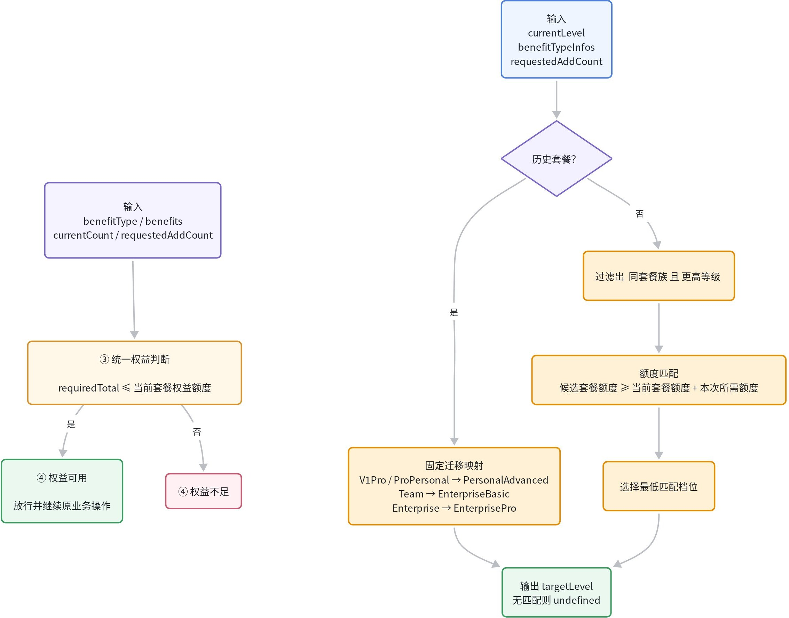
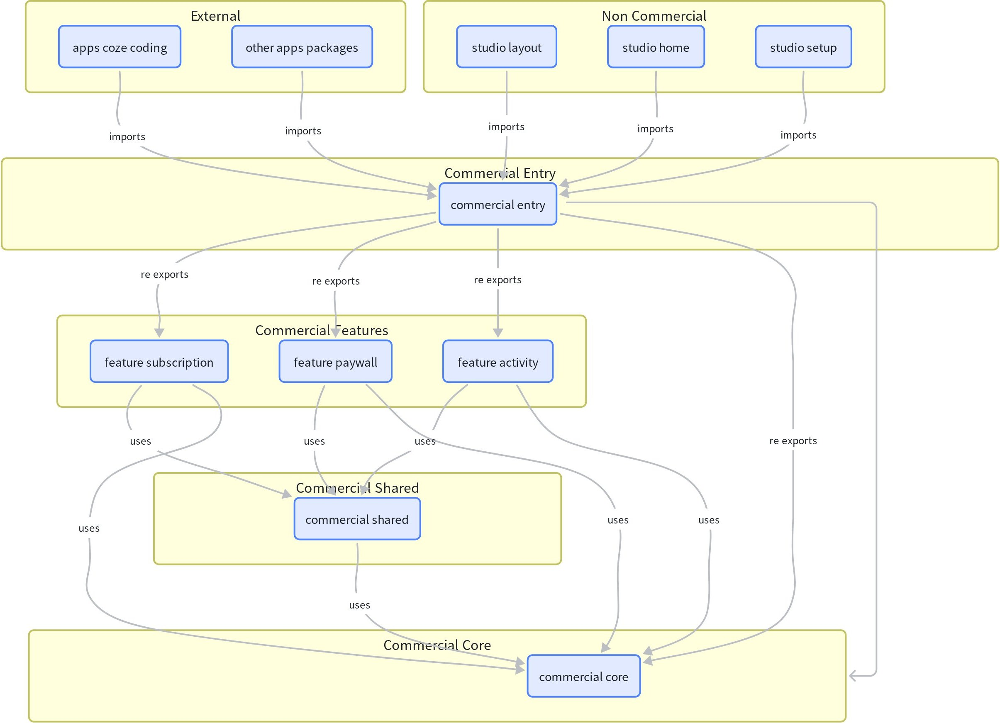

> 这是一份面向校招前端面试的深度技术准备与项目复盘文档。整合了字节跳动（扣子、TikTok）与星环科技三段实习的重点业务与技术基建，以及业余维护的 AI 工程化开源项目。文中涉及的需求、设计方案与追问复盘均保留了上下文供面试回顾使用。

---

## 1. 自我介绍

- 面试官您好，我叫冯鸿鑫，来自哈尔滨工业大学（威海）软件工程专业。在扣子、TikTok和星环科技有过三段前端实习经历。最近一段在扣子，主要做商业化相关业务以及Agent 工程化相关的东西：研发了 ProfilePilot 浏览器控制面、测试账号切换工具链 和内部一些 Agent Skills，完成了商业化域重构及扣子权益拦截能力建设。此前在 TikTok，当时把 一个 1400 多单元格表格的查看态到编辑态耗时从 10 秒降到了 1.8 秒；也做过 qiankun 与 Vite 的微前端兼容。业余时间我维护 Agent Snapshots 和 Open Token Board 两个 AI 编码工具项目。

---

## 2. 字节跳动·扣子实习

### 2.1 商业化权益能力建设

**背景：**

扣子进入商业化阶段后，需要在用户使用受限功能时进行权益拦截与付费引导。

**难点：**

1. **三端复用与扩展性**：Space、Coding 以及移动端存在相同的权益功能，如果继续在业务侧各自实现，会导致严重的逻辑冗余与维护成本；
2. **多维度的套餐推导逻辑**：单纯向上一档推荐往往无法满足用户新增的用量需求；个人版、团队版与企业版的权益形态各异，且必须向前兼容历史老套餐、向后兼容未来新增套餐；
3. **需求分散与链路协同**：商业化逻辑分散在 8 个具体的业务需求之中，且部分扩容信息无法由商业化后端统一提供，需要各业务方后端提供独立接口并在前端收口。

架构方案：

- **抽象出独立的能力**：统一的「权益拦截判断」与「套餐推导规则」，不依赖任何特定页面 UI，可直接供 PC 端、移动端多场景复用；
- **统一步骤调用契约**：调用方只需传入权益类型与本次操作的新增用量，后续的拦截判定、推荐套餐推导、付费墙文案组装及支付跳转全流程均由商业化统一处理。



#### 商业化权益 3.0 时序图

- **完整交互时序链路**：
  1. **触发拦截入口**：用户在业务界面中点击触发受权益管控的操作（例如新增协作者数量）；
  2. **契约化调用**：调用方调用商业化统一 Hook/方法 `useBenefitCheck(权益类型, 本次新增量, 当前使用量)`，只声明业务意图，不感知具体付费规则与套餐形态；
  3. **查询权益基准**：商业化侧向商业化后端发起请求，获取当前用户或企业主体生效的套餐等级、权益策略与额度上限；
  4. **返回套餐权益**：商业化后端返回最新套餐与权益元数据；
  5. **统一权益计算**：商业化侧在端侧执行统一判定公式：`当前使用量 + 本次新增量 ≤ 权益额度`，进入条件分支：
    - **分支 A [权益可用 · 未达上限]**：
    1. 商业化侧向调用方返回权益可用状态；
    2. 调用方放行操作，用户继续正常执行原业务流程。
     B [权益不足 · 拦截与动态推荐]**：
    3. **智能套餐推导**：商业化侧根据额度缺口，自动向后推导并推荐能满足本次新增量的目标套餐（避免盲目向上一档推荐导致升级后额度依然不足）；
    4. **弹出统一付费墙**：商业化侧直接唤起全局统一的权益拦截弹窗（拦截文案、权益对比均由商业化域集中管控配置）；
    5. **用户确认升级**：用户查看权益对比后在弹窗内点击确认升级；
    6. **唤起收银台支付**：商业化侧弹出专属支付弹窗，引导用户完成下单与支付；
    7. **支付回调与额度同步**：用户完成支付后，商业化侧接收支付成功回调，向商业化后端请求刷新并重新同步最新生效的权益额度；
    8. **放行并恢复业务**：商业化侧通知调用方权益已生效，调用方继续执行（或自动重试）用户最初触发的原操作。
      > **扩容类权益设计约束**：针对按量扩容类权益，其可用性由具体业务方后端自主判断，商业化侧仅收口统一的拦截弹窗与支付收银台流程，保持核心职责清晰。

---

### 2.2 扣子编程：部署 Trace 与分析

这是我入职第一周独立接手的第一个业务需求。

刚入职时，面对完全陌生的业务背景与代码库，我经历了人机协同方式的探索与转变：

起初我尝试过规范化的 Spec-Driven 开发模式，但在实际高频迭代中很快发现了其局限性：

- **Spec 文档极易过时**：业务需求在变、同事在合入代码，文档写完即脱离真实上下文，而过期的文档对 Agent 是严重干扰；
- **文档冗余且信息密度偏低**：生成的 Proposal、Design 和 Tasks 动辄上千行，人工逐行 Review 容易成为效率瓶颈；
- **产生「文档即交付」的错觉**：真正的集成问题（接口参数变动、存储时机差异）往往只有在真实运行时才能暴露。

在此之后，我调整了人机协同的工作流，形成了更加实用的协作闭环：

1. **方案与范围对齐（~80%）**：先与 Agent 对齐需求背景、职责边界和架构设计（哪些复用、哪些新建、归属哪个 Package）；
2. **定义验收标准并提供工具**：聊清核心交互流程，配备切换账号、数据 Mock 等工具让 Agent 自主执行验证；
3. **大任务拆分子会话**：复杂需求按模块拆分为多个独立 Session，主 Session 负责推进进度与统筹；
4. **自主编码与小步验证**：Agent 结合现有代码库与相关文档自主完成编码与自测，最后由人工进行兜底验证与微调。

---

### 2.3 商业化域代码组织结构重构

商业化能力最初分散在历史遗留包中，与大量非商业化代码混杂在一起，逐渐积累了严重的架构问题：

- **依赖方向倒置**：本应作为底层基础的 `subscription-common` 反向依赖了上层 UI 包 `subscription-paywall`；
- **缺乏统一对外出口**：外部业务方为了复用部分能力，不得不深路径引用内部实现文件；
- **公共能力缺乏收口**：付费墙导航等基础能力在各处被随意拼装，UI、领域逻辑和页面编排深度耦合。



我们确立了 **Feature-first + 分层依赖约束** 的架构方案：

1. **清晰的 4 层单向依赖结构**：自底向上划分为 `core`、`shared`、`feature`、`entry`，严格禁止跨层反向依赖，并配置 ESLint 规则进行自动化卡口；
2. **受控的对外出口（Entry）**：仅对外暴露经过抽象的 88 个 API，刻意杜绝 `export *` 通配导出，确保内部实现能够持续演进而不影响外部依赖；
3. **分批次平稳迁移**：先搭建新目录结构与依赖边界，再迁移共享基座，随后迁移核心业务流程，最后分批替换业务方引用并清理旧包。

本次重构共覆盖 **518 个逻辑变更文件**，收拢落地为 6 个子包，在业务高速迭代的同时实现了零故障平滑过渡。

---

### 2.4 Coze 测试账号切换工具链

在商业化开发与验证过程中，经常需要在不同权限与套餐的测试账号之间切换。过去依赖查表找账号、退出并重新登录，单次操作耗时通常在 2 分钟以上。

为了兼顾开发效率与安全性，工具链经历了三代方案演进：

- **第一代（Playwright 模拟点击）**：自动填写账号密码并点击界面，但遇到 UI 结构调整时极易失效，耗时且不稳定；
- **第二代（直接调用登录/退出接口）**：绕过了大部分 UI 交互，但需额外处理反爬动态签名，且遇到需要短信验证的企业主账号时无法直接完成；
- **第三代（UID 换取 Session Cookie 替换）**：通过后端服务直接使用目标 UID 换取合法 Session 并注入当前环境，大幅简化了操作链路；切回本人账号时，通过带有 `prompt=none` 参数的 Tab 跳转静默复用飞书登录态。

同时，工具链通过字节云与 Kani 实现了双重身份校验，确保测试账号与敏感 Session 的访问安全，并提供了 Chrome 插件与 CLI 双入口，完美支持人和 Agent 共同调用。

#### 账号切换工具链完整时序与交互流程

上述时序图梳理了工具链运行过程中的 7 个核心参与方以及「鉴权获取业务 Token」与「账号切换双路径」两大核心阶段：

- **阶段一：获取业务 Token（首次登录 / Token 失效时）**：
  1. **发起鉴权**：用户或 Agent 在 Chrome 插件中点击发起鉴权；
  2. **请求鉴权**：Chrome 插件向 Stone (插件后端)发送鉴权请求；
  3. **OAuth 授权重定向**：Stone 将请求重定向至 ByteCloud OAuth 授权中心；
  4. **弹出授权确认**：ByteCloud OAuth 向用户展示 OAuth 授权界面或确认提示；
  5. **确认授权**：用户使用企业员工账号确认授权；
  6. **返回身份凭证**：ByteCloud OAuth 向 Stone 返回员工身份凭证（OAuth Code 或 Token）；
  7. **校验业务权限**：Stone 向 Kani 权限服务发起请求，严格校验该员工在 Coze 内部的业务与项目权限；
  8. **鉴权通过**：Kani 确认该员工具备对应项目权限，向 Stone 前端返回通过结果；
  9. **签发业务 Token**：Stone 向 Chrome 插件签发带过期时间的受限业务 Token；
    > **安全约束**：插件端全流程仅持有受限业务 Token，不直接接触或持久化存储企业主账号等高危敏感凭据。
- **阶段二：账号切换与环境校验（双路径分支）**：
  - 用户或 Agent 在 Chrome 插件端选择目标操作：**切回本人账号** 或 **切换测试账号**。
  - **路径 A（切回本人账号 · 飞书静默无感复用）**：
    1. Chrome 插件控制浏览器当前标签页跳转至 Coze 页面，并在 URL Query 中显式携带 `prompt=none` 参数；
    2. Coze 宿主页面识别到该参数后，在前端直接静默复用宿主环境中当前活跃的飞书 SSO 登录态；
    3. 页面静默鉴权完成，无感恢复为开发者本人账号身份，全程无需二次输入账号密码。
  - **路径 B（切换测试账号 · UID 换取 Session 与 Cookie 热注入）**：
    1. 用户或 Agent 在插件列表中选择目标测试账号；
    2. Chrome 插件读取 Coze 页面当前已登录账号信息进行前置判断：
      - **分支 1（已是目标账号）**：若当前环境已处于目标测试账号下，插件直接提示操作完成，终止后续冗余网络请求；
      - **分支 2（非目标账号，执行 Cookie 换绑）**：
      1. **请求目标 Session**：Chrome 插件携带有效业务 Token，向 Stone 前端请求目标测试账号的 Session；
      2. **UID 换取 Session**：Stone 前端调用内部 Session 服务，凭借目标测试账号的 UID 换取合法可用的 Session 数据；
      3. **返回 Session 数据**：Session 服务生成有效 Session 并返回给 Stone 前端；
      4. **下发凭证**：Stone 前端将 Session 凭证回传给 Chrome 插件；
      5. **替换目标 Cookie**：Chrome 插件调用浏览器底层 `chrome.cookies` API，将 Coze 当前域名的 Session Cookie 原地原子替换为目标账号凭证；
      6. **页面刷新与三要素校验**：Chrome 插件触发 Coze 页面局部刷新，重新加载并严格校验 **当前账号、所属企业主体与权限套餐**：
        - **[校验一致]**：环境与权限矩阵完全匹配，提示 **「✅ 切换成功（耗时 &lt;10s）」**；
        - **[不一致 / Session 失效]**：若环境未对齐或凭证异常，提示 **「❌ 切换失败，提示重新授权」**。

---

### 2.5 通用 AI 工程化：ProfilePilot

开发自测过程中Agent操作浏览器是很重要的一环，所以评测了当时市面上比较流行的六款开源的浏览器自动化工具；

- **agent-browser**：无明显功能上的能力不足（原生支持 CDP 调试、网络层 Route/Mock 拦截、扩展特权页访问与登录态跨机持久化移植）；
- **playwright-cli**：无明显功能上的能力不足（原生全功能支持浏览器操作、网络层 Route 拦截、登录态存储恢复与 CDP 调试）；
- **Chrome DevTools MCP**：缺乏协议层网络拦截与 Mock 原语（无原生 Route API，只能在 JS 执行层做脚本降级拦截），且强绑定本地特定 `userDataDir`，登录态与会话状态无法跨机导出与移植；
- **bb-browser**：无法访问 `chrome://` 等浏览器特权页与扩展配置页，原生缺乏网络层 Route/Mock 拦截原语，且自身不支持登录态的保存与导出恢复（无 state save/load，无法持久化产出状态）；
- **@chrome（Codex 插件）**：受宿主安全策略收口，进不了特权页与扩展 options 设置页，缺乏可靠的运行时网络 Route，且无法显式证明与绑定指定 CDP 端口（仅限默认 Profile）；
- **@browser（Codex 内置）**：作为 in-app browser 完全无法继承系统浏览器的真实登录态（免登硬前提不满足），缺乏底层调试与诊断面，不支持文件上传与网络拦截。

在商业化拦截与支付流程中，大量场景必须由 Agent 在真实登录态下操作页面完成验证，而支付环节又需要人工介入。除了上述各自的功能短板外，现有工具更普遍无法解决「开发者与 Agent 抢占同一个 Chrome 窗口与焦点」 和 复制有相同登录态和插件的Profile的核心痛点。

#### ProfilePilot 双核技术架构解析（架构文字版）

ProfilePilot 采用「左翼可编程 Agent 协同控制面」与「右翼本机优先 Profile 数据管理面」的双核解耦架构，兼顾多 Agent 并发驱动的受控自动化能力与开发者本地真实浏览器资产的无损管理：

##### 一、左翼 · 可编程 Agent 协同控制面 (Control Plane)

> 核心定位：实现无感透明拦截、独占租约分发、受控 CDP 指令管道及运行时人机无缝协作。

1. **第 1 层：接入与命令透明拦截层 (Access &amp; Transparent Interception)**
  - **调用端支持**：广泛兼容外部 Agent 与主流测试框架，包括 Claude Code CLI、Codex CLI、Jest、Playwright、Puppeteer 以及各类 E2E 自动化测试脚本；
  - **透明拦截器与零侵入注入**：在系统环境层（`~/.zshenv` 等）自动静默注入环境变量 `AGENT_BROWSER_SESSION=cc-xxx`，使外部 Agent 具备原生零感知调用能力，命令行无需手动显式添加 `--session`；
  - **智能命令包装 (Wrapper)**：CLI 包装层拦截所有原始命令，提取会话特征，自动向 Gateway 申请独占租约并换取一次性安全凭证（Ticket）。
2. **第 2 层：Browser Gateway 控制中枢 (租约权威、安全鉴权与受控 CDP 路由核心)**
  - **❶ 租约与并发管理中枢 (Lease &amp; Concurrency Authority)**：
    - **端口与 Session 原子独占绑定**：每个已启动 Profile 端口同一时刻仅承载一个 Agent 独占租约，严格保障上下文独立；
    - **候选池自动切流**：当目标 Profile 处于占用状态时，Gateway 自动调度候选空闲 Profile，杜绝命令因端口冲突而报错抛出；
    - **抢占互斥保护**：从根本上解决多 Agent 或开发者在同一浏览器窗口争抢焦点与键鼠输入的冲突难题。
  - **❷ 安全鉴权与票据引擎 (Ticket &amp; Security Engine)**：
    - **HMAC-SHA256 一次性票据 (Ticket)**：每次建立 CDP 连接前必须由 Gateway 进行高强度签名签发，防止伪造与越权访问；
    - **15 秒短 TTL 与防重放保护**：Ticket 仅允许在极短握手窗口内消费一次，消费即作废，防止调试链接泄露导致重放攻击；
    - **控制代次锁 (Generation Guard)**：每次接管或租约流转均单调递增代次计数，精准阻断网络滞后或失效长连接的幽灵指令穿透。
  - **❸ 受控 CDP 管道与策略代理 (Policy &amp; Dedicated Pipe Proxy)**：
    - **设备与视口虚拟化**：按需动态注入 Device/Viewport Emulation，确保跨端与响应式测试环境的高保真与一致性；
    - **长连事件缓冲与转发**：Agent 驱动通过独立 WebSocket 接入，经 Gateway 安全校验后通过专用管道（Dedicated Pipe）单向安全转发至浏览器。
  - **❹ 会话追踪与人机接管状态机 (Session Tailer &amp; Takeover State Machine)**：
    - **会话日志增量 Tailer**：实时监听 Claude `.jsonl` 与 Codex `rollout-*.jsonl` 增量日志，毫秒级提取自然语言动作与进度状态；
    - **四态状态机流转**：定义 `active`（正常执行） ⇄ `parked`（挂起缓冲） ⇄ `takenOver`（彻底接管） ⇄ `resumed`（交还执行）的严密生命周期；
    - **Park 挂起协同**：当开发者需介入微调页面时保持 WebSocket 长连接，将指令事件排队暂存，交还时唤醒 Agent 重新获取页面最新快照；
    - **Takeover 强接管**：一键优雅终止 Agent 驱动 daemon 进程，目标 Chrome 窗口保持开启不关闭，实现向人类开发者的无缝转交。
3. **第 3 层：页面级人机协同注入 (In-Page Agent Overlay)**
  - **CDP 原生静默注入**：通过底层 `Page.addScriptToEvaluateOnNewDocument` 注入悬浮控制条，跨页面导航持久存在，无需用户手动安装任何 Chrome 扩展；
  - **Closed Shadow DOM 隔离**：组件样式与 DOM 树完全封装于 closed 容器内，彻底杜绝宿主网页自身的全局 CSS/JS 干扰状态条渲染；
  - `**aria-hidden="true"` 降噪设计**：阻止 Agent 的 Accessibility 辅助功能快照将状态条误扫为正文内容，终结 Agent 与状态条自身死循环自交互；
  - **实时进度与意图流显现**：实时展示当前主会话 Agent 名称、正在执行的动作（如“正在填写验证码”）与已完成步骤进度（如 `2/5`）；
  - **双击二次确认接管**：提供「暂停」与「接管」快捷交互，内建 3 秒防误触二次确认逻辑，通过 `Runtime.addBinding` 双向可靠上报控制信号。
4. **第 4 层：运行时受控 Chrome 实例 (Controlled Chrome Runtime &amp; Pipe Driver)**
  - `**--remote-debugging-pipe` 专用独占通道**：采用 Stdio 独占管道替代常规 TCP 调试端口，本机对外不暴露任何可探测网络端口，杜绝公网/内网恶意渗透风险；
  - **多维度探活与端口兜底机制**：集成 `lsof` 进程探测与轻量级 CDP 探活徽章；自动兼容解析 Chrome 144+ 新增的 `DevToolsActivePort` 规范，杜绝 404 失联；
  - **优雅退出 (Graceful Exit) 保留登录态**：关闭或回收 Profile 时优先发送系统级优雅退出指令（macOS `⌘Q` / `SIGTERM`），严禁暴力 kill 进程；留足磁盘 I/O 窗口让 SQLite（`Cookies`）与 LevelDB（`LocalStorage`）正常合并刷盘，根治“一关浏览器就掉登录态”的行业痛点；
  - **外部实例 (External Chrome) 兼容接管**：自动嗅探并以只读方式发现第三方工具启动的 Chromium 实例，提供统一的置顶唤起与安全关闭能力。

---

##### 二、右翼 · 本机优先 Profile 数据管理面 (Data Plane)

> 核心定位：管理本地 Chrome 真实数据资产，突破跨平台系统级加密壁垒，实现精准置顶与沙箱生命周期控制。

1. **第 1 层：桌面交互与运维控制台 (Desktop Management Console - Electron Native)**
  - **原生 TypeScript 极简控制面板**：摒弃重型前端框架，实现启动秒开与极轻量内存开销；提供 Profile 列表、运行状态徽章、端口分配全局监控；支持 Mini 悬浮小窗模式与 Live View 页面实时窥见；
  - **运维向导与资产调度**：支持一键创建独立测试 Profile 并绑定固定 CDP 调试端口；内置插件迁移向导（自动扫描 Chrome Web Store 与本地已解包扩展）；提供账号会话无损同步（支持差异比对、暂停、取消与一键克隆）。
2. **第 2 层：跨平台窗口台前激活引擎 (精准置顶特定 Profile 窗口 · 终结多实例串台痛点)**
  - **多实例激活难题**：当操作系统同时运行多个相同 bundle（如多个 `Google Chrome.app` 或相同 `chrome.exe`）时，常规系统 API 极易发生错误路由与跨实例串台；
  - **三层递进激活策略**：
    - **① 第一层 · 协议级无副作用置顶**：若 Profile 运行着调试端口，首先发送 CDP `Page.bringToFront` 命令，无侵入尝试聚焦页面；
    - **② 第二层 · 系统级原生轻量激活**：调用 macOS AppleScript 或 Win32 `SetForegroundWindow`。若确认目标 PID 已处于系统最前台则直接完成；
    - **③ 第三层（终极杀手锏）· Chrome 单例握手置前 (Singleton Handshake)**：向目标实例专属目录再次触发轻量启动命令，检测到 `SingletonLock` 后由 Chrome 内部 IPC 握手转交当前实例自我置顶；
    - **消除握手副作用 (Clean NTP)**：置顶前提前记录已有标签页快照，单例握手置顶后自动通过 CDP 关闭新弹出的空白新标签页（NTP），实现无感平滑置顶。
3. **第 3 层：跨平台账号会话无损同步 (Account &amp; Session Sync · 破解 OS Crypt 密钥藩篱)**
  - **精细化数据颗粒度与智能缓存清洗 (Data Sanitation)**：
    - **同步的核心资产**：精细化同步 `Cookies (Network/Cookies SQLite)`、`Local Storage (leveldb)`、`Session Storage` 与 `IndexedDB`；
    - **剥离污染源**：严格保留目标 Profile 既有扩展，不盲目复制来源插件以防污染安装记录（保护 `Secure Preferences`）；
    - **清洗巨型脏缓存**：自动过滤数 GB、数万个零碎文件的 `CacheStorage`，根治 Windows 平台启动扫描卡死的严重性能缺陷。
  - **⚡ 操作系统底层加密差异机制 (OS Cryptography Mechanism)**：
    - **🍏 macOS 平台机制（系统级钥匙串集中鉴权 Chrome Safe Storage）**：
      - 凭据加密基于当前 macOS 用户登录会话统一的 `Keychain` 钥匙串项，解密不严格限定物理文件路径；
      - 原生系统 Profile 拷贝至隔离测试 Profile 后，浏览器依然能正常读取当前用户钥匙串解密 Cookies；
      - **成果**：原生实现从系统默认 Chrome 无缝复制完整登录态至独立测试环境。
    - **🪟 Windows 平台机制（App-Bound Encryption 保护藩篱与 DPAPI 副本突破）**：
      - **Chrome 127+ 应用绑定加密**：主加密密钥存储于 `app_bound_encrypted_key`，由 Windows 提权服务进行调用方二进制校验；
      - **原生系统 Profile 无法直接跨目录复制**：由于密钥强绑定原生默认目录，直接拷贝到自定义目录会导致解密失败（防护搬运设计）；
      - **ProfilePilot 隔离 Profile 间克隆突破**：独立隔离实例采用 DPAPI 密钥（`os_crypt.encrypted_key`）；
      - **成果**：ProfilePilot 在隔离副本间精准提取并原子同步 DPAPI 密钥，**实现隔离测试环境间 100% 完整无损克隆**！
4. **第 4 层：本机存储资产与隔离沙箱 (Storage Sandbox &amp; Disposable Clean-Room)**
  - **Chrome 原生 Profile 目录体系**：自动解析 Chrome `Local State`，精准识别日常在用的 `Default` 与 `Profile 1..N` 目录；对主力主账号设置删除保护卡口，禁止误删；
  - **独立测试沙箱 (`--user-data-dir` 物理隔离)**：为每个测试或 Agent Profile 建立独立物理目录，彻底隔绝与日常主力浏览器的数据、缓存与 Cookie 交叉污染；
  - **用完即弃副本池 (Disposable Clean-Room Pool)**：支持一键拉起“一次性克隆”，保留源 Profile 最新登录态；进程退出或窗口关闭后由主进程 Reaper 自动移入废纸篓彻底销毁，确保每次自动化测试均从绝对干净一致的基线开始；
  - **覆盖前自动安全快照 (Pre-sync Snapshot)**：在任何账号同步或扩展覆写执行前，后台自动创建轻量增量备份快照，支持随时秒级一键回滚防意外。

---

##### 三、核心跨切面业务协同流线

- **🔵 透明调度流**：Agent 无感调用 ➔ Wrapper 拦截解析 ➔ Gateway 原子独占绑定空闲 Profile ➔ 签发 15 秒一次性短 TTL Ticket；
- **🟣 受控 CDP 流**：Daemon 携票建立长连握手 ➔ 策略卡口过滤高危命令 ➔ 专属 Pipe 管道单向安全转发驱动浏览器；
- **🟠 人机接管流**：Shadow DOM 悬浮条双击接管 ➔ Park 状态排队暂存事件 ➔ 单例 IPC 握手置顶并无感关闭空白标签页 (Clean NTP)。

---

#### ProfilePilot 多 Agent 调度与受控 CDP 通信时序解析（时序图文字版）

该时序图完整刻画了多 Agent 并行执行时，从会话环境注入、Profile 租约原子绑定、Ticket 防篡改鉴权，到受控 CDP 指令管道转发与任务释放的闭环生命周期：

- **完整交互时序链路**：
  1. **环境凭证注入**：环境层在子 Shell 启动时自动注入环境变量 `AGENT_BROWSER_SESSION=cc-xxx`，Agent 零感知无需手动指定会话 ID；
  2. **Agent 发起命令**：Agent 在终端执行 `agent-browser --cdp 9223 open ...`（命令行无需显式携带 `--session` 参数）；
  3. **本地参数解析**：Wrapper 拦截命令，提取出环境变量中的 `session=cc-xxx` 与请求的目标端口 `requestedPort=9223`；
  4. **向 Gateway 申领租约**：Wrapper 调用 `acquire(requestedPort=9223, session, autoSwitch=true)`；
  5. **Profile 匹配与排他决策**：Gateway 查询所有 Profile 实时状态与候选备用配置，进入排他判定：
    - **分支 1 [目标 Profile 空闲]**：Gateway 原地原子绑定 `9223 ↔ cc-xxx`；
    - **分支 2 [目标 Profile 被占用，且有可用候选]**：Gateway 自动无缝切换并原子绑定空闲候选 Profile（无需打断用户弹窗确认）；
    - **分支 3 [目标 Profile 被占用，且无可用候选]**：Gateway 返回 `PROFILE_ALREADY_IN_USE` 错误阻断执行，防止多个 Agent 抢占损坏同一浏览器上下文。
  6. **按需以管道模式拉起（选中的 Profile 未启动时）**：Gateway 本地 spawn 启动 Chrome 进程，显式传入 `--remote-debugging-pipe` 进行进程级独占通信（机器对外无开放明文调试端口，防外部偷窥与篡改）；
  7. **下发 Ticket 与连接凭据**：Gateway 建立租约后，向 Wrapper 返回 `chosenProfile`、一次性高防 Ticket 与专属长连接 `wsUrl`；
  8. **Daemon 连接握手**：Wrapper 启动或复用后台 Daemon 进程；Daemon 携带 Ticket 向 Gateway 发起 WebSocket 握手；Gateway 校验 Ticket 的数字签名、有效期与防重放标识；
  9. **受控 CDP 消息转发循环（每条 CDP 指令）**：
    - Wrapper 将具体执行指令交给 Daemon；
    - Daemon 向 Gateway 发送原始 CDP 请求报文；
    - Gateway 严格核验该连接的 Session 控制权与当前控制代次（Generation 状态机）；
    - 校验通过后，Gateway 通过专用管道（Dedicated Pipe）向真实 Chrome 实例安全转发指令并返回结果。
  10. **人工接管与恢复机制（Park / Resume）**：
    - **用户接管**：触发 `park`，系统保持底层 WebSocket 长连不断，暂停并拦截 Agent 后续发来的操作，同时在内存中暂存浏览器推送事件；
      - **交还控制**：人工处理完成后触发 `resume`，唤醒 Agent 并要求其重新截取快照（DOM/Accessibility Tree），从最新状态无缝继续执行。
  11. **任务收尾与租约释放**：
    - **分支 1 [正常完成]**：Agent 执行 `agent-browser profilepilot complete`；
      - **分支 2 [中途放弃]**：Agent 执行 `agent-browser profilepilot release`；
      - Wrapper 最终通知 Gateway 销毁本次会话并释放目标 Profile 租约（供下一任务借调），随后安全结束 Daemon 进程。

**产出成果**：支持日常并行运行 3 个独立的 Agent 浏览器 Session，实现多需求并行开发与自动化验证。

---

## 3. 字节跳动·TikTok 商业化实习

### 3.1 SIM 编辑态大表格性能优化

这个表格服务于 TikTok 商业化 CRM 的季度销售业绩核算。查看态是 79 行 × 12 列的树形表格，约 1000 个单元格；点击进入编辑态后展开至 79 行 × 18 列，达到约 1400 个编辑单元格，并伴随复杂的跨行跨列计算、字段校验与业务联动。

**原始性能瓶颈与排查定位**：

线上销售团队反馈：从点击“进入编辑”到页面下一帧渲染可见（interaction-to-next-paint），耗时高达 **10 秒以上**；且编辑态下在任意单元格打字输入时，存在近 **1 秒的严重卡顿与输入延迟**。

通过 Chrome Performance 面板、React DevTools Profiler 以及控制变量的替换实验逐步定位根因：

1. **全量 Form.Item 注册与同步渲染瓶颈**：原方案在每个编辑单元格内都包裹了类似 Ant Design 的 `Form.Item`。点击编辑瞬间，1400 个表单项在同一个宏任务中同时实例化、向 Form 实例注册字段与校验规则、初始化受控组件并挂载，导致浏览器主线程被长任务（Long Task）彻底占满；
2. **Context 穿透导致全表 1400 单元格连锁重渲染**：初版尝试剥离 Form 后，使用 React Context 管理整表数据与 dispatch。耗时虽然降到了约 5 秒，但用户在任意单元格键入一个字符，Context Provider 的 value 发生引用变更，导致消费该 Context 的 1400 个单元格全部触发重新渲染；且因为 Context 变动直接穿透了 `React.memo`，依然造成严重打字卡顿；
3. **视口外非活跃单元格同步挂载重型组件**：大量尚未滚入视口的树形嵌套子行也同步挂载了复杂的 Select、DatePicker，且大体积字典 options 同步加载。

为了在支持多单元格连续修改、批量提交的同时实现极致性能，我设计了**数据源与视图协调彻底解耦（Mutable Ref + 单元格级发布订阅）**的架构方案：

- **Ref 维护草稿数据，解耦数据更新与 React 协调机制**：
  - 整张表格的草稿状态（Draft State）统一保存在 Mutable Ref 中，单元格输入时仅同步写入 Ref 内部数据，不触发 React 协调流程（Reconciliation），更新函数引用保持稳定；
  - 统一提交时一次性从 Ref 中提取整表最新快照进行批量业务校验与网络提交，彻底避免单格频繁保存引发的接口风暴与复算弹窗干扰。
- **基于 EventEmitter 的单元格级局部发布订阅**：
  - 每个单元格组件根据其字段唯一标识（`fieldKey`）订阅局部更新事件通道；
  - 输入时仅向事件中心发布对应字段的局部通知，只有当前被编辑的单元格以及确实受该字段联动影响的目标单元格触发 re-render，将更新范围从 1400 格精准收敛至 1~2 格。
- **分治渲染与按需挂载削峰**：
  - **分页治理**：默认引入每页 25 行分页，首屏挂载体量直接削减约 70%；
  - **占位懒加载**：视口内非聚焦单元格先渲染轻量级文本占位，点击激活时再动态挂载重型 Input / Select；
  - **字典按需加载**：大体积下拉选项数据改为聚焦时按需懒加载，并增加平滑切换过渡 loading 状态。

```
【原架构：全表 Context 穿透】
单元格输入 -> Context Provider Value 改变 -> 穿透 React.memo -> 1400 个单元格全部 Re-render (输入卡顿 1s)

【优化架构：Ref 草稿 + 单元格发布订阅】
单元格输入 -> 写入 Mutable Ref (无协调) -> EventEmitter 触发 fieldKey 事件 -> 仅当前单元格/受联动格 Re-render (精准 1~2 格更新)
```

**产出成果**：

- 切换编辑态耗时从 **10 秒骤降至 1.8 秒**，整体交互性能**提速约 82%**；
- 彻底消除了单元格输入时的丢帧与打字延迟，达到稳定 60fps 流畅交互；
- 建立了严谨科学的线上度量口径：在点击编辑时记录 `performance.now()`，渲染就绪后利用 `requestAnimationFrame` 记录下一帧可见时间（interaction-to-next-paint），线上埋点同口径对比验证。

**核心思考与面试深度追问复盘**：

- **追问 1：为什么 `React.memo` 无法阻断 Context 变化引发的重新渲染？**
`React.memo` 只能通过浅比较拦截由父组件传来的 `props` 变化。当组件内部使用 `useContext` 消费 Context 时，只要 Provider 的 `value` 引用改变，React 就会直接将该组件标记为 dirty 并安排重新渲染，根本不经过 `memo` 的拦截逻辑。只有将状态移出 Context（如使用 Ref）并配合发布订阅，才能真正实现精准的局部更新。
- **追问 2：为什么不直接采用虚拟列表（Virtual List）？**
该核算表格具有树形展开/折叠嵌套结构、动态行高、复杂联动以及通过键盘 Tab 键快速在单元格间连续切格录入的诉求。直接上虚拟列表不仅改造成本与回归风险巨大，还会破坏原生的 Tab 焦点流转、输入框焦点保持以及原生平滑滚动。在 1400 格量级下，通过状态模型细化 + 分页懒加载已经完全达成 1.8 秒的性能要求，是性价比最高的工程权衡。

---

## 4. 星环科技实习

### 4.1 qiankun 微前端基础设施与 Vite 子应用兼容

在星环科技推进微前端基础设施建设，基于 qiankun 构建企业级微前端基座，聚合多个异构子业务系统。Webpack 子应用通过 UMD 打包接入相对成熟，但随着现代前端推进，新型子应用全面切换至 Vite 后，遇到了传统微前端脚本执行模型与现代化原生 ESM 开发范式的根本性冲突：

**技术挑战与底层架构冲突**：

1. **执行沙箱与原生 ESM 的底层冲突**：qiankun 底层依赖 `import-html-entry` 抓取子应用静态资源，将其放置在由 Proxy 代理的全局 `window` 沙箱中通过普通 `eval` 执行。但 Vite 在开发环境下保留了浏览器原生 ESM（`import/export`），而在非 `type="module"` 的普通脚本沙箱中直接执行 ESM 会立即抛出语法错误（`SyntaxError: Cannot use import statement outside a module`）；
2. **生产构建与开发体验严重割裂**：如果强行把 Vite 生产产物配置为 UMD/IIFE 格式，不仅开发环境依然无法享受极速热更新（HMR），而且 Rollup/Vite 对 UMD 格式不支持代码分割（Code Splitting），导致所有子路由都打入单文件，严重损害首屏加载性能；
3. **缺乏运行时 publicPath 与静态资源跨域错位**：Vite 不具备 Webpack 的动态运行时 `__webpack_public_path__`。子应用被主应用基座挂载后，图片、字体等相对路径资源默认会以主应用的 Origin 寻址，导致大量静态资源请求打到主应用端口报 404 错误。

针对上述冲突，我探索并落地了以 `**vite-plugin-qiankun` 为核心的生命周期适配 + 静态资源双轨寻址** 的完整工程解法：

- **基于 `vite-plugin-qiankun` 的生命周期与沙箱桥接**：
  - 在开发模式下通过插件向子应用代码注入轻量包装层，在保留 Vite 原生 ESM 极速 HMR 体验的同时，将子应用的生命周期钩子（`bootstrap`、`mount`、`unmount`）挂载到独立作用域，使其能够被 qiankun 识别与调度；
  - 代理子应用全局变量，实现与 qiankun 内部沙箱的平滑对接。
- **静态资源双轨制寻址策略**：
  - **开发态（`server.origin`）**：配置 Vite 的 `server.origin` 参数，强制开发服务器在编译资源时，将生成的静态资源 URL 统一指向子应用本地开发端口，解决主应用挂载时的资源寻址错位；
  - **生产态（`base`）**：通过 CI/CD 构建流水线注入对应的 `base` 路径（结合 CDN 地址），保证静态资源在多环境部署时拥有绝对可信的公共前缀；
  - **特殊资源兜底**：针对开发阶段仍难以自动寻址的内联图片资源，开发针对性 Vite 插件在构建阶段自动将其转为 base64 内联，消除路径解析歧义。
- **主子路由联动与内存泄漏防护**：
  - 规范主子应用路由前缀契约，主应用基于路径前缀分发子应用，子应用配置对齐的 `basename`；通过自定义事件同步浏览器前进/后退历史；
  - 在子应用 `unmount` 生命周期中，严格执行卸载清理：解绑全局事件监听器、清理未完成的定时器与网络请求，并移除 DOM 容器残留，防止跨应用内存泄露。

```
【主基座与 Vite 子应用加载流】
qiankun (import-html-entry) 
  -> vite-plugin-qiankun 桥接协议暴露 (bootstrap / mount / unmount)
  -> 开发态: server.origin 定位本地端口; 生产态: base 统一公共前缀
  -> 独立挂载容器 + 路由联动 (basename) + unmount 深度资源卸载
```

**产出成果**：

- 成功解决了 qiankun 传统沙箱与 Vite 原生 ESM 的兼容难题，打通了跨 Webpack / Vite 多技术栈子应用的无缝集成与秒级平滑切换；
- 沉淀了团队内部微前端接入规范文档与样板脚手架，后续新系统接入周期从数天缩短至半天以内。

**核心思考与面试深度追问复盘**：

- **追问 1：为什么不能把生产打包成 UMD 作为标准方案？**
UMD 方案只能覆盖生产构建，开发环境仍然无法调试；同时 UMD/IIFE 格式不支持 ESM 的动态代码分割（Code Splitting），导致所有异步路由和按需组件都打包进主包，牺牲了大型应用的加载性能；此外也未解决 Vite 运行时 publicPath 的动态寻址问题。
- **追问 2：`server.origin` 与 `base` 在微前端静态资源处理中的本质区别？**
`server.origin` 是 Vite 开发服务器的专属配置，用于在开发阶段让所有动态引用的资源 URL 强制附带子应用自己的域名端口（`http://localhost:port`）；而 `base` 是生产构建时的资源前缀配置，决定了构建产物中所有静态引用（CSS 中的 url、HTML 中的 script/link）的根路径。两者分别负责开发态与生产态，不可互相替代。

---

## 5. 开源与 AI 工程化项目

### 5.1 Agent Snapshots：Codex / Claude Code 本地会话知识库

Agent Snapshots 是一个的 AI Coding 会话资产管理器与工作记忆入口，致力于将散落在本机各处的异构 JSONL 日志转换为可快速检索、安全脱敏分享、并能随时回到原会话继续工作的个人知识库。

**背景与痛点**：

在日常深度使用 Codex 与 Claude Code 进行代码开发后，本地积累了大量高价值的会话与排错轨迹。但原始日志面临三大痛点：

1. **日志异构与碎片化**：不同 Agent 工具的日志存储路径、事件格式、Token 统计字段各不相同，缺乏统一视角查看和复盘；
2. **严重的隐私与安全风险**：日志中混合了大量的 API Token、Session Cookie、内网域名、本机文件绝对路径以及工具执行输出，直接共享原始日志会产生极大的信息泄露风险；
3. **只读孤岛与工作流割裂**：传统归档工具仅支持静态查看，无法让开发者基于历史会话一键回到当时的终端上下文继续交互。

**核心方案设计与系统架构**：

- **无依赖领域模型层（`agent-session-core`）**：
  - 抽离出零运行时依赖的独立包，统一将 Codex 和 Claude Code 的日志文件归一化为标准化时间线（包含 message、tool call、tool result、token usage、compaction 等结构化事件）；
  - 抽象了 Codex 累计 Token 快照向增量事件流转换的算法，精准识别会话 reset 与上下文压缩；该核心库被 Open Token Board 直接复用，从源头避免不同工具口径漂移。
- **双层搜索与本地语义检索（Local-first）**：
  - **全文关键词搜索**：基于 SQLite FTS5 trigram 分词建立本地文档索引，毫秒级响应中文模糊关键词与代码错误堆栈检索；
  - **本地向量语义搜索**：将长会话按 chunk 切分，调用本地运行的 Ollama 模型生成 embedding，使用余弦相似度计算匹配度；全流程数据不出本机，兼顾智能化检索与极致隐私保障。
- **单源规则的敏感信息脱敏闸门**：
  - 统一梳理高危规则字典（私钥、JWT、Bearer Token、GitHub/OpenAI API Key、Session Cookie、内网域名、Home 路径等）；
  - 前端“风险提示标记”与导出时的“敏感数据正则替换”强绑定同一套规则引擎，彻底杜绝“检测报警但导出漏脱敏”的规则漂移风险。
- **可逆续接的开发闭环（Session 恢复）**：
  - 归一化持久化记录会话的 engine、session ID 以及工作目录（cwd）；
  - 触发“继续会话”时，优先检测系统内是否已有对应的活动终端；若有则平滑切换，若无则在对应的 cwd 目录自动拉起 `codex resume <id>` 或 `claude --resume <id>`，让历史会话重新接驳至生产力。

```
【本地会话处理闭环】
本地 JSONL 日志 (Codex / Claude Code) 
  -> agent-session-core 归一化时间线与增量事件
  -> SQLite FTS5 全文索引 + Ollama 本地向量语义索引 (余弦相似度)
  -> 单源敏感数据脱敏闸门 (私钥 / Token / 路径) -> 安全导出
  -> Session 可逆续接 (codex resume / claude --resume)
```

**产出成果**：

- 核心解析库 `agent-session-core` 成为 AI 工具链的核心底层组件，供知识库与用量平台多场景复用；
- 本地知识库支撑个人日常数百个复杂会话的高性能检索与离线安全管理，大幅提升了长周期需求排查与历史上下文恢复的效率。

**核心思考与面试深度追问复盘**：

- **追问 1：全文搜索与本地语义搜索分别适用于什么场景？**
全文搜索适合记忆中存在明确关键词（如特定报错信息、类名、函数名）的场景，响应速度极快且结果绝对精确；语义搜索适合只记得“当时聊过的大致问题或业务方案”，但想不起具体用词的模糊意图召回。两者结合才能覆盖完整的代码与会话回忆场景。

---

### 5.2 Open Token Board：AI 编码用量与额度平台

Open Token Board 是一个支持自托管的 AI 编码用量与额度分析平台。本机 Agent 读取 Codex、Claude Code、Gemini CLI 等工具的日志，经过归一脱敏后可靠上报，服务端提供多维度排行、额度预警、burn rate 趋势分析与飞书战报。

**核心工程挑战**：

项目最核心的技术难点不是前端图表开发，而是在分布式、不可信网络环境下实现**数据可信**与**并发上报的一致性**：

1. **异构工具的日志口径难以对账**：不同工具的 Token 字段各异（prompt / completion / cache read / cache write），且累计语义与增量语义并存；
2. **弱网重试与重复扫描导致的数据翻倍**：本机 Agent 定时执行，网络抖动重试或多目录软链接扫描极易造成 Token 重复统计；
3. **全量重同步的原子性安全**：用户选择全量重新同步历史时，传统的“先删后插”一旦发生网络中断，将导致线上历史数据永久丢失。

**核心方案设计与系统架构**：

系统划分为 **本机采集 Agent、API 网关鉴权、PostgreSQL 存储、Web 可视化产品** 四层解耦架构：

- **两层幂等设计（彻底杜绝数据翻倍）**：
  - **本地采集层**：通过 checkpoint 水位记录优化扫描性能，按设备号（device）与 inode 去重同一物理文件的多路径引用；
  - **服务端存储层**：基于 `agent-session-core` 为每个事件生成唯一的稳定事件键（`tool:sessionId:eventId`），PostgreSQL 建立强主键约束并配合 `ON CONFLICT DO NOTHING`，从物理层确保任意重试与重复上报都不会导致计数漂移。
- **两层原子性设计（Staging + DB 事务的全量安全替换）**：
  - **网络传输层（三阶段握手）**：`start`（声明预期事件数与文件清单 SHA256 指纹） -&gt; `append`（分批上报暂存至 staging 临时表） -&gt; `commit`（核验总条数与指纹一致性）；
  - **数据库执行层**：仅当数据完整到达且校验通过后，在单一 PostgreSQL 事务中执行“删除旧数据 + 从 staging 批量转移至正式表”，任何一步失败均触发 rollback，旧数据完好无损。
- **用量消耗与订阅额度双轨建模**：
  - **用量模型**：按时间窗口聚合 Token 净消耗量，精确核算真实成本与使用习惯分布；
  - **额度模型**：独立捕捉订阅的时间窗口剩余比例（如 5 小时滑动窗口或周重置额度），结合实时消耗速率（burn rate）预测耗尽时间点，并在额度偏低时通过飞书机器人提前预警。

```
【四层数据对账与一致性链路】
本机日志 (Codex/Claude Code) 
  -> 本地 agent (inode去重 + agent-session-core归一 + checkpoint)
  -> API 鉴权网关 (GitHub OAuth + 稳定事件键生成 + 数据清洗)
  -> 存储层 (两层幂等 ON CONFLICT + 两层原子性 Staging/事务 + PostgreSQL SQL聚合)
  -> 产品表现层 (用量大屏 / 5小时额度预测 / 飞书群战报与低额度预警)
```

**产出成果**：

- 统一了多种异构 AI 编码工具的统计口径，实现了千万级 Token 的零误差幂等对账；
- 平台长期稳定支撑个人与好友团队的 AI 编码消耗监控，日/周报自动推送至飞书群，有效提升了团队用量规划与额度预警能力。

**核心思考与面试深度追问复盘**：

- **追问 1：既然有了三阶段上传（`start/append/commit`），为什么还需要数据库事务？**
两者解决不同维度的原子性：Staging 解决的是不可靠网络传输期间的数据完整性问题，避免因为网络异常中断导致只写入了部分数据；而数据库事务解决的是版本正式替换瞬间的数据一致性问题，防止在旧数据删除后、新数据尚未完全写入期间出现脏读或数据丢失。

