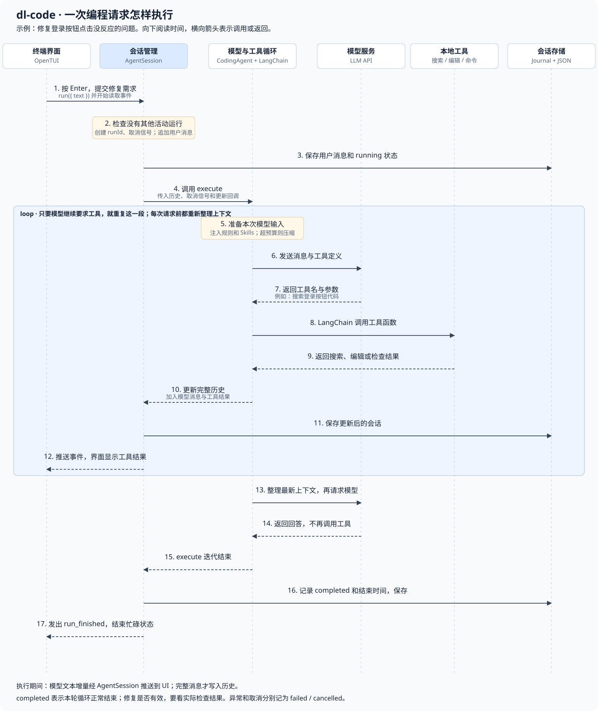

> 这是一份面向校招前端面试的深度技术准备与项目复盘文档。整合了字节跳动（扣子、TikTok）与星环科技三段实习的重点业务与技术基建，以及业余维护的 AI 工程化开源项目。文中涉及的需求、设计方案与追问复盘均保留了上下文供面试回顾使用。

---

## 1. 自我介绍

- 面试官您好，我叫冯鸿鑫，来自哈尔滨工业大学（威海）软件工程专业。在扣子、TikTok和星环科技有过三段前端实习经历。最近一段在扣子，主要做商业化相关业务以及Agent 工程化相关的东西，技术建设上研发了 ProfilePilot 浏览器控制面、测试账号切换工具链 和内部一些 Agent Skills，完成了商业化域重构；业务上主要做扣子权益拦截能力建设相关的。此前在 TikTok，做过一个表格的性能优化，从 10 秒降到了 1.8 秒；再之前也做过 qiankun 与 Vite 的微前端兼容。业余时间我维护 Agent Snapshots 和 Open Token Board 两个 AI 编码工具项目，也通过 dl-code 这个学习型项目实践了 Coding Agent 的运行时、上下文压缩、只读子 Agent 协作与流式终端交互。

---

## 2. 字节跳动·扣子实习

### 2.1 商业化权益能力建设

**背景：**

扣子进入商业化阶段后，需要在用户使用受限功能时进行权益拦截与付费引导。

**难点：**

1. **三端复用与扩展性**：Space、Coding 以及移动端存在相同的权益功能，如果继续在业务侧各自实现，会导致严重的逻辑冗余与维护成本；
2. **多维度的套餐推导逻辑**：单纯向上一档推荐往往无法满足用户新增的用量需求；个人版、团队版与企业版的权益形态各异，且必须向前兼容历史老套餐、向后兼容未来新增套餐；
3. **需求分散与链路协同**：商业化逻辑分散在 8 个具体的业务需求之中，且部分扩容信息无法由商业化后端统一提供，需要各业务方后端提供独立接口并在前端收口。

架构方案：

- **抽象出独立的能力**：统一的「权益拦截判断」与「套餐推导规则」，不依赖任何特定页面 UI，可直接供 PC 端、移动端多场景复用；
- **统一步骤调用契约**：调用方只需传入权益类型与本次操作的新增用量，后续的拦截判定、推荐套餐推导、付费墙文案组装及支付跳转全流程均由商业化统一处理。


#### 商业化权益能力架构（文字版）

图中将能力拆成两个独立部分：左侧判断当前权益是否足够，右侧推导需要推荐的目标套餐。两部分只处理权益数据与规则，业务页面通过统一契约调用。

**左侧：统一权益判断。**

1. **输入业务上下文**：接收权益类型 `benefitType`、当前套餐权益数据 `benefits`、当前使用量 `currentCount` 和本次新增量 `requestedAddCount`。
2. **计算本次操作所需总量**：`requiredTotal = currentCount + requestedAddCount`，再与当前套餐中对应权益的额度比较。
3. **返回判断结果**：若 `requiredTotal ≤ 当前套餐权益额度`，返回权益可用，调用方放行并继续原业务操作；否则返回权益不足，进入后续拦截与套餐推荐流程。

**右侧：套餐推导。**

1. **输入推荐参数**：接收当前套餐等级 `currentLevel`、各套餐的权益信息 `benefitTypeInfos` 和本次新增量 `requestedAddCount`，首先判断当前套餐是否属于历史套餐。
2. **历史套餐走固定迁移映射**：不走普通的逐档筛选，按下表确定目标等级。
  
  | 历史套餐                    | 迁移后的目标套餐           |
  | ----------------------- | ------------------ |
  | `V1Pro` / `ProPersonal` | `PersonalAdvanced` |
  | `Team`                  | `EnterpriseBasic`  |
  | `Enterprise`            | `EnterprisePro`    |
  
3. **非历史套餐按额度筛选**：先筛选与当前套餐属于同一套餐族、且等级更高的候选项，再按图中的规则检查 `候选套餐额度 ≥ 当前套餐额度 + 本次所需额度`，从满足条件的候选中选择最低匹配档位。
4. **输出推荐结果**：返回目标套餐等级 `targetLevel`；没有匹配套餐时返回 `undefined`，表示当前规则下没有可推荐的目标套餐。

这里有两个不同的计算基准：左侧判断操作能否执行，用的是“当前使用量 + 本次新增量”；右侧图示的非历史套餐推荐规则，用的是“当前套餐额度 + 本次所需额度”。前者回答当前权益是否够用，后者回答应推荐哪个升级档位。

#### 商业化权益 3.0 时序图

- **完整交互时序链路**：
  1. **触发拦截入口**：用户在业务界面中点击触发受权益管控的操作（例如新增协作者数量）；
  2. **契约化调用**：调用方调用商业化统一 Hook/方法 `useBenefitCheck(权益类型, 本次新增量, 当前使用量)`，只声明业务意图，不感知具体付费规则与套餐形态；
  3. **查询权益基准**：商业化侧向商业化后端发起请求，获取当前用户或企业主体生效的套餐等级、权益策略与额度上限；
  4. **返回套餐权益**：商业化后端返回最新套餐与权益元数据；
  5. **统一权益计算**：商业化侧在端侧执行统一判定公式：`当前使用量 + 本次新增量 ≤ 权益额度`，进入条件分支：
    - **分支 A [权益可用 · 未达上限]**：
    1. 商业化侧向调用方返回权益可用状态；
    2. 调用方放行操作，用户继续正常执行原业务流程。
    权益不足 · 拦截与动态推荐]**：
    3. **智能套餐推导**：商业化侧根据额度缺口，自动向后推导并推荐能满足本次新增量的目标套餐（避免盲目向上一档推荐导致升级后额度依然不足）；
    4. **弹出统一付费墙**：商业化侧直接唤起全局统一的权益拦截弹窗（拦截文案、权益对比均由商业化域集中管控配置）；
    5. **用户确认升级**：用户查看权益对比后在弹窗内点击确认升级；
    6. **唤起收银台支付**：商业化侧弹出专属支付弹窗，引导用户完成下单与支付；
    7. **支付回调与额度同步**：用户完成支付后，商业化侧接收支付成功回调，向商业化后端请求刷新并重新同步最新生效的权益额度；
    8. **放行并恢复业务**：商业化侧通知调用方权益已生效，调用方继续执行（或自动重试）用户最初触发的原操作。
      > **扩容类权益设计约束**：针对按量扩容类权益，其可用性由具体业务方后端自主判断，商业化侧仅收口统一的拦截弹窗与支付收银台流程，保持核心职责清晰。

---

### 2.2 开发工作流的探索

这是我入职第一周独立接手的第一个业务需求。

刚入职时，面对完全陌生的业务背景与代码库，我经历了人机协同方式的探索与转变：

起初我尝试过规范化的 Spec-Driven 开发模式，但在实际高频迭代中很快发现了其局限性：

- **Spec 文档极易过时**：业务需求在变、同事在合入代码，文档写完即脱离真实上下文，而过期的文档对 Agent 是严重干扰；
- **文档冗余且信息密度偏低**：生成的 Proposal、Design 和 Tasks 动辄上千行，人工逐行 Review 容易成为效率瓶颈；
- **产生「文档即交付」的错觉**：真正的集成问题（接口参数变动、存储时机差异）往往只有在真实运行时才能暴露。

在此之后，我调整了人机协同的工作流，形成了更加实用的协作闭环：

1. **方案与范围对齐（~80%）**：先与 Agent 对齐需求背景、职责边界和架构设计（哪些复用、哪些新建、归属哪个 Package）；
2. **定义验收标准并提供工具**：聊清核心交互流程，配备切换账号、数据 Mock 等工具让 Agent 自主执行验证；
3. **大任务拆分子会话**：复杂需求按模块拆分为多个独立 Session，主 Session 负责推进进度与统筹；
4. **自主编码与小步验证**：Agent 结合现有代码库与相关文档自主完成编码与自测，最后由人工进行兜底验证与微调。

---

### 2.3 商业化域代码组织结构重构

商业化能力最初分散在历史遗留包中，与大量非商业化代码混杂在一起，逐渐积累了严重的架构问题：

- **依赖方向倒置**：本应作为底层基础的 `subscription-common` 反向依赖了上层 UI 包 `subscription-paywall`；
- **缺乏统一对外出口**：外部业务方为了复用部分能力，不得不深路径引用内部实现文件；
- **公共能力缺乏收口**：付费墙导航等基础能力在各处被随意拼装，UI、领域逻辑和页面编排深度耦合。


#### 商业化域分层架构（文字版）

这张图描述的是代码包的导入与重导出关系，整体方向为“外部调用方 → 统一入口 → 业务功能层 → 共享层 → 核心层”。其中业务功能层也可以直接依赖核心层，入口可以直接重导出受控的核心 API。

1. **外部调用方**：`apps coze coding`、其他应用与包，以及非商业化域的 `studio layout`、`studio home`、`studio setup`，统一从 `commercial entry` 导入商业化能力，不直接引用内部实现路径。
2. **Entry：统一对外入口**：`commercial entry` 集中重导出需要开放的 API。图中入口分别连接订阅、付费墙、活动三个 Feature，以及底层 Core，使调用方通过一个稳定出口使用不同层的能力。
3. **Feature：按业务功能组织**：`feature subscription`、`feature paywall`、`feature activity` 分别承载订阅、付费墙与活动功能。三个 Feature 都可以使用 `commercial shared` 的公共能力，也可以直接使用 `commercial core` 的底层能力；图中没有 Feature 之间的相互依赖。
4. **Shared：跨功能共享能力**：`commercial shared` 收纳多个 Feature 复用的能力，并向下依赖 `commercial core`。它不反向依赖订阅、付费墙或活动等上层 Feature，避免再次形成“公共包依赖具体业务 UI”的倒置关系。
5. **Core：底层核心能力**：`commercial core` 位于依赖链底部，为 Shared 和各 Feature 提供基础能力，不反向依赖 Shared、Feature 或 Entry。

图中的 `imports` 表示外部调用方导入统一入口，`re exports` 表示入口转出受控 API，`uses` 表示内部包使用下层能力。ESLint 依赖规则负责约束这些方向，防止业务代码绕过入口或重新引入反向依赖。

我们确立了 **Feature-first + 分层依赖约束** 的架构方案：

1. **清晰的 4 层单向依赖结构**：自底向上划分为 `core`、`shared`、`feature`、`entry`，严格禁止跨层反向依赖，并配置 ESLint 规则进行自动化卡口；
2. **受控的对外出口（Entry）**：仅对外暴露经过抽象的 88 个 API，刻意杜绝 `export *` 通配导出，确保内部实现能够持续演进而不影响外部依赖；
3. **分批次平稳迁移**：先搭建新目录结构与依赖边界，再迁移共享基座，随后迁移核心业务流程，最后分批替换业务方引用并清理旧包。

本次重构共覆盖 **518 个逻辑变更文件**，收拢落地为 6 个子包，在业务高速迭代的同时实现了零故障平滑过渡。

---

### 2.4 Coze 测试账号切换工具链

在商业化开发与验证过程中，经常需要在不同权限与套餐的测试账号之间切换。过去依赖查表找账号、退出并重新登录，单次操作耗时通常在 2 分钟以上。

为了兼顾开发效率与安全性，工具链经历了三代方案演进：

- **第一代（Playwright 模拟点击）**：自动填写账号密码并点击界面，但遇到 UI 结构调整时极易失效，耗时且不稳定；
- **第二代（直接调用登录/退出接口）**：绕过了大部分 UI 交互，但需额外处理反爬动态签名，且遇到需要短信验证的企业主账号时无法直接完成；
- **第三代（UID 换取 Session Cookie 替换）**：通过后端服务直接使用目标 UID 换取合法 Session 并注入当前环境，大幅简化了操作链路；切回本人账号时，通过带有 `prompt=none` 参数的 Tab 跳转静默复用飞书登录态。

同时，工具链通过字节云与 Kani 实现了双重身份校验，确保测试账号与敏感 Session 的访问安全，并提供了 Chrome 插件与 CLI 双入口，完美支持人和 Agent 共同调用。

#### 账号切换工具链完整时序与交互流程

上述时序图梳理了工具链运行过程中的 7 个核心参与方以及「鉴权获取业务 Token」与「账号切换双路径」两大核心阶段：

- **阶段一：获取业务 Token（首次登录 / Token 失效时）**：
  1. **发起鉴权**：用户或 Agent 在 Chrome 插件中点击发起鉴权；
  2. **请求鉴权**：Chrome 插件向 Stone (插件后端)发送鉴权请求；
  3. **OAuth 授权重定向**：Stone 将请求重定向至 ByteCloud OAuth 授权中心；
  4. **弹出授权确认**：ByteCloud OAuth 向用户展示 OAuth 授权界面或确认提示；
  5. **确认授权**：用户使用企业员工账号确认授权；
  6. **返回身份凭证**：ByteCloud OAuth 向 Stone 返回员工身份凭证（OAuth Code 或 Token）；
  7. **校验业务权限**：Stone 向 Kani 权限服务发起请求，严格校验该员工在 Coze 内部的业务与项目权限；
  8. **鉴权通过**：Kani 确认该员工具备对应项目权限，向 Stone 前端返回通过结果；
  9. **签发业务 Token**：Stone 向 Chrome 插件签发带过期时间的受限业务 Token；
    > **安全约束**：插件端全流程仅持有受限业务 Token，不直接接触或持久化存储企业主账号等高危敏感凭据。
- **阶段二：账号切换与环境校验（双路径分支）**：
  - 用户或 Agent 在 Chrome 插件端选择目标操作：**切回本人账号** 或 **切换测试账号**。
  - **路径 A（切回本人账号 · 飞书静默无感复用）**：
    1. Chrome 插件控制浏览器当前标签页跳转至 Coze 页面，并在 URL Query 中显式携带 `prompt=none` 参数；
    2. Coze 宿主页面识别到该参数后，在前端直接静默复用宿主环境中当前活跃的飞书 SSO 登录态；
    3. 页面静默鉴权完成，无感恢复为开发者本人账号身份，全程无需二次输入账号密码。
  - **路径 B（切换测试账号 · UID 换取 Session 与 Cookie 热注入）**：
    1. 用户或 Agent 在插件列表中选择目标测试账号；
    2. Chrome 插件读取 Coze 页面当前已登录账号信息进行前置判断：
      - **分支 1（已是目标账号）**：若当前环境已处于目标测试账号下，插件直接提示操作完成，终止后续冗余网络请求；
      - **分支 2（非目标账号，执行 Cookie 换绑）**：
      1. **请求目标 Session**：Chrome 插件携带有效业务 Token，向 Stone 前端请求目标测试账号的 Session；
      2. **UID 换取 Session**：Stone 前端调用内部 Session 服务，凭借目标测试账号的 UID 换取合法可用的 Session 数据；
      3. **返回 Session 数据**：Session 服务生成有效 Session 并返回给 Stone 前端；
      4. **下发凭证**：Stone 前端将 Session 凭证回传给 Chrome 插件；
      5. **替换目标 Cookie**：Chrome 插件调用浏览器底层 `chrome.cookies` API，将 Coze 当前域名的 Session Cookie 原地原子替换为目标账号凭证；
      6. **页面刷新与三要素校验**：Chrome 插件触发 Coze 页面局部刷新，重新加载并严格校验 **当前账号、所属企业主体与权限套餐**：
        - **[校验一致]**：环境与权限矩阵完全匹配，提示 **「✅ 切换成功（耗时 &lt;10s）」**；
        - **[不一致 / Session 失效]**：若环境未对齐或凭证异常，提示 **「❌ 切换失败，提示重新授权」**。

---

### 2.5 通用 AI 工程化：ProfilePilot

在商业化拦截与支付流程中，大量场景必须由 Agent 在真实登录态下操作页面完成验证，而支付环节又需要人工介入。除了上述各自的功能短板外，现有工具更普遍无法解决「**开发者与 Agent 以及Agent 与 Agent 抢占同一个 Chrome 窗口与焦点**」 和 **复制有相同登录态和插件的Profile** 的三个核心痛点。

开发自测过程中Agent操作浏览器是很重要的一环，所以评测了当时市面上比较流行的六款开源的浏览器自动化工具；

- **agent-browser**：无明显功能上的能力不足（原生支持 CDP 调试、网络层 Route/Mock 拦截、扩展特权页访问与登录态跨机持久化移植）；
- **playwright-cli**：无明显功能上的能力不足（原生全功能支持浏览器操作、网络层 Route 拦截、登录态存储恢复与 CDP 调试）；
- **Chrome DevTools MCP**：缺乏协议层网络拦截与 Mock 原语（无原生 Route API，只能在 JS 执行层做脚本降级拦截），且强绑定本地特定 `userDataDir`，登录态与会话状态无法跨机导出与移植；
- **bb-browser**：无法访问 `chrome://` 等浏览器特权页与扩展配置页，原生缺乏网络层 Route/Mock 拦截原语，且自身不支持登录态的保存与导出恢复（无 state save/load，无法持久化产出状态）；
- **@chrome（Codex 插件）**：受宿主安全策略收口，进不了特权页与扩展 options 设置页，缺乏可靠的运行时网络 Route，且无法显式证明与绑定指定 CDP 端口（仅限默认 Profile）；
- **@browser（Codex 内置）**：作为 in-app browser 完全无法继承系统浏览器的真实登录态（免登硬前提不满足），缺乏底层调试与诊断面，不支持文件上传与网络拦截。


#### ProfilePilot 技术架构解析（架构文字版）

##### 一、 Agent 协同控制面 (Control Plane)

> 核心定位：实现无感透明拦截、独占租约分发、受控 CDP 指令管道及运行时人机无缝协作。

1. **第 1 层：wrapper层**
  - **调用端支持**：广泛兼容外部 Agent 与主流测试框架，包括 Claude Code CLI、Codex CLI、Jest、Playwright、Puppeteer 以及各类 E2E 自动化测试脚本；
  - **环境变量注入**：在系统环境层（`~/.zshenv` 等）自动静默注入环境变量 `AGENT_BROWSER_SESSION=cc-xxx`，使外部 Agent 具备原生零感知调用能力，命令行无需手动显式添加 `--session`；
  - **智能命令包装 (Wrapper)**：CLI 包装层拦截所有原始命令，提取会话特征，自动向 Gateway 申请独占租约并换取一次性安全凭证（Ticket）。
2. **第 2 层：Browser Gateway 控制中枢 (租约权威、安全鉴权与受控 CDP 路由核心)**
  - **❶ 租约与并发管理中枢 (Lease &amp; Concurrency Authority)**：
    - **端口与 Session 原子独占绑定**：每个已启动 Profile 端口同一时刻仅承载一个 Agent 独占租约，严格保障上下文独立；
    - **候选池自动切流**：当目标 Profile 处于占用状态时，Gateway 自动调度候选空闲 Profile，杜绝命令因端口冲突而报错抛出；
    - **抢占互斥保护**：从根本上解决多 Agent 或开发者在同一浏览器窗口争抢焦点与键鼠输入的冲突难题。
  - **❷ 安全鉴权与票据引擎 (Ticket &amp; Security Engine)**：
    - **HMAC-SHA256 一次性票据 (Ticket)**：每次建立 CDP 连接前必须由 Gateway 进行高强度签名签发，防止伪造与越权访问；
    - **15 秒短 TTL 与防重放保护**：Ticket 仅允许在极短握手窗口内消费一次，消费即作废，防止调试链接泄露导致重放攻击；
    - **控制代次锁 (Generation Guard)**：每次接管或租约流转均单调递增代次计数，精准阻断网络滞后或失效长连接的幽灵指令穿透。
  - **❸ 受控 CDP 管道与策略代理 (Policy &amp; Dedicated Pipe Proxy)**：
    - **长连事件缓冲与转发**：Agent 驱动通过独立 WebSocket 接入，经 Gateway 安全校验后通过专用管道（Dedicated Pipe）单向安全转发至浏览器。
  - **❹ 会话追踪与人机接管状态机 (Session Tailer &amp; Takeover State Machine)**：
    - **会话日志增量 Tailer**：实时监听 Claude `.jsonl` 与 Codex `rollout-*.jsonl` 增量日志，毫秒级提取自然语言动作与进度状态；
    - **四态状态机流转**：定义 `active`（正常执行） ⇄ `parked`（挂起缓冲） ⇄ `takenOver`（彻底接管） ⇄ `resumed`（交还执行）的严密生命周期；
    - **Park 挂起协同**：当开发者需介入微调页面时保持 WebSocket 长连接，将指令事件排队暂存，交还时唤醒 Agent 重新获取页面最新快照；
    - **Takeover 强接管**：一键优雅终止 Agent 驱动 daemon 进程，目标 Chrome 窗口保持开启不关闭，实现向人类开发者的无缝转交。
3. **第 3 层：页面级人机协同注入 (In-Page Agent Overlay)**
  - **CDP 原生静默注入**：通过底层 `Page.addScriptToEvaluateOnNewDocument` 注入悬浮控制条，跨页面导航持久存在，无需用户手动安装任何 Chrome 扩展；
  - **Closed Shadow DOM 隔离**：组件样式与 DOM 树完全封装于 closed 容器内，彻底杜绝宿主网页自身的全局 CSS/JS 干扰状态条渲染；
  - `**aria-hidden="true"` 降噪设计**：阻止 Agent 的 Accessibility 辅助功能快照将状态条误扫为正文内容，终结 Agent 与状态条自身死循环自交互；
  - **实时进度与意图流显现**：实时展示当前主会话 Agent 名称、正在执行的动作（如“正在填写验证码”）与已完成步骤进度（如 `2/5`）；
  - **双击二次确认接管**：提供「暂停」与「接管」快捷交互，内建 3 秒防误触二次确认逻辑，通过 `Runtime.addBinding` 双向可靠上报控制信号。
4. **第 4 层：运行时受控 Chrome 实例 (Controlled Chrome Runtime &amp; Pipe Driver)**
  - `**--remote-debugging-pipe` 专用独占通道**：采用 Stdio 独占管道替代常规 TCP 调试端口，本机对外不暴露任何可探测网络端口，杜绝公网/内网恶意渗透风险；
  - **多维度探活与端口兜底机制**：集成 `lsof` 进程探测与轻量级 CDP 探活徽章；自动兼容解析 Chrome 144+ 新增的 `DevToolsActivePort` 规范，杜绝 404 失联；
  - **优雅退出 (Graceful Exit) 保留登录态**：关闭或回收 Profile 时优先发送系统级优雅退出指令（macOS `⌘Q` / `SIGTERM`），严禁暴力 kill 进程；留足磁盘 I/O 窗口让 SQLite（`Cookies`）与 LevelDB（`LocalStorage`）正常合并刷盘，根治“一关浏览器就掉登录态”的行业痛点；
  - **外部实例 (External Chrome) 兼容接管**：自动嗅探并以只读方式发现第三方工具启动的 Chromium 实例，提供统一的置顶唤起与安全关闭能力。

---

##### 二、Profile 数据管理面 (Data Plane)

> 核心定位：管理本地 Chrome 真实数据资产，突破跨平台系统级加密壁垒，实现精准置顶与沙箱生命周期控制。

1. **第 1 层：桌面交互与运维控制台 (Desktop Management Console - Electron Native)**
  - **运维向导与资产调度**：支持一键创建独立测试 Profile 并绑定固定 CDP 调试端口；内置插件迁移向导（自动扫描 Chrome Web Store 与本地已解包扩展）；提供账号会话无损同步（支持差异比对、暂停、取消与一键克隆）。
2. **第 2 层：跨平台窗口前台激活引擎 (按需激活与前台进程验证)**
  - **窗口激活难点**：CDP 请求成功不等于 Windows 已完成前台切换；原生窗口激活受系统前台权限与异步消息处理影响，需要读取实际前台进程确认结果。
  - **三层递进激活策略（Windows）**：
    - **第 1 层：CDP 激活与前台检查**。对带 CDP 的 Profile，先调用 `Page.bringToFront` 请求激活页面，再通过 `GetForegroundWindow` 和 `GetWindowThreadProcessId` 读取前台窗口所属 PID；若属于目标 Profile 的 PID 列表，立即结束。未启用 CDP 时跳过页面激活，直接检查前台进程。
    - **第 2 层：原生激活与等待验证**。仅在尚未确认目标进程位于前台时，按目标 PID 查找窗口并执行 Windows 原生激活，随后短时间轮询前台 PID，确认成功即结束。若使用缓存 PID 的尝试失败，则重新扫描进程信息并重试。
    - **第 3 层：Chrome 单例兜底**。前两层及必要重试仍未确认成功时，按目标 Profile 的数据目录与子目录配置再次执行 Chrome 启动命令，利用单例机制请求现有实例置前，并继续检查前台 PID；仍未确认则返回错误。
  - **空白标签清理**：对 CDP 可访问且握手前已有页面的实例，根据握手前后的 Target ID 差异与空白页 URL 尝试清理新增空白标签。这是启发式识别，无法仅凭这些条件区分握手新增标签与用户同期新开的空白标签。
  - **验证边界**：PID 校验确认的是前台窗口所属进程；同一 Chrome 进程下的多个 Profile 窗口，不能仅靠 PID 精确区分。
3. **第 3 层：跨平台账号会话无损同步 (Account &amp; Session Sync · 破解 OS Crypt 密钥藩篱)**
  - **精细化数据颗粒度与智能缓存清洗 (Data Sanitation)**：
    - **同步的核心资产**：精细化同步 `Cookies (Network/Cookies SQLite)`、`Local Storage (leveldb)`、`Session Storage` 与 `IndexedDB`；
    - **剥离污染源**：严格保留目标 Profile 既有扩展，不盲目复制来源插件以防污染安装记录（保护 `Secure Preferences`）；
    - **清洗巨型脏缓存**：自动过滤数 GB、数万个零碎文件的 `CacheStorage`，根治 Windows 平台启动扫描卡死的严重性能缺陷。
  - **⚡ 操作系统底层加密差异机制 (OS Cryptography Mechanism)**：
    - **🍏 macOS 平台机制（系统级钥匙串集中鉴权 Chrome Safe Storage）**：
      - 凭据加密基于当前 macOS 用户登录会话统一的 `Keychain` 钥匙串项，解密不严格限定物理文件路径；
      - 原生系统 Profile 拷贝至隔离测试 Profile 后，浏览器依然能正常读取当前用户钥匙串解密 Cookies；
      - **成果**：原生实现从系统默认 Chrome 无缝复制完整登录态至独立测试环境。
    - **🪟 Windows 平台机制（App-Bound Encryption 保护藩篱与 DPAPI 副本突破）**：
      - **Chrome 127+ 应用绑定加密**：主加密密钥存储于 `app_bound_encrypted_key`，由 Windows 提权服务进行调用方二进制校验；
      - **原生系统 Profile 无法直接跨目录复制**：由于密钥强绑定原生默认目录，直接拷贝到自定义目录会导致解密失败（防护搬运设计）；
      - **ProfilePilot 隔离 Profile 间克隆突破**：独立隔离实例采用 DPAPI 密钥（`os_crypt.encrypted_key`）；
      - **成果**：ProfilePilot 在隔离副本间精准提取并原子同步 DPAPI 密钥，**实现隔离测试环境间 100% 完整无损克隆**！
4. **第 4 层：本机存储资产与隔离沙箱 (Storage Sandbox &amp; Disposable Clean-Room)**
  - **Chrome 原生 Profile 目录体系**：自动解析 Chrome `Local State`，精准识别日常在用的 `Default` 与 `Profile 1..N` 目录；对主力主账号设置删除保护卡口，禁止误删；
  - **独立测试沙箱 (`--user-data-dir` 物理隔离)**：为每个测试或 Agent Profile 建立独立物理目录，彻底隔绝与日常主力浏览器的数据、缓存与 Cookie 交叉污染；
  - **用完即弃副本池 (Disposable Clean-Room Pool)**：支持一键拉起“一次性克隆”，保留源 Profile 最新登录态；进程退出或窗口关闭后由主进程 Reaper 自动移入废纸篓彻底销毁，确保每次自动化测试均从绝对干净一致的基线开始；
  - **覆盖前自动安全快照 (Pre-sync Snapshot)**：在任何账号同步或扩展覆写执行前，后台自动创建轻量增量备份快照，支持随时秒级一键回滚防意外。

---

#### ProfilePilot 多 Agent 调度与受控 CDP 通信时序解析（时序图文字版）

该时序图完整刻画了多 Agent 并行执行时，从会话环境注入、Profile 租约原子绑定、Ticket 防篡改鉴权，到受控 CDP 指令管道转发与任务释放的闭环生命周期：

- **完整交互时序链路**：
  1. **环境凭证注入**：环境层在子 Shell 启动时自动注入环境变量 `AGENT_BROWSER_SESSION=cc-xxx`，Agent 零感知无需手动指定会话 ID；
  2. **Agent 发起命令**：Agent 在终端执行 `agent-browser --cdp 9223 open ...`（命令行无需显式携带 `--session` 参数）；
  3. **本地参数解析**：Wrapper 拦截命令，提取出环境变量中的 `session=cc-xxx` 与请求的目标端口 `requestedPort=9223`；
  4. **向 Gateway 申领租约**：Wrapper 调用 `acquire(requestedPort=9223, session, autoSwitch=true)`；
  5. **Profile 匹配与排他决策**：Gateway 查询所有 Profile 实时状态与候选备用配置，进入排他判定：
    - **分支 1 [目标 Profile 空闲]**：Gateway 原地原子绑定 `9223 ↔ cc-xxx`；
    - **分支 2 [目标 Profile 被占用，且有可用候选]**：Gateway 自动无缝切换并原子绑定空闲候选 Profile（无需打断用户弹窗确认）；
    - **分支 3 [目标 Profile 被占用，且无可用候选]**：Gateway 返回 `PROFILE_ALREADY_IN_USE` 错误阻断执行，防止多个 Agent 抢占损坏同一浏览器上下文。
  6. **按需以管道模式拉起（选中的 Profile 未启动时）**：Gateway 本地 spawn 启动 Chrome 进程，显式传入 `--remote-debugging-pipe` 进行进程级独占通信（机器对外无开放明文调试端口，防外部偷窥与篡改）；
  7. **下发 Ticket 与连接凭据**：Gateway 建立租约后，向 Wrapper 返回 `chosenProfile`、一次性高防 Ticket 与专属长连接 `wsUrl`；
  8. **Daemon 连接握手**：Wrapper 启动或复用后台 Daemon 进程；Daemon 携带 Ticket 向 Gateway 发起 WebSocket 握手；Gateway 校验 Ticket 的数字签名、有效期与防重放标识；
  9. **受控 CDP 消息转发循环（每条 CDP 指令）**：
    - Wrapper 将具体执行指令交给 Daemon；
    - Daemon 向 Gateway 发送原始 CDP 请求报文；
    - Gateway 严格核验该连接的 Session 控制权与当前控制代次（Generation 状态机）；
    - 校验通过后，Gateway 通过专用管道（Dedicated Pipe）向真实 Chrome 实例安全转发指令并返回结果。
  10. **人工接管与恢复机制（Park / Resume）**：
    - **用户接管**：触发 `park`，系统保持底层 WebSocket 长连不断，暂停并拦截 Agent 后续发来的操作，同时在内存中暂存浏览器推送事件；
      - **交还控制**：人工处理完成后触发 `resume`，唤醒 Agent 并要求其重新截取快照（DOM/Accessibility Tree），从最新状态无缝继续执行。
  11. **任务收尾与租约释放**：
    - **分支 1 [正常完成]**：Agent 执行 `agent-browser profilepilot complete`；
      - **分支 2 [中途放弃]**：Agent 执行 `agent-browser profilepilot release`；
      - Wrapper 最终通知 Gateway 销毁本次会话并释放目标 Profile 租约（供下一任务借调），随后安全结束 Daemon 进程。

**产出成果**：支持日常并行运行 3 个独立的 Agent 浏览器 Session，实现多需求并行开发与自动化验证。

---

## 3. 字节跳动·TikTok 商业化实习

### 3.1 SIM 编辑态大表格性能优化

这个表格服务于 TikTok 商业化 CRM 的季度销售业绩核算。查看态是 79 行 × 12 列的树形表格，约 1000 个单元格；点击进入编辑态后展开至 79 行 × 18 列，达到约 1400 个编辑单元格，并伴随复杂的跨行跨列计算、字段校验与业务联动。

**原始性能瓶颈与排查定位**：

线上销售团队反馈：点击“进入编辑”后，编辑态切换耗时高达 **10 秒以上**；且编辑态下在任意单元格打字输入时，存在近 **1 秒的严重卡顿与输入延迟**。这里的编辑态切换耗时属于业务计时口径，不直接等同于标准 INP，测量边界见下文。

通过 Chrome Performance 面板、React DevTools Profiler 以及控制变量的替换实验逐步定位根因：

1. **全量 Form.Item 注册与同步渲染瓶颈**：原方案在每个编辑单元格内都包裹了类似 Ant Design 的 `Form.Item`。点击编辑瞬间，1400 个表单项在同一个宏任务中同时实例化、向 Form 实例注册字段与校验规则、初始化受控组件并挂载，导致浏览器主线程被长任务（Long Task）彻底占满；
2. **Context 穿透导致全表 1400 单元格连锁重渲染**：初版尝试剥离 Form 后，使用 React Context 管理整表数据与 dispatch。耗时虽然降到了约 5 秒，但用户在任意单元格键入一个字符，Context Provider 的 value 发生引用变更，导致消费该 Context 的 1400 个单元格全部触发重新渲染；且因为 Context 变动直接穿透了 `React.memo`，依然造成严重打字卡顿；

为了在支持多单元格连续修改、批量提交的同时实现极致性能，我设计了**数据源与视图协调彻底解耦（Mutable Ref + 单元格级发布订阅）**的架构方案：

- **Ref 维护草稿数据，解耦数据更新与 React 协调机制**：
  - 整张表格的草稿状态（Draft State）统一保存在 Mutable Ref 中，单元格输入时仅同步写入 Ref 内部数据，不触发 React 协调流程（Reconciliation），更新函数引用保持稳定；
  - 统一提交时一次性从 Ref 中提取整表最新快照进行批量业务校验与网络提交，彻底避免单格频繁保存引发的接口风暴与复算弹窗干扰。
- **基于 EventEmitter 的单元格级局部发布订阅**：
  - 每个单元格组件根据其字段唯一标识（`fieldKey`）订阅局部更新事件通道；
  - 输入时仅向事件中心发布对应字段的局部通知，只有当前被编辑的单元格以及确实受该字段联动影响的目标单元格触发 re-render，将更新范围从 1400 格精准收敛至 1~2 格。

```
【原架构：全表 Context 穿透】
单元格输入 -> Context Provider Value 改变 -> 穿透 React.memo -> 1400 个单元格全部 Re-render (输入卡顿 1s)

【优化架构：Ref 草稿 + 单元格发布订阅】
单元格输入 -> 写入 Mutable Ref (无协调) -> EventEmitter 触发 fieldKey 事件 -> 仅当前单元格/受联动格 Re-render (精准 1~2 格更新)
```

**产出成果**：

- 切换编辑态耗时从 **10 秒骤降至 1.8 秒**，整体交互性能**提速约 82%**；
- 彻底消除了单元格输入时的丢帧与打字延迟，达到稳定 60fps 流畅交互；

**核心思考与面试深度追问复盘**：

- **追问 1：为什么 `React.memo` 无法阻断 Context 变化引发的重新渲染？**
`React.memo` 只能通过浅比较拦截由父组件传来的 `props` 变化。当组件内部使用 `useContext` 消费 Context 时，只要 Provider 的 `value` 引用改变，React 就会直接将该组件标记为 dirty 并安排重新渲染，根本不经过 `memo` 的拦截逻辑。只有将状态移出 Context（如使用 Ref）并配合发布订阅，才能真正实现精准的局部更新。
- **追问 2：为什么不直接采用虚拟列表（Virtual List）？**
该核算表格具有树形展开/折叠嵌套结构、动态行高、复杂联动以及通过键盘 Tab 键快速在单元格间连续切格录入的诉求。直接上虚拟列表不仅改造成本与回归风险巨大，还会破坏原生的 Tab 焦点流转、输入框焦点保持以及原生平滑滚动。在 1400 格量级下，通过状态模型细化 + 分页懒加载已经完全达成 1.8 秒的性能要求，是性价比最高的工程权衡。
- **追问 3：开源工具可以做到吗？为什么没有直接使用开源方案？**

开源方案可以实现这些能力。我这次工作的重点是定位现有系统中全量挂载和过度渲染的问题，再通过细粒度订阅、分页和编辑器按需挂载解决。保留现有表格可以减少整体迁移的范围；至于状态订阅层，Zustand 等库也能实现，并不一定要自研。我的贡献主要是瓶颈分析、业务适配和性能验证。

#### 表格卡顿排查流程：从复现到验证根因

以下是一套用于后续复现和面试准备的建议流程，不代表当时已经完整执行或保留了每项实验。介绍项目时，应以实际代码、性能录制和测量记录为依据，不补造调用栈或阶段性数据。

排查顺序是：**稳定复现 → 找出耗时阶段 → 定位具体组件或函数 → 单变量实验 → 改造后复测**。首先把“进入编辑慢”和“输入一个字符慢”分开，它们可能来自不同的瓶颈。

**第一步：固定场景，建立基线。**

使用同一份数据，固定行列数、树形展开状态、分页、浏览器窗口大小和设备条件，分别测试：

- 点击“编辑”，直到首屏编辑器可以操作；
- 在普通输入框中输入一个字符；
- 修改一个会触发其他字段联动的单元格。

每个场景重复几次，记录典型耗时和波动；首次进入与再次进入分开记录，避免混入缓存收益。正式性能对比尽量使用生产构建，开发模式用于辅助定位组件。测量前关闭大量调试日志、随机延迟等干扰项，并保持前后条件一致。

**第二步：先用 Chrome Performance 判断时间花在哪一层。**

打开 DevTools 的 Performance 面板，开始录制，只执行一次目标操作，页面稳定后停止。选中这次交互附近的时间区间，观察 Interactions、Main 主线程及底部分析面板。


| 录制中看到的现象                           | 下一步调查方向                |
| ---------------------------------- | ---------------------- |
| 操作发生后，事件处理迟迟没有开始                   | 主线程此前正在执行的任务           |
| JavaScript 执行占据大部分时间               | 字段初始化、业务计算、React 渲染、校验 |
| `Recalculate Style` / `Layout` 耗时高 | DOM 数量、复杂布局、反复读取和修改布局  |
| 主线程比较空闲，但界面持续等待                    | 请求、定时器、异步流程或人为延迟       |
| 垃圾回收频繁且耗时明显                        | 大对象创建、深拷贝、大数组分配        |


在 **Bottom-up** 中寻找累计耗时高的函数，在 **Call tree** 中追踪调用来源。区分 Self Time 与 Total Time：父函数总耗时高，可能是其子调用昂贵，并不意味着父函数自身逻辑很慢。先回答“卡在哪一层”，再决定是否需要虚拟滚动等方案。参考 [Chrome Performance 官方说明](https://developer.chrome.com/docs/devtools/performance/reference/)。

**第三步：如果主要耗时在 React，用 React DevTools Profiler 缩小范围。**

分别录制“进入编辑”和“输入一个字符”，检查每次操作产生多少次 commit、哪些组件参与渲染，以及是少数单元格特别昂贵，还是大量无关单元格都执行了一遍。结合组件状态和代码，追踪更新来自 props、Context 还是本地 state。

对这个表格重点验证两个假设：点击编辑是否一次挂载了大量 Form.Item、Input、Select；输入一个字符是否让无关单元格也重新渲染。React 渲染耗时并不包含完整的浏览器布局、绘制和网络等待，不能替代整个交互耗时。参考 [React Profiler 文档](https://react.dev/reference/react/Profiler)。

**第四步：用单变量替换实验验证假设。**

每次只改变一个实验因素，并与相同基线比较；独立实验应回到基线，分阶段累积改造则单独记录，避免混淆收益来源。


| 临时实验                       | 如果明显变快，支持的调查方向       |
| -------------------------- | -------------------- |
| 保留字段和布局，把 Select 换成简单原生输入框 | 重型编辑器的实现或 options 处理 |
| 保留编辑器，绕开表单包装层并提供最小必要绑定     | 表单注册、校验或绑定链路         |
| 让一个单元格只使用本地 state，停止向整表写入  | 共享状态更新及后续传播          |
| 保留共享状态写入，暂时关闭联动与校验         | 业务计算链路；再分别关闭两者继续细分   |
| 将挂载行数降到原来的约三分之一            | 挂载规模；观察耗时是否随之明显下降    |


一次替换只能缩小嫌疑范围。例如绕开 Form 后变快，可能同时取消了注册、校验和受控绑定，不能立即断言“字段注册就是根因”，还需要继续拆分并结合调用栈验证。

**第五步：找到昂贵工作后，追问为什么执行了这么多次。**

以 `useState + Context` 管理整表草稿的实现为例，可以沿着以下链路检查：

```text
输入字符
→ updateValues 调用 setFormValues
→ FormSelf 重新渲染
→ 创建新的 contextValue
→ 消费该 Context 的单元格重新渲染
```

源码可以解释更新机制，但要判断它是否为主要瓶颈，还需要 Profiler 中的渲染范围、耗时及隔离共享更新后的对照结果。1400 个字段本身不能证明性能一定差；应继续检查是否每格重复转换字典、每次输入遍历整表校验，或全量挂载重型组件的成本过高。

**第六步：改造后按同一场景复测，并验证业务正确性。**

记录每项改动、耗时变化和渲染范围，同时验证联动与校验、翻页和折叠后的草稿、取消编辑、连续输入、Tab 切格，以及保存时是否读取最新完整数据。分页、订阅优化、编辑器按需挂载分别解决不同问题，组合收益不能全部归因于发布订阅。

计时需要区分两个终点：交互后的下一次绘制，以及首屏编辑器真正可操作。提前展示占位符可能改善前者，但并不代表后者同样变快；异步加载场景还可以另记全部目标编辑器就绪的时间。标准 INP 基于 Event Timing 衡量交互响应，不能用点击处理函数中的 `performance.now()` 加一次 `requestAnimationFrame` 回调替代。参考 [INP 定义](https://web.dev/articles/inp) 和 [绘制时序说明](https://codelabs.developers.google.com/understanding-inp)。

面试时按“观察到的现象 → 提出的假设 → 验证证据 → 改动 → 性能与业务验收”展开。真正需要讲清楚的是瓶颈如何被证明，以及方案为何适合当前业务。

---

## 4. 星环科技实习

### 4.1 qiankun 微前端基础设施与自研 Vite 接入插件

在星环科技推进微前端基础设施建设，基于 qiankun 构建企业级微前端基座，聚合多个异构子业务系统。Webpack 子应用通过 UMD 打包接入相对成熟，但随着现代前端推进，新型子应用全面切换至 Vite 后，遇到了传统微前端脚本执行模型与现代化原生 ESM 开发范式的根本性冲突：

**技术挑战与底层架构冲突**：

1. **脚本执行模型与原生 ESM 不匹配**：传统 qiankun HTML 入口接入依赖 `import-html-entry` 提取、执行脚本并获取生命周期；Vite 则使用浏览器原生 ESM 加载。普通脚本执行环境不能直接执行含静态 `import/export` 的模块代码，且浏览器模块的导出不会自动成为 qiankun 可识别的应用生命周期；
2. **生产构建与开发接入割裂**：仅将生产产物改为 UMD/IIFE，无法解决开发环境的 ESM 入口接入；当时使用的 Rollup 构建链路也不支持 UMD/IIFE 多 chunk 输出，若强制内联动态导入，会失去原有的按需分包收益；
3. **静态资源寻址错位**：Vite 没有与 Webpack `__webpack_public_path__` 等价的运行时开关。挂载到主应用文档后，未正确处理的 HTML 相对资源地址可能指向主应用；需要区分 HTML、CSS 和 ESM 内部引用各自的解析基准，避免资源 404。

针对上述冲突，我自行开发了项目内部的 **Vite–qiankun 接入插件**，将方案拆成构建与开发阶段的入口转换、运行时异步生命周期桥接，以及资源寻址适配。个人负责的核心工作是把这套接入协议实现为可复用插件，并落地到项目的主子应用集成中。

- **自研入口转换与异步生命周期桥接**：
  - **入口转换**：通过 Vite 插件对 HTML 入口进行适配，用普通入口脚本中的动态 `import()` 加载子应用 ESM。动态 `import()` 可以在普通脚本中调用，模块及其依赖仍交给浏览器原生加载器处理，保留 ESM 的模块组织与分包能力；
  - **生命周期提前暴露**：桥接脚本先向 qiankun 暴露 `bootstrap`、`mount`、`unmount` 代理函数；调用代理函数时等待子应用模块和真实生命周期就绪，再转发调用参数并返回执行结果，解决“qiankun 获取生命周期”和“ESM 异步加载完成”之间的时序差；
  - **加载与挂载分离**：模块加载只准备应用代码和生命周期，真正的 UI 创建放在 `mount` 中，由 qiankun 控制；卸载后再次进入时重新挂载，不能依赖模块顶层代码再次执行；
  - **隔离边界**：桥接负责加载和生命周期适配。浏览器原生加载的 ESM 不会自动进入 qiankun 的 Proxy 沙箱，因此不能将该方案表述为完整的 ESM 沙箱隔离；全局变量访问、跨应用通信及副作用清理需要显式管理。
- **静态资源双轨制寻址策略**：
  - **开发态（`server.origin`）**：配置 Vite 开发服务生成资源 URL 时使用的 origin，并为桥接入口解析出子应用服务地址，解决主应用挂载时的资源寻址错位；跨域请求还需要配套服务端 CORS 配置；
  - **生产态（`base`）**：通过 CI/CD 构建流水线注入对应的 `base` 路径（结合 CDN 地址），保证静态资源在多环境部署时拥有绝对可信的公共前缀；
  - **特殊资源兜底**：针对项目中存在寻址问题的图片资源，补充针对性的 Vite 转换逻辑，将适合内联的资源转为 base64，减少对文档路径的依赖。
- **主子路由联动与内存泄漏防护**：
  - 规范主子应用路由前缀契约，主应用基于路径前缀分发子应用，子应用配置对齐的 `basename`；通过自定义事件同步浏览器前进/后退历史；
  - 在子应用 `unmount` 生命周期中，严格执行卸载清理：解绑全局事件监听器、清理未完成的定时器与网络请求，并移除 DOM 容器残留，防止跨应用内存泄露。

```
【主基座与 Vite 子应用加载流】
qiankun (import-html-entry) 
  -> 自研 Vite 插件转换 HTML 入口，生成动态 import 加载脚本
  -> 同步暴露代理生命周期，等待 ESM 加载与真实生命周期就绪
  -> 转发 bootstrap / mount / unmount 调用
  -> 开发态: server.origin 定位本地端口; 生产态: base 统一公共前缀
  -> 独立挂载容器 + 路由联动 (basename) + unmount 深度资源卸载
```

**产出成果**：

- 自研接入插件打通了传统 qiankun 生命周期协议与 Vite ESM 加载链路，支持 Webpack / Vite 多技术栈子应用集成与秒级切换；
- 沉淀了团队内部微前端接入规范文档与样板脚手架，后续新系统接入周期从数天缩短至半天以内。

**核心思考与面试深度追问复盘**：

- **追问 1：为什么不能把生产打包成 UMD 作为标准方案？**
只修改生产输出格式，不能自动解决开发服务的 ESM 入口接入。当时的 Rollup 构建链路不支持 UMD/IIFE 多 chunk 输出，若通过内联动态导入输出单文件，会牺牲按需加载；同时资源寻址仍需单独处理。因此我保留 ESM，通过自研插件适配加载入口和生命周期。
- **追问 2：`server.origin` 与 `base` 在微前端静态资源处理中的本质区别？**
`server.origin` 指定开发服务生成资源 URL 时使用的 origin；`base` 是开发和生产均可使用的公共基础路径，并非仅在生产生效。本项目开发接入重点处理子应用服务地址，生产部署则通过 `base` 配置对应环境的公共资源前缀。它们都不会自动改写任意业务字符串拼接的 URL，相关引用仍需排查。参见 [Vite base 配置](https://vite.dev/config/shared-options.html#base) 与 [server.origin 配置](https://vite.dev/config/server-options.html#server-origin)。
- **追问 3：自研插件最核心的实现是什么？**

核心是“入口转换 + 异步生命周期桥接”：普通入口脚本同步提供 qiankun 所需的代理生命周期，浏览器通过动态 `import()` 加载 ESM；代理函数等待真实生命周期就绪后再转发调用。这样既满足 qiankun 的调度协议，也保留 Vite 的模块加载方式。

- **追问 4：为什么不能只把 `type="module"` 去掉？**

去掉标签属性并不会把模块代码变成普通脚本，静态 `import/export` 仍要求模块执行环境；也没有解决生命周期如何暴露的问题。转换后执行的是包含动态 `import()` 的桥接脚本，真正的模块仍由浏览器加载，而非交给普通脚本执行器解释。

- **追问 5：这种方案解决了沙箱和 HMR 的所有问题吗？**

没有。ESM 加载桥接不等于全局对象隔离，模块中的原生 `window` 访问仍需约束。开发服务可接入也不等于框架 HMR 已完整兼容，Vite client、React Refresh 等注入脚本以及 HMR WebSocket 地址都需要针对实际技术栈验证。介绍成果时，应区分“支持开发态接入”和“已验证的热更新能力”。

- **追问 6：工程化时还需要关注哪些边界？**

模块通常会被缓存，因此重复挂载不能依赖顶层初始化再次运行；应用应在 `mount` 中创建 UI，在 `unmount` 中释放资源。加载失败需要传递到生命周期调用方，采用注册式桥接时还要防止注册失败造成 Promise 永久等待。生产入口需要解析真实的带 hash 文件名；若采用直接导出形式，要确保构建保留生命周期导出。多个应用的生命周期与注册状态应按稳定应用标识区分，避免相互覆盖。

---

## 5. 开源与 AI 工程化项目

### 5.1 Agent Snapshots：Codex / Claude Code 本地会话知识库

Agent Snapshots 是一个的 AI Coding 会话资产管理器与工作记忆入口，致力于将散落在本机各处的异构 JSONL 日志转换为可快速检索、安全脱敏分享、并能随时回到原会话继续工作的个人知识库。

**背景与痛点**：

在日常深度使用 Codex 与 Claude Code 进行代码开发后，本地积累了大量高价值的会话与排错轨迹。但原始日志面临三大痛点：

1. **日志异构与碎片化**：不同 Agent 工具的日志存储路径、事件格式、Token 统计字段各不相同，缺乏统一视角查看和复盘；
2. **严重的隐私与安全风险**：日志中混合了大量的 API Token、Session Cookie、内网域名、本机文件绝对路径以及工具执行输出，直接共享原始日志会产生极大的信息泄露风险；
3. **只读孤岛与工作流割裂**：传统归档工具仅支持静态查看，无法让开发者基于历史会话一键回到当时的终端上下文继续交互。

**核心方案设计与系统架构**：

- **无依赖领域模型层（`agent-session-core`）**：
  - 抽离出零运行时依赖的独立包，统一将 Codex 和 Claude Code 的日志文件归一化为标准化时间线（包含 message、tool call、tool result、token usage、compaction 等结构化事件）；
  - 抽象了 Codex 累计 Token 快照向增量事件流转换的算法，精准识别会话 reset 与上下文压缩；该核心库被 Open Token Board 直接复用，从源头避免不同工具口径漂移。
- **双层搜索与本地语义检索（Local-first）**：
  - **全文关键词搜索**：基于 SQLite FTS5 trigram 分词建立本地文档索引，毫秒级响应中文模糊关键词与代码错误堆栈检索；
  - **本地向量语义搜索**：将长会话按 chunk 切分，调用本地运行的 Ollama 模型生成 embedding，使用余弦相似度计算匹配度；全流程数据不出本机，兼顾智能化检索与极致隐私保障。
- **单源规则的敏感信息脱敏闸门**：
  - 统一梳理高危规则字典（私钥、JWT、Bearer Token、GitHub/OpenAI API Key、Session Cookie、内网域名、Home 路径等）；
  - 前端“风险提示标记”与导出时的“敏感数据正则替换”强绑定同一套规则引擎，彻底杜绝“检测报警但导出漏脱敏”的规则漂移风险。
- **可逆续接的开发闭环（Session 恢复）**：
  - 归一化持久化记录会话的 engine、session ID 以及工作目录（cwd）；
  - 触发“继续会话”时，优先检测系统内是否已有对应的活动终端；若有则平滑切换，若无则在对应的 cwd 目录自动拉起 `codex resume <id>` 或 `claude --resume <id>`，让历史会话重新接驳至生产力。

```
【本地会话处理闭环】
本地 JSONL 日志 (Codex / Claude Code) 
  -> agent-session-core 归一化时间线与增量事件
  -> SQLite FTS5 全文索引 + Ollama 本地向量语义索引 (余弦相似度)
  -> 单源敏感数据脱敏闸门 (私钥 / Token / 路径) -> 安全导出
  -> Session 可逆续接 (codex resume / claude --resume)
```

**产出成果**：

- 核心解析库 `agent-session-core` 成为 AI 工具链的核心底层组件，供知识库与用量平台多场景复用；
- 本地知识库支撑个人日常数百个复杂会话的高性能检索与离线安全管理，大幅提升了长周期需求排查与历史上下文恢复的效率。

**核心思考与面试深度追问复盘**：

- **追问 1：全文搜索与本地语义搜索分别适用于什么场景？**
全文搜索适合记忆中存在明确关键词（如特定报错信息、类名、函数名）的场景，响应速度极快且结果绝对精确；语义搜索适合只记得“当时聊过的大致问题或业务方案”，但想不起具体用词的模糊意图召回。两者结合才能覆盖完整的代码与会话回忆场景。

---

#### 5.1.1 新增实践：面向调试历史的本地 RAG（2026-09-11）

**项目要解决的问题**：用户记得自己以前解决过某个问题，但找不到当时的有效方案。Agent 会话里同时存在用户问题、助手猜测、失败命令、测试输出和最终修复。如果只取语义最相似的一小段，就容易把“尝试过”误当成“验证有效”。

目前已实现查看器搜索中的 **“问历史”** 模式：选择全部项目或当前项目，输入问题后显式提问，返回答案、原文证据卡和会话入口。索引未完成、模型缺失、证据不足、请求取消等状态均有反馈。

**一分钟面试讲述**：

> 我在 Agent Snapshots 中实现了一个针对编程 Agent 历史会话的本地 RAG 功能。这个场景的难点是调试记录中有大量失败尝试，语义相关不代表方案有效。
>
> 我按用户轮次组织父块，再拆成小片段做关键词和向量召回，用 RRF 融合排名。命中之后会补齐所在轮次和相邻后续反馈，保留失败、执行与验证的上下文，再生成带引用的答案。工程上做了 SQLite 持久化、按内容哈希复用向量、变更和删除处理，以及取消请求和模型不可用时的降级。
>
> 我还建立了可复现的合成回归集，对关键词、向量、混合检索，以及只给子块和扩展上下文做了对照。真实模型测试让我发现，引用合法并不代表答案正确，因此我把检索指标与生成质量分开评估，保留失败样例，也没有把合成数据的结果宣称成真实业务准确率。

**实际架构与实现细节**：

```text
本地 JSONL → 现有 Codex / Claude 解析适配器 → 脱敏
  → 用户轮次父块 + 1200 字符子块（150 字符重叠）
  → SQLite：会话、父块、子块、FTS、向量缓存
  → BM25 关键词召回 + Ollama 向量余弦召回
  → RRF 融合 → 候选证据筛选
  → 补齐当前父块和下一父块 → 去重与上下文预算
  → Ollama 结构化生成 → 引用编号校验
  → 答案、可展开证据、打开原会话
```

| 工程问题 | 已实现的处理 | 需要说明的边界 |
| --- | --- | --- |
| 中文描述与错误码混合 | `Intl.Segmenter` 中文分词加代码标识符提取；关键词和向量分别召回 | 不把相似度分数解释为正确概率 |
| 不同检索分数量纲不同 | `RRF(d) = Σ 1/(60 + rank(d))`，每路最多 40 个候选 | 尚未加入 Cross-encoder 重排 |
| 会话末尾的修复被漏掉 | 新建完整片段索引，不沿用旧语义索引每会话前 8 个片段的上限 | 首次索引分批建立，未覆盖部分会明确提示 |
| 失败尝试被误认为有效方案 | 检索小片段，补齐父块和下一轮反馈；提示词区分建议、声称成功、工具验证及后续否定 | 当前没有专门训练的结果分类器，不能保证消除误判 |
| 上下文冗余与过长 | 父块去重，每个会话最多 2 个证据，总计最多 4 个；按 UTF-8 JSON 字节预算，保留头尾并标明省略 | 字节预算是保守控制，长上下文仍可能缺失关键中间步骤 |
| 重启与增量更新 | SQLite 持久化；主日志路径、文件修改时间、大小等指纹触发更新；内容哈希复用未变片段的向量 | 同名模型原地替换应重建向量索引；独立子 Agent 文件的单独变化仍需进一步完善跟踪 |
| 过期索引继续误导答案 | 变更事务替换；尚未成功更新的旧记录不参与检索；删除会话时清理关联记录和孤立向量 | 同步由请求驱动，尚未接入独立 RAG Worker 持续同步 |
| Node 运行时没有 FTS5 | 自动降级为相同分词上的 BM25 扫描 | 扫描性能不能宣称等同于 FTS 倒排索引 |
| 本机资源有限 | 默认 `qwen3-embedding:0.6b` + `qwen3:4b`；8192 生成上下文，按请求卸载模型 | 释放内存会增加模型加载耗时，可配置驻留来换取速度 |
| 模型编造引用或生成危险 HTML | 结构化输出；每个结论必须带存在的引用编号；文本以纯文本渲染 | 校验编号不等于校验语义支持关系 |
| 用户取消后旧答案回写 | AbortController 向下传递取消，请求序号阻止旧响应写入，单实例并发冲突返回 409 | 当前是单进程 RAG 请求互斥，不是分布式任务调度 |

**两个真实遇到的工程问题**：

1. 命令行 Node 22 没有 FTS5，直接创建虚拟表会报错。因此加了 BM25 降级，并在评测中记录实际使用的检索后端。Electron 与命令行运行时均做了回归验证。
2. 本机 16 GB 内存环境同时驻留向量模型和生成模型时发生过内存/显存分配失败。最终改为默认按请求卸载模型、限制生成上下文，并保留驻留和 CPU/GPU 配置。这个取舍降低峰值资源需求，但增加冷加载延迟。

**代码位置与复现方式**：

- `src/server/rag-core.mts`：切块、分词、RRF、证据筛选和引用验证。
- `src/server/rag-index.mts`：SQLite、BM25、向量缓存和增量一致性。
- `src/server/rag-service.mts`：模型调用、检索编排、进度事件和降级。
- `src/server/viewer-ui/js/rag.mts`：问答界面、证据卡、取消与范围选择。
- `scripts/test-rag.mjs`、`scripts/test-rag-http.mjs`：核心逻辑、真实解析器与 HTTP 契约回归。
- `scripts/eval-rag.mjs`、`scripts/fixtures/rag-corpus.mjs`：真实模型评测脚本与合成语料。

```sh
ollama pull qwen3-embedding:0.6b
ollama pull qwen3:4b
pnpm test:rag
pnpm eval:rag --generate 12 --output docs/evaluations/rag-local.json
pnpm app:dev
```

默认走本机 Ollama。若使用 `SNAPSHOT_OLLAMA_URL` 指向远程服务，问题和脱敏证据会发送到该地址，因此面试时应说“默认本地运行”，不要绝对化成任何配置下都不出本机。

#### 5.1.2 RAG 的评测口径与面试追问

**当前评测集**：10 个手工编写的合成调试会话，每个有失败尝试和最终验证；40 个可回答问题，加 10 个语料中没有答案的问题，共 50 题。它是开发回归集，尚不是经过人工标注的真实用户历史测试集。生成抽样覆盖多个场景，包含 8 个可回答问题和 4 个无答案问题。

以下指标需要分开理解：

- **Recall@5 / MRR@5**：前五个不同会话能否找到目标会话、目标排位如何。不能证明找到了正确解决方案。
- **正确方案文本覆盖率**：送入上下文的证据是否包含标注方案的原文。这是自动代理指标，不能等同于模型答案正确率。
- **引用编号合法性**：服务端能确定编号是否存在；“原文是否支持这句话”仍需要人工核对。
- **无答案拒答**：分别记录模型主动拒答、没有召回证据，以及空结论被校验层拦下。系统拒绝输出不等于模型自己识别了所有未知问题。
- **延迟**：分别记录索引同步、检索、生成以及总耗时；模型按请求卸载时，冷加载也是用户实际需要等待的成本。

**2026-09-11 实际运行结果**（50 题合成开发回归集，40 题用于召回与方案覆盖指标）：

| 方案 | 会话 Recall@5 | 会话 MRR@5 | 子块含正确方案原文 | 扩展上下文含正确方案原文 | 检索 P95 |
| --- | --- | --- | --- | --- | --- |
| 关键词 | 97.5%（39/40） | 0.9208 | 27.5% | 97.5% | 约 3.2 ms |
| 向量 | 100%（40/40） | 0.9750 | 32.5% | 100% | 约 2.80 s |
| 混合 | 100%（40/40） | 0.9750 | 35.0% | 97.5% | 约 2.80 s |

这里最值得讲的是：在这套合成语料中，相同混合检索下，只给子块时正确方案文本覆盖为 14/40，扩展上下文后为 39/40。这个结果说明补齐调试过程有价值；它不是“答案准确率提升到 97.5%”。纯向量的方案文本覆盖还高于混合方案，因此也不能宣称混合检索在所有指标上都更好。

实际运行环境是 Windows、Node v22.14.0，关键词使用 `bm25-scan` 降级后端；向量模型为 `qwen3-embedding:0.6b`，回答模型为 `qwen3:4b`，默认按请求卸载。上述 P95 包含相应的模型加载成本，是本机单次观察，不是稳定的生产 SLA。

12 道抽样问题的系统流程均完成，没有模型调用或输出结构错误。其中 8 道可回答题调用了生成模型；4 道无答案题均因没有通过筛选的证据而在生成前拒答，**不能据此声称模型本身的拒答准确率为 100%**。抽样生成阶段 P95 约 6.97 秒，不包含前面的检索与索引同步。

**仍然存在的失败案例**：`index-1` 的答案同时给出“新增会话后测试通过”和“索引更新延迟问题未解决”，说明模型仍可能混淆时间顺序；`vector-1` 在回答向量模型问题时附带了其他问题的修复，说明相关性控制仍不充分。两者引用编号都合法，这也是不能把“有引用”当成“回答正确”的直接证据。

原始结果在 Agent Snapshots 仓库的 `docs/evaluations/rag-2026-09-11.json`，包含逐题答案、引用原文、运行配置和代码哈希。早期小模型失败结果另存于 `rag-baseline-2026-09-11.json`。前后同时调整了模型、候选筛选、分词和上下文策略，不属于单一变量的模型消融；阈值也尚未在独立数据集校准。

工程回归新增 15 项，在命令行 Node 与 Electron 运行时均通过。原有完整测试流程在文件监听的短时序用例处曾失败，该用例单独复测通过；其余已执行检查通过，部署 Bash 测试因本机未安装 Bash 而跳过。应保留这些验证边界，不说成“所有平台全部通过”。

**追问：为什么没直接上一个向量数据库？**

> 我先用 SQLite 保存结构化证据和向量缓存，用分页精确余弦扫描建立个人语料的基线。这样便于检查缓存命中、删除一致性和检索结果。当前复杂度随片段数线性增长；如果规模和 P95 超过目标，再评估 ANN/HNSW，而不是在没有量测时宣称已经支持海量检索。

**追问：RRF 为什么比直接加权分数合适？**

> BM25 分数和向量相似度的范围不同，直接相加需要额外归一化与权重校准。RRF 先融合各路名次，作为简单稳定的基线。但它丢失部分分数间隔信息，也不保证每个数据集都优于单路检索，所以我同时保留三种方式的对照。

**追问：如何避免把失败方案推荐给用户？**

> 我把相邻执行结果和后续反馈补入上下文，并明确区分“尝试”“声称成功”和“工具验证”。实际测试中，小模型仍发生过混淆失败方案和最终方案的情况，所以我做了上下文筛选和模型对照，但不声称已经完全解决。下一步应在独立真实标注集上量测误判率，再决定是否增加结果状态抽取或证据重排。

**追问：带引用是不是就不会幻觉？**

> 不是。引用存在只证明链接有出处，模型仍可能误读原文。我的确定性校验拒绝不存在的编号和无引用结论，语义支持关系则通过保留原文和人工评测来检查。这两个层次要分开讲。

**追问：是不是 token 级流式回答？**

> 目前用 NDJSON 流式返回阶段进度和证据，完整结构化答案通过校验后再展示。没有逐 token 展示未经校验的答案，这是为了让界面只展示已经通过引用结构检查的结论。

**可以写在简历上的表述**：

> 为 Agent 会话知识库实现本地 RAG 问答：基于轮次父子块组织历史，融合 BM25 与向量召回，完成上下文扩展、SQLite 增量索引与向量复用、引用校验和请求取消；建立 50 题合成回归集，验证检索与上下文策略，并保留真实模型失败案例进行分析。

尚未完成的能力应作为后续方向：真实会话人工标注集、引用语义支持评测、结果状态分类器、Cross-encoder 重排、ANN 索引和独立 RAG 后台 Worker。不能把这些说成已经交付。

---

### 5.2 Open Token Board：AI 编码用量与额度平台

Open Token Board 是一个支持自托管的 AI 编码用量与额度分析平台。本机 Agent 读取 Codex、Claude Code、Gemini CLI 等工具的日志，经过归一脱敏后可靠上报，服务端提供多维度排行、额度预警、burn rate 趋势分析与飞书战报。

**核心工程挑战**：

项目最核心的技术难点不是前端图表开发，而是在分布式、不可信网络环境下实现**数据可信**与**并发上报的一致性**：

1. **异构工具的日志口径难以对账**：不同工具的 Token 字段各异（prompt / completion / cache read / cache write），且累计语义与增量语义并存；
2. **弱网重试与重复扫描导致的数据翻倍**：本机 Agent 定时执行，网络抖动重试或多目录软链接扫描极易造成 Token 重复统计；
3. **全量重同步的原子性安全**：用户选择全量重新同步历史时，传统的“先删后插”一旦发生网络中断，将导致线上历史数据永久丢失。

**核心方案设计与系统架构**：

系统划分为 **本机采集 Agent、API 网关鉴权、PostgreSQL 存储、Web 可视化产品** 四层解耦架构：

- **两层幂等设计（彻底杜绝数据翻倍）**：
  - **本地采集层**：通过 checkpoint 水位记录优化扫描性能，按设备号（device）与 inode 去重同一物理文件的多路径引用；
  - **服务端存储层**：基于 `agent-session-core` 为每个事件生成唯一的稳定事件键（`tool:sessionId:eventId`），PostgreSQL 建立强主键约束并配合 `ON CONFLICT DO NOTHING`，从物理层确保任意重试与重复上报都不会导致计数漂移。
- **两层原子性设计（Staging + DB 事务的全量安全替换）**：
  - **网络传输层（三阶段握手）**：`start`（声明预期事件数与文件清单 SHA256 指纹） -&gt; `append`（分批上报暂存至 staging 临时表） -&gt; `commit`（核验总条数与指纹一致性）；
  - **数据库执行层**：仅当数据完整到达且校验通过后，在单一 PostgreSQL 事务中执行“删除旧数据 + 从 staging 批量转移至正式表”，任何一步失败均触发 rollback，旧数据完好无损。
- **用量消耗与订阅额度双轨建模**：
  - **用量模型**：按时间窗口聚合 Token 净消耗量，精确核算真实成本与使用习惯分布；
  - **额度模型**：独立捕捉订阅的时间窗口剩余比例（如 5 小时滑动窗口或周重置额度），结合实时消耗速率（burn rate）预测耗尽时间点，并在额度偏低时通过飞书机器人提前预警。

```
【四层数据对账与一致性链路】
本机日志 (Codex/Claude Code) 
  -> 本地 agent (inode去重 + agent-session-core归一 + checkpoint)
  -> API 鉴权网关 (GitHub OAuth + 稳定事件键生成 + 数据清洗)
  -> 存储层 (两层幂等 ON CONFLICT + 两层原子性 Staging/事务 + PostgreSQL SQL聚合)
  -> 产品表现层 (用量大屏 / 5小时额度预测 / 飞书群战报与低额度预警)
```

**产出成果**：

- 统一了多种异构 AI 编码工具的统计口径，实现了千万级 Token 的零误差幂等对账；
- 平台长期稳定支撑个人与好友团队的 AI 编码消耗监控，日/周报自动推送至飞书群，有效提升了团队用量规划与额度预警能力。

**核心思考与面试深度追问复盘**：

- **追问 1：既然有了三阶段上传（`start/append/commit`），为什么还需要数据库事务？**
两者解决不同维度的原子性：Staging 解决的是不可靠网络传输期间的数据完整性问题，避免因为网络异常中断导致只写入了部分数据；而数据库事务解决的是版本正式替换瞬间的数据一致性问题，防止在旧数据删除后、新数据尚未完全写入期间出现脏读或数据丢失。

---

### 5.3 dl-code：Coding Agent 的执行流程与工程实现

**整体架构：从用户按下 Enter，到 Agent 返回结果。** dl-code 是一个使用 TypeScript、LangChain / LangGraph 和 OpenTUI 构建的学习型编程助手。以下以“修复登录按钮点击没反应的问题”为例，展示一次请求经过哪些模块、模型和工具怎样循环工作。



#### 先沿着时序图走一遍

**1. 用户按 Enter，终端把输入交给会话对象。** `TerminalApp.submit()` 读取输入框内容，调用 `AgentSession.run({ text })`，并用 `for await` 开始读取返回的事件。开始消费这个异步迭代器时，执行才真正启动。UI 提前订阅了会话事件，因此能持续展示执行过程。

**2. AgentSession 保存这次请求，再启动 CodingAgent。** 它先检查当前会话没有其他活动运行，创建本次 `runId` 和 `AbortController`，把状态设为 `running`，将用户输入追加到历史并保存。随后调用 `CodingAgent.execute()`，传入会话历史、取消信号和上下文更新回调。这就是“启动一次运行”在代码里实际做的事情。

**3. CodingAgent 准备模型和工具，交给框架执行 Agent Loop。** 它注册搜索、文件编辑、命令执行等工具和请求前中间件，调用 LangChain 的 `createAgent`。每次请求模型之前，中间件整理系统提示、项目规则、激活的 Skills 和历史消息，检查上下文预算，必要时压缩；工具定义也随请求提供给模型。

**4. 模型提出工具调用，本地程序真正执行。** 例如模型返回搜索工具名和“登录按钮”这个参数，LangChain 调用对应的本地函数；搜索结果加入消息历史，再发给模型。模型可能接着要求读取文件、修改代码、执行检查，于是重复“请求模型 → 执行工具 → 回传结果”。一次用户输入通常会产生多次模型请求，工具选择取决于模型输出，不是预先固定的流水线。

**5. 模型不再要求工具调用，本轮循环结束。** `CodingAgent.execute()` 迭代完成后，`AgentSession` 将状态设为 `completed`，记录结束时间、保存最终上下文并发出 `run_finished`，UI 结束忙碌状态。执行抛错或用户取消分别记为 `failed`、`cancelled`。`completed` 只说明本轮正常结束，登录按钮是否修好仍要看实际检查结果。

这套结构把三个容易混淆的职责分开了：

| 模块 | 具体负责什么 | 不应混淆的边界 |
| --- | --- | --- |
| `TerminalApp` + `Transcript` | 接收输入，整理和显示消息、流式文本、工具状态 | UI 不决定下一步用哪个工具 |
| `AgentSession` | 保存输入，启动执行，处理取消、恢复和事件通知 | 一段会话可以先后包含多次运行 |
| `CodingAgent` + LangChain / LangGraph | 组装模型、工具、中间件，执行 Agent Loop | 底层模型与工具循环使用框架实现 |
| `SessionManager` + `AgentJournal` | 读写会话快照与恢复日志 | 保存会话的 `SessionManager` 不执行模型 |
| `SubagentManager` | 启动只读子任务，管理邮箱、状态与并发 | 当前也保存主 Agent 记录，服务于父子通信和日志恢复 |

这里把整套执行基础设施称为 **Agent Runtime**；具体会话对象叫 `AgentSession`，模型与工具反复交互的过程叫 **Agent Loop**，避免把整体架构和单个类都叫 Harness。

#### 为什么做这个项目，面试时怎么介绍

最初是想理解日常使用的 Coding Agent 如何把一句需求变成文件修改。功能增加后，又遇到更具体的问题：关闭界面时如何停止任务，历史太长如何继续，子任务如何传回结果，以及中断后如何避免盲目重做已经产生副作用的操作。项目由此从工具调用练习发展为 Agent Runtime 的工程实践。

**一分钟讲述**：

> 我做了一个学习型 Coding Agent 项目 dl-code。用户在终端输入需求后，AgentSession 先保存请求，再启动 CodingAgent；CodingAgent 用 LangChain 组织模型与工具循环，模型决定调用哪些工具，本地程序执行并把结果交回模型。我主要实现外围的会话管理、上下文策略、Skills、只读子 Agent 和流式终端。比如每次模型请求前检查预算、用可复用摘要和原文回查控制长历史，以及在取消或重启后恢复上下文。通过这些实践，我把“Agent 怎么执行任务”拆成了可以追踪和测试的代码流程。

#### 长任务：完整历史、模型输入和界面显示分开保存

完整历史用于恢复和回查，不能直接等同于每次发给模型的内容。`ContextManager` 在每次模型请求前估算系统提示、规则、Skill、消息及工具 Schema，并从总窗口扣除输出预留和安全余量。默认总窗口为 100,000 Token，未配置模型输出时预留 8,192、安全余量最多 2,048，在可用输入预算的 80% 触发压缩。这些是项目配置值，不代表所有模型都有相同窗口。

压缩后，模型收到“系统规则 + 任务摘要 + 近期完整消息”，原始历史仍保留。`contextCheckpoint` 记录摘要覆盖到哪条消息及原始前缀哈希，下一轮先校验再复用；再次压缩只总结“已有摘要 + 新增的旧消息”。近期消息按 Token 预算和完整工具交换选择，避免把调用与结果拆开。

摘要要求保留目标、约束、已完成事项、待办、文件、验证结果和下一步。过长的工具输出写入归档，模型先看到引用与首尾预览，需要时调用 `read_context_artifact` 分页读取。摘要无效时回退为明确标记的“未验证摘录”；压缩后仍超预算则报错，不静默丢弃最新请求和活跃规则。

界面显示又是另一份状态：模型输出半句话时，`text_delta` 只进入 `Transcript`；完整消息到达后按 messageId 替换展示记录，并写入历史。OpenTUI 每 33 ms 合并刷新、复用渲染对象，减少重复解析。取消后半截回答在当前 UI 标为中断，不会在重启时恢复成一条完整模型回答。

#### 项目规则与 Skills：在模型请求前补充需要的知识

项目规则根据访问路径加载，例如读 UI 文件时加载它的祖先目录规则，并附上来源和适用范围。受检查的文件工具发现新规则或规则变更时，先返回“未执行”；下一次模型请求收到规则后再重试。shell 和 MCP 不自动分析命令里的路径，需要模型先调用 `load_project_instructions`，这仍有依赖模型遵循要求的边界。

Skills 则按任务加载。先向模型提供名称和描述目录，调用 `load_skill` 后注入正文；激活记录保存名称、路径和哈希，每次模型请求重新读取。文件变化、缺失或被同名版本覆盖时停用，要求重新加载，避免恢复会话后悄悄换掉指令。读取 Skill 资源会检查路径和符号链接，加载本身不执行脚本。

两者都提供指导，不能赋予新权限。真正限制子 Agent 能做什么的是它拿到的工具集合。

#### 子 Agent：先把并行范围限制在只读分析

`SubagentManager` 允许主 Agent 同时运行最多两个只读子 Agent。主 Agent 通过 `spawn_agent` 提供具体任务和必要背景，子任务不继承完整父会话，也不能继续派生子任务；每个子任务有自己的消息历史、Skills、邮箱、取消信号和状态。

子 Agent 只拿到读取、检索、Skill、项目规则与上下文归档读取工具，没有 shell、编辑器、Todo、MCP 或委派工具。它们共享进程和文件系统，因此这是工具能力限制，不是 OS 沙箱。

消息在下一次模型请求前投递并持久化。子任务完成后向父 Agent 邮箱发送结果；主 Agent 也可用 `wait_agent` 等待。等待超时不会取消子任务，取消中的任务必须等执行器退出才释放并发名额。

#### 取消与恢复：继续上下文，先检查未知结果

按 Escape 后，UI 调用 `AgentSession.cancel()`，会话对象向主执行和子任务传播取消信号并等待退出。主 Agent 使用独立、持久、非交互式 PowerShell/Bash 进程执行命令，默认 30 秒超时、2 MB 输出上限；取消时清理所属进程树。同一 shell 不接受并发命令，避免输出混在一起。已完成的文件修改不会被取消操作回滚。

每次上下文变化会更新 `AgentJournal`，再写兼容会话 JSON；JSON 用同目录临时文件替换，已保存 `tool_calls`、调用 ID 与结果状态。owner 文件防止两个活动运行时同时写同一根会话日志。日志和 JSON 不是跨文件事务，不能保证存储故障时两者同时成功。

启动时发现上次仍是 `running`，会标记为 `interrupted`。用户显式 `/resume` 后，从最新上下文开启新的运行，记录 `resumedFrom`，不重复追加原用户输入。如果历史里有工具调用却没有结果，会补充“结果未知”，让模型先检查实际文件或环境。它不自动重放工具，也不保证副作用 exactly-once。

#### 工具扩展与验证

基础工具包括搜索、目录查看、文件编辑、命令执行和 Todo；MCP 将外部工具发现结果转换为 LangChain 工具。stdio 客户端已有消息分帧、请求 ID 关联、超时和断连处理；JSON Schema 转换主要覆盖基本类型、对象、数组和必填字段，`enum`、`oneOf`、`$ref` 等尚未完整支持，HTTP 流式行为也需继续验证。MCP 连接由应用统一关闭，单个 CodingAgent 清理自身资源时不会断开全局连接。

**本次改名后的实际验证（2026-09-11）**：`npm test` 的 71 项测试通过，包括新增的旧数据目录兼容用例；OpenTUI 原生检查、TypeScript 构建和 `dl-code --help` 入口检查通过。Agent 用例使用真实 LangChain 编排配合脚本模型，UI 用合成输入，证明的是执行机制，不能外推成真实模型的任务成功率或所有终端输入法的兼容性。

项目另有真实模型 Prompt 评测入口，用设置修复、目录规则、编辑冲突恢复和只读分析四类任务检查行为。修改类任务必须在最后一次编辑后实际执行检查并通过，仅回答“测试通过”不计分。本次未运行付费模型评测，不给出成本下降或任务成功率提升数字。

#### 面试追问

**用了 LangChain，你自己做了什么？**

> 框架负责模型与工具循环；我负责会话输入和运行状态、取消与恢复、每次请求前的上下文策略、Skills、目录规则、只读子任务及终端事件展示。可以沿时序图从 Enter 一直追到工具执行和最终保存，明确哪一步是自己的代码、哪一步交给框架。

**为什么同时有 AgentSession 和 SessionManager？**

> AgentSession 是一个正在使用的会话：接收输入、启动执行、取消和订阅事件。SessionManager 是保存和读取会话的组件：可以列出、加载、删除 JSON，但不会请求模型。把执行和存储分开，才能在无 UI 测试里替换模型和保存函数。

**有摘要和原文引用，是否就不会丢信息？**

> 原文保留不等于模型一定会回查，摘要也可能丢失语义。前缀哈希解决摘要是否还能复用，完整工具交换解决协议消息不能拆开，原文引用提供找回细节的路径；摘要质量仍需要真实任务评测。

**显示的 Token 数能当账单吗？**

> 不能。它是下一次模型输入的本地估算，未知模型会回退编码器，多模态与供应商开销并不精确，也未累计摘要调用费用。精确用量需要另行采集供应商返回的 usage。

**恢复之后能保证不重复改文件吗？**

> 不能。恢复的是消息上下文，不是工具执行到一半的指令位置。文件可能已改、结果却未保存，所以程序标记结果未知，让模型先检查。工具级幂等键与统一重试策略还没有实现。

**下一步优先补什么？**

> 统一工具执行层、主 Agent 权限策略、工具幂等和重试、运行预算以及独立验收状态。当前图步数限制为 100，事件序号只在实例内递增，尚未实现持久化事件游标重放。应先用固定代码任务量测完整流程，再讨论日常可用性和性能收益。

**简历表述**：

> 实现学习型 Coding Agent dl-code：以 AgentSession 分离会话执行与终端 UI，统一输入、取消、持久化和中断恢复；基于 LangChain 组织模型工具循环，实现增量上下文压缩与原文回查、Skills 按需注入、目录规则和只读子 Agent 协作，通过离线集成测试验证执行机制。

**版本与源码入口**：本节按 2026-09-11 的 [dl-code 提交 `8452582`](https://github.com/ffffhx/deer-code/commit/84525822eda56c2e73a025afaf8196a92b814e99)核对，该版本已包含 OpenTUI 流式终端、AgentSession 命名和旧数据目录兼容。项目现名为 `dl-code`，[远程仓库](https://github.com/ffffhx/deer-code)地址暂沿用旧名，本地最新项目放在 `repositories/dl-code`。新安装使用 `.dl-code` 数据目录；新目录不存在时继续使用已有 `.deer-code`，不自动搬迁或合并历史。源码可从 [AgentSession](https://github.com/ffffhx/deer-code/blob/8452582/src/runtime/AgentSession.ts)、[默认组装](https://github.com/ffffhx/deer-code/blob/8452582/src/runtime/default.ts)、[CodingAgent](https://github.com/ffffhx/deer-code/blob/8452582/src/agents/coding-agent.ts)、[子 Agent 管理](https://github.com/ffffhx/deer-code/blob/8452582/src/agents/subagents/SubagentManager.ts)、[上下文管理](https://github.com/ffffhx/deer-code/blob/8452582/src/context/ContextManager.ts)、[请求前中间件](https://github.com/ffffhx/deer-code/blob/8452582/src/skills/middleware.ts)与[终端界面](https://github.com/ffffhx/deer-code/blob/8452582/src/ui/terminal-app.ts)依次阅读。

---

## 6. AI 工程化与人机协同通用问答复盘

### 6.1 使用 AI 的过程中踩过的坑以及如何解决的？

**核心痛点与工程解法**：

1. **过度迷信 Spec-Driven，陷入“文档即交付”与上下文污染陷阱**：
  - **踩坑**：初期尝试让 AI 生成详尽完备的 PRD、Design Doc 与 Task 拆解，但在高频迭代的真实业务场景下，文档在写完即与实际代码脱节；动辄上千行的冗长文档不仅严重挤占上下文窗口（Context Window），而且人review起来也特别麻烦；
  - **解决**：转向人机协同轻量闭环，人工前期仅对齐约 80% 的架构边界与模块职责；大任务拆分为独立的子会话（Sub-sessions），主会话把握进度与统筹，子会话专注局部交付；以真实代码库和类型契约为单一事实来源（Single Source of Truth）。
2. **应该用harness约束AI，而不是纯靠prompt**：
  - 重构的时候先把架构以及依赖写成ESLint规则约束，
  - goofy部署应该完善准入准出流程
3. **skill不是越多越好**
  - **我的分类原则**：
  1. **模型能力补丁**：几个月之前的模型，跑长任务会遗忘计划、重复调查、上下文压缩之后会丢失进度，所以那时候我搞了个skill，将计划、发现、进展什么的写入文件，然后通过hooks在后续步骤中重新注入，当然现在模型能力增加，压缩几百轮、跑两三天的长任务，我也都测试过，跑的好好的，没啥问题。然后再早之前比如说模型会把lint通过当做构建成功， 看见报错就猜修复方案之类的问题；
  2. **公共领域知识**：React、TypeScript、Git 的一般知识通常不值得重复教授，模型的预训练知识已经足够，Skill 还可能冻结过时版本或个人偏好。若要求的是“本团队 React 禁止怎样写”，它就不再是公共知识，而是下一类团队规范。
  3. **私域知识、团队规范与个人工作流**：仓库架构边界、内部发布流程、业务术语、测试账号切换方式、个人稳定习惯，以及模型无法自行发现的工具协议，是最值得沉淀的内容。它们的价值不是让模型“更聪明”，而是告诉模型这个环境里无法从公共语料推导出的事实。
  4. **确定性能力封装**：可视为第三类中价值最高的子类，例如内部 API 客户端、浏览器控制、固定格式生成器、发布脚本和带 Schema 的数据转换器。此时 Skill 的主要作用不是灌输知识，而是让模型调用经过测试的程序，把概率性的文本生成收敛为可复现执行。

---
